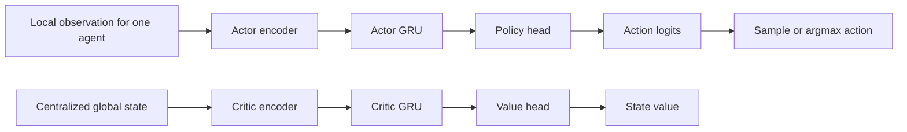
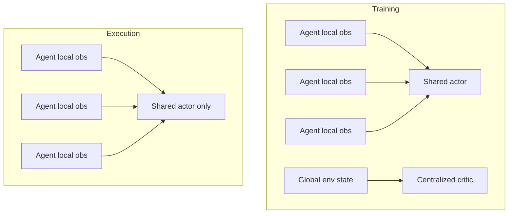
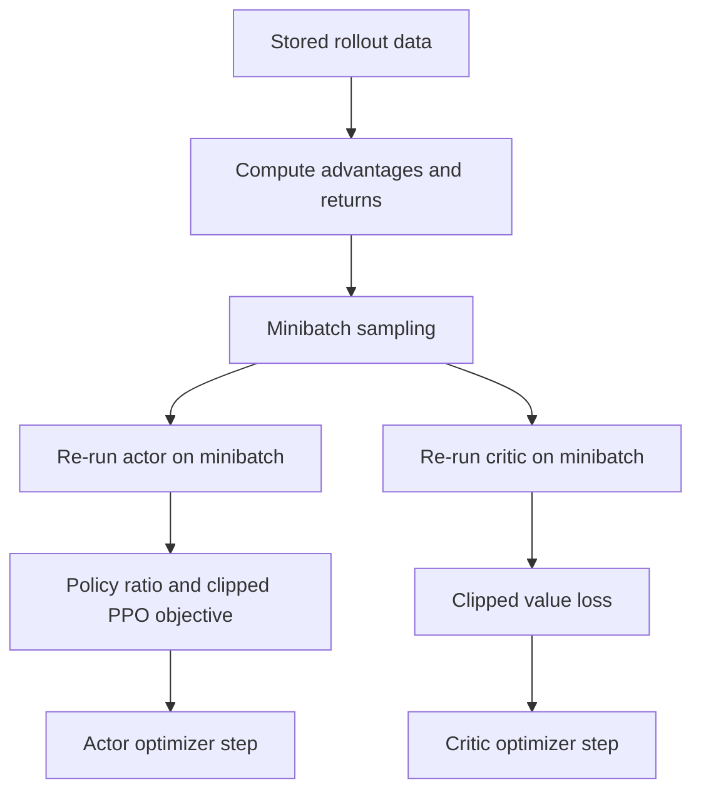
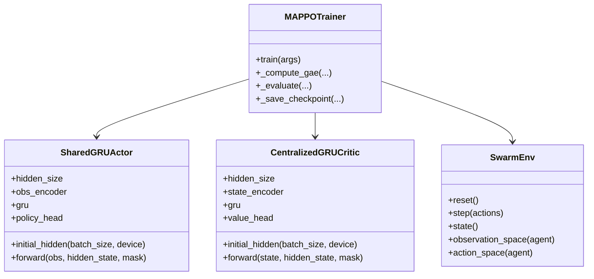

# GRU MAPPO

This document explains GRU MAPPO at an intuitive level and then walks through how it is implemented in this repository.

The target reader already knows:

- basic deep learning
- standard reinforcement learning ideas
- policy gradients and PPO at a high level

The goal is that by the end you can:

- explain what GRU MAPPO is
- understand why this repo uses it
- read the implementation without getting lost
- modify the code with confidence

## 1. What Is GRU MAPPO?

GRU MAPPO stands for:

- `GRU`: Gated Recurrent Unit
- `MAPPO`: Multi-Agent Proximal Policy Optimization

At a high level:

- `PPO` is a policy-gradient method that updates a policy carefully so it does not move too far at once.
- `MAPPO` adapts PPO to multiple agents.
- `GRU MAPPO` adds recurrence, so the policy and critic can remember recent history instead of reacting only to the current observation.

This matters in partially observable settings.

For swarm robotics, an agent usually does not see the full world. It sees:

- local lidar
- local pheromone samples
- maybe relative target or nest hints

but not the entire arena state.

That means the problem is not fully observable from one frame alone. Memory helps.

## 2. Why Not Just Use a Feedforward Policy?

A feedforward policy sees only:

`observation_t -> action_t`

That works if the observation already contains everything needed.

But in many swarm tasks, that is not true.

Examples:

- an agent may need to remember that it recently saw food behind an obstacle
- a temporary sensor dropout should not instantly erase all useful internal state
- a robot may need to remember short-term movement context to behave stably

A recurrent policy changes the mapping to:

`(observation_t, hidden_state_t) -> (action_t, hidden_state_{t+1})`

So the model carries forward a compressed memory.

## 3. Why MAPPO for Multi-Agent RL?

In a multi-agent system, each agent acts locally, but learning is much easier if training can use more global information.

This leads to a common pattern:

- each agent executes with only local observations
- training uses a centralized critic with more complete state information

This pattern is called:

`CTDE = Centralized Training, Decentralized Execution`

That is exactly what this repo does.

## 4. Intuition for MAPPO

Standard PPO is already a strong policy optimization method.

It works by:

1. running the current policy to collect trajectories
2. estimating advantages
3. updating the policy with a clipped objective so the new policy does not deviate too much

MAPPO keeps that same core structure, but adapts it to multiple agents.

There are many design choices possible in multi-agent PPO. In this repo, the important ones are:

- one shared actor across agents
- one centralized critic for training
- per-agent local observations for the actor
- global training-time state for the critic

That means all agents share the same policy weights, but each agent receives different inputs and can therefore behave differently.

This is usually a good fit for a homogeneous swarm.

## 5. Where the GRU Fits

The GRU is inserted between an encoder and the output head.

For the actor:

```text
obs -> encoder -> GRU -> policy head -> logits
```

For the critic:

```text
global state -> encoder -> GRU -> value head -> V(s)
```

The GRU hidden state acts like a compact rolling memory.

## 6. Big Picture Diagram



## 7. CTDE Diagram



During execution on real robots, the critic is not needed.

## 8. Core Math

### 8.1 Actor

The actor defines a policy:

```text
pi_theta(a_t | o_t, h_t)
```

where:

- `o_t` is the local observation
- `h_t` is the recurrent hidden state
- `a_t` is the action

The actor produces logits over discrete actions, then a categorical distribution is formed.

### 8.2 Critic

The critic estimates:

```text
V_phi(s_t, h_t^c)
```

where:

- `s_t` is the centralized global state
- `h_t^c` is the critic recurrent hidden state

### 8.3 GAE

Advantages are estimated using Generalized Advantage Estimation:

```text
delta_t = r_t + gamma * V(s_{t+1}) - V(s_t)
```

```text
A_t = delta_t
    + gamma * lambda * delta_{t+1}
    + gamma^2 * lambda^2 * delta_{t+2}
    + ...
```

This gives lower-variance advantage estimates than plain Monte Carlo returns.

### 8.4 PPO Objective

PPO uses the ratio:

```text
r_t(theta) = pi_theta(a_t | o_t, h_t) / pi_theta_old(a_t | o_t, h_t)
```

and the clipped surrogate:

```text
L_CLIP = E[min(
    r_t(theta) * A_t,
    clip(r_t(theta), 1 - epsilon, 1 + epsilon) * A_t
)]
```

This is the key idea that stabilizes PPO updates.

## 9. Why Shared Actor, But Centralized Critic?

This is one of the most important ideas in the repo.

### Shared actor

All swarm agents are homogeneous, so sharing the actor:

- reduces parameter count
- improves sample efficiency
- encourages reusable swarm behavior

### Centralized critic

The critic gets the global state because value estimation is easier when training can see:

- all agents
- all targets
- all obstacles
- global episode context

But the actor must still act only from what a single agent can actually observe at deployment time.

That is the heart of CTDE.

## 10. Why Recurrent Actor and Recurrent Critic?

You might ask: why not only make the actor recurrent?

Because if the actor uses memory but the critic does not, then the critic is asked to value decisions generated from hidden temporal context it does not model well.

Making both recurrent keeps training more consistent:

- actor uses memory for action choice
- critic uses memory for value prediction

## 11. Repository Overview

The key implementation files are:

- [train/mappo_gru.py](/Users/christopherlin/dev/cwsf2026/sim/train/mappo_gru.py)
- [algorithms/mappo/networks.py](/Users/christopherlin/dev/cwsf2026/sim/algorithms/mappo/networks.py)
- [algorithms/mappo/inference.py](/Users/christopherlin/dev/cwsf2026/sim/algorithms/mappo/inference.py)
- [env/swarm_env.py](/Users/christopherlin/dev/cwsf2026/sim/env/swarm_env.py)
- [train/demo.py](/Users/christopherlin/dev/cwsf2026/sim/train/demo.py)
- [firmware/run.py](/Users/christopherlin/dev/cwsf2026/sim/firmware/run.py)

## 12. Network Definitions

The actor and critic live in [networks.py](/Users/christopherlin/dev/cwsf2026/sim/algorithms/mappo/networks.py).

### 12.1 SharedGRUActor

The actor is:

```python
self.obs_encoder = nn.Sequential(
    nn.Linear(obs_dim, hidden_size),
    nn.ReLU(),
)
self.gru = nn.GRU(hidden_size, hidden_size, batch_first=True)
self.policy_head = nn.Sequential(
    nn.Linear(hidden_size, hidden_size),
    nn.ReLU(),
    nn.Linear(hidden_size, action_dim),
)
```

Interpretation:

- first compress the observation into a hidden feature vector
- pass it through the GRU
- project the GRU output into action logits

The forward pass expects:

- `obs: [B, obs_dim]`
- `hidden_state: [1, B, H]`
- optional `mask: [B]`

The mask is important. It resets memory at episode boundaries:

```python
hidden_state = hidden_state * mask.view(1, -1, 1)
```

So if `mask[i] == 0`, that agent’s hidden state is zeroed before the next step.

### 12.2 CentralizedGRUCritic

The critic mirrors the actor structure:

```python
self.state_encoder = nn.Sequential(
    nn.Linear(state_dim, hidden_size),
    nn.ReLU(),
)
self.gru = nn.GRU(hidden_size, hidden_size, batch_first=True)
self.value_head = nn.Sequential(
    nn.Linear(hidden_size, hidden_size),
    nn.ReLU(),
    nn.Linear(hidden_size, 1),
)
```

The difference is:

- actor input is local observation
- critic input is centralized training state
- actor output is logits
- critic output is scalar value

## 13. Where the Global State Comes From

The centralized critic uses `env.state()`, implemented in [swarm_env.py](/Users/christopherlin/dev/cwsf2026/sim/env/swarm_env.py).

That state is a fixed-layout vector encoding:

- all agents
- targets
- obstacles
- nest information
- some episode/global summary values

The actor never sees this during decentralized execution.

## 14. Training Loop Structure

Training is implemented in [mappo_gru.py](/Users/christopherlin/dev/cwsf2026/sim/train/mappo_gru.py).

The high-level loop is:

```text
for each curriculum stage:
    build env
    reset env
    initialize actor/critic hidden states
    repeat:
        collect rollout
        compute GAE
        run PPO updates
        periodically evaluate
        save best checkpoints
```

## 15. Curriculum

This repo does not train GRU MAPPO in one static environment from the start.

Instead it uses curriculum stages from:

- [curriculum.py](/Users/christopherlin/dev/cwsf2026/sim/algorithms/mappo/curriculum.py)

Stages vary things like:

- number of agents
- world size
- number of targets
- obstacle count
- reward shaping
- pheromone settings

This is important because the policy being learned is fairly complex.

## 16. Rollout Collection

In [mappo_gru.py](/Users/christopherlin/dev/cwsf2026/sim/train/mappo_gru.py), the trainer allocates a rollout buffer:

```python
rollout = {
    "obs": ...,
    "state": ...,
    "actions": ...,
    "log_probs": ...,
    "values": ...,
    "rewards": ...,
    "dones": ...,
    "actor_hidden": ...,
    "critic_hidden": ...,
    "masks": ...,
    "critic_masks": ...,
}
```

This is a key design point.

The code does not just store observations and actions. It also stores:

- the actor hidden state at each step
- the critic hidden state at each step
- masks that indicate whether memory should be reset

That is what makes recurrent PPO practical.

## 17. One Training Step in Detail

Inside rollout collection, the code does roughly this:

1. Store the current observations and state.
2. Store current hidden states.
3. Build masks from previous done flags.
4. Run actor:

```python
logits, actor_hidden = actor(obs_t, actor_hidden, actor_mask_t)
```

5. Sample action from:

```python
dist = torch.distributions.Categorical(logits=logits)
actions = dist.sample()
log_probs = dist.log_prob(actions)
```

6. Run critic:

```python
value, critic_hidden = critic(state_t, critic_hidden, critic_mask_t)
```

7. Step the environment.
8. Store reward, value, action, log-prob, done.

That repeats for `rollout_steps`.

## 18. Important Implementation Detail: Team Reward

In this repo, the rollout stores:

```python
rollout["rewards"][t] = float(rewards.mean())
```

So the PPO update uses the mean reward across agents at each timestep.

This means learning is strongly team-oriented rather than fully individualized.

That is a deliberate swarm-style design choice.

## 19. Hidden State Reset Logic

At episode termination, recurrent state must reset.

The code handles this via masks:

- actor mask:

```python
actor_mask_t = torch.as_tensor(1.0 - prev_done, ...)
```

- critic mask:

```python
critic_mask_t = torch.as_tensor([1.0 - float(prev_done.any())], ...)
```

Interpretation:

- each agent’s actor state resets if that agent is done
- the centralized critic state resets if the whole episode is done

The GRU modules apply this through:

```python
hidden_state = hidden_state * mask.view(1, -1, 1)
```

This is one of the cleanest parts of the implementation.

## 20. Advantage Computation

Advantages are computed in `_compute_gae(...)` in [mappo_gru.py](/Users/christopherlin/dev/cwsf2026/sim/train/mappo_gru.py).

Inputs:

- rewards
- values
- dones
- next_value
- `gamma`
- `gae_lambda`

Outputs:

- advantages
- returns

Then the advantages are normalized:

```python
advantages_batch = (advantages_batch - adv_mean) / adv_std
```

This is standard PPO practice and helps optimization.

## 21. PPO Update Phase

After rollout collection, the code switches to PPO updates.

For the actor:

```python
logits, _ = actor(mb_obs, mb_actor_hidden, mb_masks)
dist = torch.distributions.Categorical(logits=logits)
new_log_probs = dist.log_prob(mb_actions)
ratio = torch.exp(new_log_probs - mb_old_log_probs)
```

Then it computes:

- unclipped surrogate
- clipped surrogate
- entropy bonus

For the critic:

```python
critic_values, _ = critic(mb_states, mb_critic_hidden, mb_critic_masks)
```

and then uses clipped value loss.

## 22. PPO Loss Diagram



## 23. Why Store Hidden States in the Rollout?

This is a very important recurrent-RL question.

If you train a recurrent model, you need to know what hidden state the model had when it processed each timestep.

This repo handles that by storing:

- actor hidden state before each actor step
- critic hidden state before each critic step

Then minibatches can restart the recurrent computation from the appropriate stored context.

Without this, recurrent PPO updates would be inconsistent.

## 24. Inference Path

The inference loader is in [inference.py](/Users/christopherlin/dev/cwsf2026/sim/algorithms/mappo/inference.py).

It loads:

- `actor.pt`

and reconstructs:

- `SharedGRUActor(obs_dim, action_dim, hidden_size=...)`

This is intentionally minimal because deployment only needs the actor.

## 25. Demo-Time Inference

In [demo.py](/Users/christopherlin/dev/cwsf2026/sim/train/demo.py), the MAPPO demo path does:

```python
actor, device = load_actor(...)
hidden_state = actor.initial_hidden(env.cfg.n_agents, device)
```

Then each step:

```python
logits, hidden_state = actor(obs_tensor, hidden_state, done_mask)
greedy_actions = torch.argmax(logits, dim=-1)
```

So demo execution is recurrent and greedy.

## 26. Real Robot Inference

On the physical robot, [run.py](/Users/christopherlin/dev/cwsf2026/sim/firmware/run.py) also uses the recurrent MAPPO actor.

It:

- loads `actor.pt`
- initializes hidden state with batch size `1`
- maintains that hidden state across timesteps
- uses greedy action selection from logits

This is how the same GRU policy moves from simulation into deployment.

## 27. Checkpoint Format

This repo’s MAPPO checkpoint layout is:

- `actor.pt`
- `critic.pt`
- `trainer.pt`
- `metadata.json`

### `actor.pt`

Contains:

- actor `state_dict`
- hidden size

### `critic.pt`

Contains:

- critic `state_dict`
- hidden size

### `trainer.pt`

Contains:

- actor optimizer state
- critic optimizer state
- dimensions and metadata needed for resume

### `metadata.json`

Contains:

- algorithm name
- dimensions
- training stage information
- environment configuration summary
- evaluation metadata

## 28. UML Class Diagram



## 29. Data Flow Through Training

```mermaid
sequenceDiagram
    participant Env as SwarmEnv
    participant Actor as SharedGRUActor
    participant Critic as CentralizedGRUCritic
    participant Trainer as mappo_gru.py

    Trainer->>Env: reset()
    loop rollout steps
        Trainer->>Actor: obs, actor_hidden, mask
        Actor-->>Trainer: logits, next_actor_hidden
        Trainer->>Critic: global_state, critic_hidden, critic_mask
        Critic-->>Trainer: value, next_critic_hidden
        Trainer->>Env: step(actions)
        Env-->>Trainer: next_obs, rewards, dones, infos
        Trainer->>Trainer: store obs/actions/log_probs/values/hidden states
    end
    Trainer->>Trainer: compute GAE
    Trainer->>Actor: PPO minibatch updates
    Trainer->>Critic: value updates
```

## 30. How to Read the Code Without Getting Lost

A good order is:

1. read [networks.py](/Users/christopherlin/dev/cwsf2026/sim/algorithms/mappo/networks.py)
2. read [inference.py](/Users/christopherlin/dev/cwsf2026/sim/algorithms/mappo/inference.py)
3. read the rollout section of [mappo_gru.py](/Users/christopherlin/dev/cwsf2026/sim/train/mappo_gru.py)
4. read `_compute_gae(...)`
5. read the PPO update section
6. read [demo.py](/Users/christopherlin/dev/cwsf2026/sim/train/demo.py)
7. read [firmware/run.py](/Users/christopherlin/dev/cwsf2026/sim/firmware/run.py)

This order matches the conceptual flow:

`model definition -> training -> inference -> deployment`

## 31. What To Modify If You Want To Change Things

### Change hidden size

Edit:

- [mappo_gru.py](/Users/christopherlin/dev/cwsf2026/sim/train/mappo_gru.py)
- [networks.py](/Users/christopherlin/dev/cwsf2026/sim/algorithms/mappo/networks.py)

Usually you only need to change the CLI/config in training, because the saved checkpoint already stores hidden size for inference loading.

### Change actor architecture

Edit:

- [SharedGRUActor in networks.py](/Users/christopherlin/dev/cwsf2026/sim/algorithms/mappo/networks.py)

Examples:

- deeper encoder
- layer norm
- different activation
- separate policy/value towers before heads

### Change critic architecture

Edit:

- [CentralizedGRUCritic in networks.py](/Users/christopherlin/dev/cwsf2026/sim/algorithms/mappo/networks.py)

### Change PPO hyperparameters

Edit:

- `MAPPOConfig` in [mappo_gru.py](/Users/christopherlin/dev/cwsf2026/sim/train/mappo_gru.py)

Key knobs:

- `clip_ratio`
- `entropy_coef`
- `value_coef`
- `gae_lambda`
- `rollout_steps`
- `update_epochs`
- `minibatch_size`

### Change action selection at inference

Edit:

- [inference.py](/Users/christopherlin/dev/cwsf2026/sim/algorithms/mappo/inference.py)
- [demo.py](/Users/christopherlin/dev/cwsf2026/sim/train/demo.py)
- [run.py](/Users/christopherlin/dev/cwsf2026/sim/firmware/run.py)

For example, you could switch from greedy `argmax` to sampling.

### Change the centralized state

Edit:

- [swarm_env.py](/Users/christopherlin/dev/cwsf2026/sim/env/swarm_env.py)

Specifically:

- `state()`
- `_get_global_state()`
- any dimension calculation tied to critic state size

Be careful: if you change the centralized state shape, old critic checkpoints may no longer load.

## 32. Common Confusions

### “Is this just PPO with a GRU?”

Almost, but the multi-agent structure matters:

- shared actor across many agents
- centralized critic with global state
- multi-agent rollout collection

So it is more than “single-agent PPO + GRU”.

### “Do all agents share one hidden state?”

No.

The actor is shared, but each agent has its own hidden-state slot.

That is why actor hidden shape is:

`[1, n_agents, hidden_size]`

The weights are shared, the memory slots are not.

### “Why does the critic hidden state use batch size 1?”

Because the critic evaluates one centralized environment state per timestep, not one separate state per agent.

### “Why use logits instead of probabilities?”

Because PyTorch categorical distributions are usually built from logits directly, which is numerically stable.

## 33. Practical Mental Model

If you want one compact intuition, think of the implementation like this:

- each agent has a shared brain with its own private short-term memory
- training also uses a second brain that sees the whole world and estimates how good the situation is
- PPO updates the shared actor carefully using advantage estimates from the critic
- the GRUs let both actor and critic remember recent temporal context

That is GRU MAPPO in this repo.

## 34. If You Need To Explain It To Others

A good short explanation is:

`GRU MAPPO is a multi-agent version of PPO where all agents share one recurrent policy network, but training also uses a centralized recurrent critic that sees the full environment state. The GRU gives memory, PPO gives stable policy updates, and centralized training helps the swarm learn coordination while still executing from local observations only.`

## 35. Final Summary

This repo’s GRU MAPPO implementation is:

- recurrent
- shared-policy
- centralized-critic
- PPO-based
- curriculum-trained
- deployed with the actor only

The main mapping from concept to code is:

- actor and critic definitions:
  - [networks.py](/Users/christopherlin/dev/cwsf2026/sim/algorithms/mappo/networks.py)
- training loop:
  - [mappo_gru.py](/Users/christopherlin/dev/cwsf2026/sim/train/mappo_gru.py)
- checkpoint loading for inference:
  - [inference.py](/Users/christopherlin/dev/cwsf2026/sim/algorithms/mappo/inference.py)
- demo inference:
  - [demo.py](/Users/christopherlin/dev/cwsf2026/sim/train/demo.py)
- robot deployment:
  - [run.py](/Users/christopherlin/dev/cwsf2026/sim/firmware/run.py)

If you understand:

- shared actor
- centralized critic
- recurrent hidden states
- rollout collection
- GAE
- PPO clipping

then you understand the core of GRU MAPPO in this codebase.
