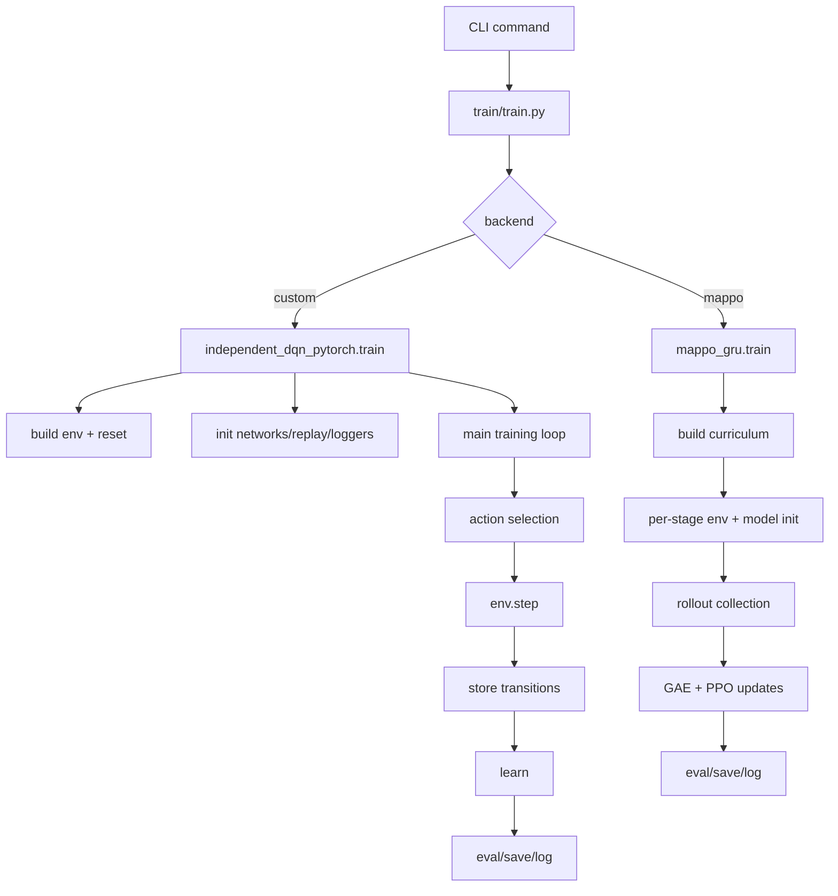

# Training And Curriculum Walkthrough

This document explains:

1. how training works in this repo in general
2. how the recurrent MAPPO curriculum path is implemented on top of that

The focus is on the actual current code paths, not an idealized design.

## 1. High-Level Training Entry Point

The top-level training dispatcher is [train/train.py](/Users/christopherlin/dev/cwsf2026/sim/train/train.py#L12).

It does one job: parse `--backend`, then forward the remaining CLI args to the correct trainer.

Supported backends:

- `custom` -> [train/independent_dqn_pytorch.py](/Users/christopherlin/dev/cwsf2026/sim/train/independent_dqn_pytorch.py#L230)
- `sb3` -> [train/sb3_dqn.py](/Users/christopherlin/dev/cwsf2026/sim/train/sb3_dqn.py)
- `rllib` -> [train/rllib_dqn.py](/Users/christopherlin/dev/cwsf2026/sim/train/rllib_dqn.py)
- `mappo` -> [train/mappo_gru.py](/Users/christopherlin/dev/cwsf2026/sim/train/mappo_gru.py#L211)

The dispatcher also forwards the top-level pheromone toggle with:

- `--use-pheromone`
- `--no-use-pheromone`

## 2. General Training Structure In This Repo

Across the main trainers, the code follows roughly the same lifecycle:

1. parse CLI args
2. build an environment config
3. create the environment
4. reset the env to get initial observations
5. infer observation/action dimensions
6. initialize model(s), optimizer(s), and training state
7. run a main training loop
8. periodically log, evaluate, and save checkpoints
9. write plots and summary metadata at the end

That pattern is easiest to see in the custom DQN trainer and the MAPPO trainer.

## 3. Custom DQN Training Flow

The main custom baseline is [train/independent_dqn_pytorch.py](/Users/christopherlin/dev/cwsf2026/sim/train/independent_dqn_pytorch.py#L230).

### 3.1 Setup Phase

At the start of `train(args)`:

- the environment config is built with `make_swarm_config(args)` in [train/independent_dqn_pytorch.py](/Users/christopherlin/dev/cwsf2026/sim/train/independent_dqn_pytorch.py#L235)
- the environment is created as `SwarmEnv(cfg, headless=args.headless)` in [train/independent_dqn_pytorch.py](/Users/christopherlin/dev/cwsf2026/sim/train/independent_dqn_pytorch.py#L248)
- the initial reset happens with `env.reset(seed=args.seed)` in [train/independent_dqn_pytorch.py](/Users/christopherlin/dev/cwsf2026/sim/train/independent_dqn_pytorch.py#L249)
- observation and action dimensions are derived from the first observation and config in [train/independent_dqn_pytorch.py](/Users/christopherlin/dev/cwsf2026/sim/train/independent_dqn_pytorch.py#L252)

Then the trainer opens:

- `episode_metrics.csv`
- `eval_metrics.csv`
- `run_config.json`
- checkpoint metadata

in [train/independent_dqn_pytorch.py](/Users/christopherlin/dev/cwsf2026/sim/train/independent_dqn_pytorch.py#L262).

### 3.2 Model Initialization

The trainer has two modes:

- shared policy across agents
- independent policy per agent

That branch starts at [train/independent_dqn_pytorch.py](/Users/christopherlin/dev/cwsf2026/sim/train/independent_dqn_pytorch.py#L345).

Shared-policy mode creates:

- one online Q-network
- one target Q-network
- one optimizer
- one replay buffer per agent

Independent mode creates one of each per agent.

### 3.3 Main Interaction Loop

The main training loop starts at [train/independent_dqn_pytorch.py](/Users/christopherlin/dev/cwsf2026/sim/train/independent_dqn_pytorch.py#L402):

```python
while global_step < args.total_steps:
```

Inside each iteration:

1. epsilon is computed with `linear_schedule(...)`
2. actions are selected from the policy
3. actions are converted into the PettingZoo-style action dict
4. the environment is stepped
5. transitions are written into replay buffers
6. learning happens after warmup
7. target networks are periodically synced
8. evaluation/checkpoint logic runs if due
9. episode summaries are logged at episode end

The environment interaction happens here:

- action dict build: [train/independent_dqn_pytorch.py](/Users/christopherlin/dev/cwsf2026/sim/train/independent_dqn_pytorch.py#L458)
- env step: [train/independent_dqn_pytorch.py](/Users/christopherlin/dev/cwsf2026/sim/train/independent_dqn_pytorch.py#L459)

The replay write happens here:

- [train/independent_dqn_pytorch.py](/Users/christopherlin/dev/cwsf2026/sim/train/independent_dqn_pytorch.py#L469)

### 3.4 Learning Step

Learning starts after `warmup_steps` in [train/independent_dqn_pytorch.py](/Users/christopherlin/dev/cwsf2026/sim/train/independent_dqn_pytorch.py#L493).

The DQN learning logic is standard:

- sample minibatch from replay
- compute `Q(s, a)`
- compute target from target network
- compute Huber loss
- backpropagate
- optimizer step

The shared-policy batching branch is at [train/independent_dqn_pytorch.py](/Users/christopherlin/dev/cwsf2026/sim/train/independent_dqn_pytorch.py#L495).

The independent per-agent branch is at [train/independent_dqn_pytorch.py](/Users/christopherlin/dev/cwsf2026/sim/train/independent_dqn_pytorch.py#L510).

### 3.5 Evaluation, Checkpoints, Episode Logging

Three side systems run during training:

- evaluation: [train/independent_dqn_pytorch.py](/Users/christopherlin/dev/cwsf2026/sim/train/independent_dqn_pytorch.py#L534)
- milestone checkpoint saves: [train/independent_dqn_pytorch.py](/Users/christopherlin/dev/cwsf2026/sim/train/independent_dqn_pytorch.py#L540)
- episode-end CSV logging and runtime prints: [train/independent_dqn_pytorch.py](/Users/christopherlin/dev/cwsf2026/sim/train/independent_dqn_pytorch.py#L553)

At the end, final checkpoints, plots, and summary metadata are written in [train/independent_dqn_pytorch.py](/Users/christopherlin/dev/cwsf2026/sim/train/independent_dqn_pytorch.py#L626).

## 4. General MAPPO Training Flow

The recurrent MAPPO trainer is [train/mappo_gru.py](/Users/christopherlin/dev/cwsf2026/sim/train/mappo_gru.py#L211).

Unlike DQN:

- it is on-policy, not replay-based
- it uses one shared recurrent actor
- it uses one centralized recurrent critic
- it trains from rollout chunks instead of a replay buffer

### 4.1 Setup Phase

`parse_args()` in [train/mappo_gru.py](/Users/christopherlin/dev/cwsf2026/sim/train/mappo_gru.py#L51) defines PPO/MAPPO-style hyperparameters:

- `rollout_steps`
- `update_epochs`
- `minibatch_size`
- `gamma`
- `gae_lambda`
- `clip_ratio`
- `entropy_coef`
- `value_coef`
- `hidden_size`

At the start of `train(args)` in [train/mappo_gru.py](/Users/christopherlin/dev/cwsf2026/sim/train/mappo_gru.py#L211):

- RNG seeds are set
- output/checkpoint folders are created
- `MAPPOConfig` is built
- the curriculum list is selected
- CSV loggers are opened
- `run_config.json` is written

### 4.2 Actor/Critic Roles

The recurrent networks are defined in [algorithms/mappo/networks.py](/Users/christopherlin/dev/cwsf2026/sim/algorithms/mappo/networks.py#L7).

`SharedGRUActor`:

- input: local observation
- recurrent state: per-agent GRU hidden state
- output: action logits

`CentralizedGRUCritic`:

- input: centralized training state
- recurrent state: critic GRU hidden state
- output: scalar value estimate

This is CTDE:

- centralized training
- decentralized execution

### 4.3 Rollout Collection

Inside each stage, rollouts are collected into a preallocated `rollout` dict in [train/mappo_gru.py](/Users/christopherlin/dev/cwsf2026/sim/train/mappo_gru.py#L329).

The rollout stores:

- observations
- centralized states
- actions
- action log-probs
- critic values
- rewards
- done flags
- actor hidden states
- critic hidden states
- masks for hidden-state reset

During each rollout step in [train/mappo_gru.py](/Users/christopherlin/dev/cwsf2026/sim/train/mappo_gru.py#L344):

1. current obs/state/hidden-state snapshots are written into rollout storage
2. actor produces action logits
3. a categorical action is sampled
4. critic produces value estimate
5. env is stepped
6. reward/done/info are collected
7. episode stats are updated

### 4.4 Advantage Computation And PPO Update

After rollout collection:

- the next critic value is computed in [train/mappo_gru.py](/Users/christopherlin/dev/cwsf2026/sim/train/mappo_gru.py#L442)
- GAE is computed by `_compute_gae()` in [train/mappo_gru.py](/Users/christopherlin/dev/cwsf2026/sim/train/mappo_gru.py#L447)
- rollout arrays are converted into tensors in [train/mappo_gru.py](/Users/christopherlin/dev/cwsf2026/sim/train/mappo_gru.py#L458)
- advantages are normalized in [train/mappo_gru.py](/Users/christopherlin/dev/cwsf2026/sim/train/mappo_gru.py#L470)

Then the PPO update loop runs in [train/mappo_gru.py](/Users/christopherlin/dev/cwsf2026/sim/train/mappo_gru.py#L474):

- shuffled minibatch indices
- actor loss using PPO clipping
- entropy bonus
- clipped value loss
- separate optimizer steps for actor and critic

### 4.5 Evaluation And Checkpointing

Periodic evaluation happens in [train/mappo_gru.py](/Users/christopherlin/dev/cwsf2026/sim/train/mappo_gru.py#L517).

Stage checkpoints are saved in [train/mappo_gru.py](/Users/christopherlin/dev/cwsf2026/sim/train/mappo_gru.py#L538):

- `actor.pt`
- `critic.pt`
- `trainer.pt`
- `metadata.json`
- plus `latest/`

## 5. UML: General Training Flow



## 6. Curriculum Training: What It Is In This Repo

Curriculum learning is implemented only for the recurrent MAPPO path.

It is not a general-purpose training abstraction shared by all backends.

The schedule definition is in [algorithms/mappo/curriculum.py](/Users/christopherlin/dev/cwsf2026/sim/algorithms/mappo/curriculum.py#L13).

The key design choice is that the curriculum currently changes only one task variable:

- swarm size

The three stages are:

1. `stage1_single_agent`
2. `stage2_small_swarm`
3. `stage3_full_marl`

## 7. Curriculum Schedule Code

The `CurriculumStage` dataclass in [curriculum.py](/Users/christopherlin/dev/cwsf2026/sim/algorithms/mappo/curriculum.py#L6) stores:

- `name`
- `n_agents`
- `total_steps`

`default_curriculum(total_steps, full_agents)` in [curriculum.py](/Users/christopherlin/dev/cwsf2026/sim/algorithms/mappo/curriculum.py#L13) does this:

- ensures `total_steps >= 3`
- splits the total roughly into thirds
- sets stage 1 to 1 agent
- sets stage 2 to a capped small swarm
- sets stage 3 to the requested full swarm

For example, with:

- `--total-steps 120000`
- `--n-agents 6`

the resulting curriculum is approximately:

- stage 1: `1` agent, `40000` steps
- stage 2: `3` agents, `40000` steps
- stage 3: `6` agents, `40000` steps

Then `select_curriculum()` in [curriculum.py](/Users/christopherlin/dev/cwsf2026/sim/algorithms/mappo/curriculum.py#L26) selects:

- `stage1`
- `stage1_to_2`
- `full`

## 8. Curriculum Training Flow In Code

The stage list is built in [train/mappo_gru.py](/Users/christopherlin/dev/cwsf2026/sim/train/mappo_gru.py#L234):

```python
curriculum = select_curriculum(default_curriculum(args.total_steps, args.n_agents), args.curriculum)
```

That stage list is recorded into `run_config.json` in [train/mappo_gru.py](/Users/christopherlin/dev/cwsf2026/sim/train/mappo_gru.py#L275).

Then the trainer enters the stage loop at [train/mappo_gru.py](/Users/christopherlin/dev/cwsf2026/sim/train/mappo_gru.py#L290):

```python
for stage_index, stage in enumerate(curriculum, start=1):
```

For each stage, it does the following.

### 8.1 Rebuild The Environment For The New Stage

`_build_env(args, stage.n_agents)` is called in [train/mappo_gru.py](/Users/christopherlin/dev/cwsf2026/sim/train/mappo_gru.py#L293).

That helper in [train/mappo_gru.py](/Users/christopherlin/dev/cwsf2026/sim/train/mappo_gru.py#L85) copies the CLI args, overrides `n_agents`, rebuilds `SwarmConfig`, and constructs a new `SwarmEnv`.

So curriculum is not simulated inside one fixed env. Each stage gets a fresh env configured specifically for that stage’s swarm size.

### 8.2 Rebuild The Models For The Stage

Inside the stage loop, the code creates:

- a fresh `SharedGRUActor`
- a fresh `CentralizedGRUCritic`
- fresh Adam optimizers

in [train/mappo_gru.py](/Users/christopherlin/dev/cwsf2026/sim/train/mappo_gru.py#L296).

This matters because observation and state shapes depend on the current env/stage.

### 8.3 Transfer Or Resume Weights

There are two ways weights enter a stage.

First, if `--resume-checkpoint` is used, `_load_checkpoint()` is called in [train/mappo_gru.py](/Users/christopherlin/dev/cwsf2026/sim/train/mappo_gru.py#L300).

Second, if this is not the first stage, the previous stage’s actor weights are transferred with:

```python
actor.load_state_dict(carried_actor_state)
```

in [train/mappo_gru.py](/Users/christopherlin/dev/cwsf2026/sim/train/mappo_gru.py#L304).

That is the main curriculum-learning mechanism in practice:

- easier-stage actor weights carry into harder stages

### 8.4 Train Until The Stage Budget Is Used

Each stage runs its own training loop:

```python
while stage_steps < stage.total_steps:
```

in [train/mappo_gru.py](/Users/christopherlin/dev/cwsf2026/sim/train/mappo_gru.py#L328).

That means the curriculum boundary is explicit and hard:

- stage runs for its own step budget
- then the next stage starts

### 8.5 Log Stage-Specific Episode Data

Episode rows include:

- `stage`
- `stage_index`
- `global_step`
- `n_agents`

in [train/mappo_gru.py](/Users/christopherlin/dev/cwsf2026/sim/train/mappo_gru.py#L397).

So downstream analysis can separate stage behavior from final full-swarm behavior.

### 8.6 Save Stage Checkpoints

At stage end, the trainer saves to:

- `checkpoints/<run>/<stage.name>/`
- `checkpoints/<run>/latest/`

in [train/mappo_gru.py](/Users/christopherlin/dev/cwsf2026/sim/train/mappo_gru.py#L538).

It also writes stage metadata in [train/mappo_gru.py](/Users/christopherlin/dev/cwsf2026/sim/train/mappo_gru.py#L542).

Then it stores:

```python
carried_actor_state = actor.state_dict()
```

in [train/mappo_gru.py](/Users/christopherlin/dev/cwsf2026/sim/train/mappo_gru.py#L541), which becomes the starting point for the next stage.

## 9. UML: Curriculum Flow

```mermaid
flowchart TD
    A[train/mappo_gru.py train(args)] --> B[build curriculum list]
    B --> C[write run_config.json]
    C --> D{for each stage}
    D --> E[rebuild env with stage.n_agents]
    E --> F[create fresh actor critic optimizers]
    F --> G{resume or transfer weights}
    G -->|resume checkpoint| H[load actor and maybe critic]
    G -->|prior stage exists| I[load carried actor weights]
    H --> J[train stage until stage.total_steps]
    I --> J
    J --> K[log episodes with stage name]
    K --> L[optional evaluation]
    L --> M[save stage checkpoint]
    M --> N[carry actor weights forward]
    N --> D
```

## 10. Why The Critic Does Not Cleanly Transfer Across Stages

This is the most important current limitation.

The centralized critic input is `env.state()`, and that state dimension depends on the number of agents in the stage. Because curriculum changes `n_agents`, the centralized state dimension can change between stages.

That is why `_load_checkpoint()` in [train/mappo_gru.py](/Users/christopherlin/dev/cwsf2026/sim/train/mappo_gru.py#L169) only reloads critic weights if:

```python
trainer_payload["state_dim"] == critic.state_encoder[0].in_features
```

If not, the critic is effectively restarted for the new stage.

So currently:

- actor transfer is the reliable curriculum mechanism
- critic transfer is conditional

## 11. Mental Model

The easiest mental model for the current curriculum system is:

- MAPPO training is standard recurrent PPO-style training
- curriculum wraps that training in a sequence of stage-specific env rebuilds
- the actor is carried forward from easy stage to hard stage
- the critic is rebuilt when the centralized-state shape changes

This means curriculum here is not “one training loop with dynamic difficulty.” It is:

- a stage scheduler
- plus actor weight transfer
- plus per-stage logging/checkpointing

## 12. Practical Example

If you run:

```bash
python train/train.py --backend mappo --headless --curriculum full --n-agents 6 --total-steps 120000
```

the code will approximately do this:

1. build a three-stage curriculum
2. train stage 1 with `1` agent for about `40000` steps
3. save `stage1_single_agent/`
4. rebuild the env for a small swarm
5. load the stage 1 actor weights into a fresh stage 2 actor
6. train stage 2 for about `40000` steps
7. save `stage2_small_swarm/`
8. rebuild the env for `6` agents
9. load the stage 2 actor weights into a fresh stage 3 actor
10. train stage 3 for about `40000` steps
11. save `stage3_full_marl/` and `latest/`

## 13. Current Limits

The current curriculum implementation is useful, but it is still narrow:

- only MAPPO uses it
- only swarm size is staged
- critic transfer is limited by centralized-state shape changes
- stage step allocation is a simple equal split
- there is no learned or metric-triggered stage advancement

So this is a straightforward staged curriculum, not an adaptive one.
