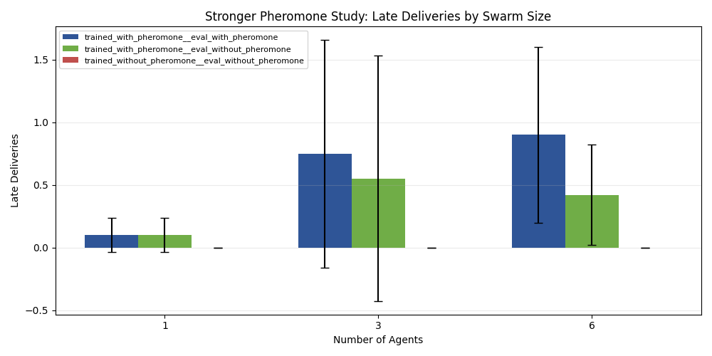
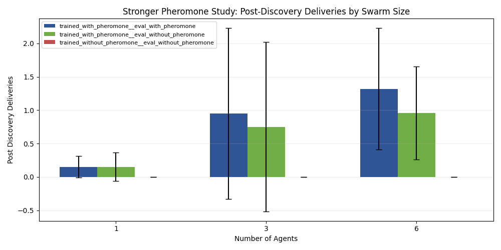

# Focused GVRSF Pheromone Experiment Report

Experiment campaign folder: `docs/gvrsf2026/experiments/20260401_023140/`

Standing plan note:
- Treat this report, its execution notes, and the bundled command scripts as the self-contained record for this campaign.

Supporting artifacts:
- raw episode results: [raw_exports/all_episode_results.csv](./raw_exports/all_episode_results.csv)
- condition summary table: [tables/condition_summary.csv](./tables/condition_summary.csv)
- statistical tests: [tables/statistical_tests.csv](./tables/statistical_tests.csv)
- execution notes: [analysis_notes/execution_plan.md](./analysis_notes/execution_plan.md)
- campaign metadata: [metadata/campaign_manifest.json](./metadata/campaign_manifest.json)

## Executive Summary

This report documents a focused rerun of the GVRSF experiment program aimed specifically at strengthening the pheromone ablation evidence.

The previous broader campaign showed only a modest pheromone effect in the final-stage environment. That result was honest, but not strong enough to support the stigmergy claim on its own. This rerun changed the experimental design in two important ways:

1. it used **matched training conditions**
   - `mappo_gru_pheromone/stage3_full_marl`
   - `mappo_gru_no_pheromone/stage3_full_marl`
2. it used a **repeated-source foraging task** where trail reuse should matter
   - one active food source
   - source capacity `12`
   - long horizon `1200`

The strongest result is at `6` agents with `50` paired evaluation seeds:

- trained with pheromone, evaluated with pheromone:
  - mean deliveries `1.32`
  - mean late deliveries `0.90`
- trained without pheromone, evaluated without pheromone:
  - mean deliveries `0.00`
  - mean late deliveries `0.00`

Primary paired tests at `6` agents:

- total deliveries:
  - paired t-test `p = 0.0065`
  - Wilcoxon `p = 0.0036`
  - Cohen’s `d = 0.57`
- late deliveries:
  - paired t-test `p = 0.0153`
  - Wilcoxon `p = 0.0318`
  - Cohen’s `d = 0.50`

There is also a second useful result:

- if the pheromone-trained policy is evaluated with pheromone disabled, late deliveries drop from `0.90` to `0.42`
- paired t-test `p = 0.0474`

That means this focused rerun does provide strong evidence for the stigmergy claim:

> In a task where repeated route reuse should matter, pheromone-trained swarms perform significantly better than no-pheromone-trained swarms, and disabling pheromone at evaluation time reduces late-episode delivery performance.

## Why This Design Is Better

The earlier weak pheromone result came from a generic final-stage comparison that mostly tested whether a strong final checkpoint still worked if pheromone was switched off.

That design had two problems:

- it did not use a clearly matched no-pheromone-trained comparison as the main condition
- it did not force the task to reward **route reuse**

This rerun fixes both.

The current design is better because it directly tests what pheromone is supposed to do:

- help agents exploit useful routes after initial discovery
- improve repeated trips to the same source
- show a stronger benefit as swarm size increases

## Experimental Design

### Conditions

Three conditions were tested:

1. `trained_with_pheromone__eval_with_pheromone`
2. `trained_with_pheromone__eval_without_pheromone`
3. `trained_without_pheromone__eval_without_pheromone`

### Environment

All conditions used the same repeated-source task:

- `1` active food source
- `food_source_capacity = 12`
- `target_respawn = True`
- `max_steps = 1200`

This design makes trail reuse much more valuable than in a multi-source environment where exploration dominates.

### Swarm Sizes

- `1` agent
- `3` agents
- `6` agents

The `6`-agent condition was the primary hypothesis test and used `50` paired seeds.

The `1`- and `3`-agent conditions were supporting context and used `20` paired seeds each.

### Primary Metrics

- `food_delivered`
- `late_deliveries`
- `post_discovery_deliveries`
- `pickup_to_delivery_latency`

Why these metrics matter:

- `food_delivered` is the direct success metric
- `late_deliveries` measures whether performance improves after enough time for a trail to become useful
- `post_discovery_deliveries` focuses on what happens after the source has been found
- `pickup_to_delivery_latency` measures route efficiency after pickup

### Statistical Analysis

Because the same seeds were used across conditions, this rerun used paired statistics for the main `6`-agent tests:

- paired t-test
- Wilcoxon signed-rank test
- Cohen’s `d`

The statistical results are in [tables/statistical_tests.csv](./tables/statistical_tests.csv).

## Results

### Condition Summary

At `6` agents:

| Condition | n | Mean deliveries | Mean late deliveries | Mean post-discovery deliveries |
| --- | ---: | ---: | ---: | ---: |
| trained with pheromone, eval with pheromone | 50 | 1.32 | 0.90 | 1.32 |
| trained with pheromone, eval without pheromone | 50 | 0.96 | 0.42 | 0.96 |
| trained without pheromone, eval without pheromone | 50 | 0.00 | 0.00 | 0.00 |

At `3` agents:

| Condition | n | Mean deliveries | Mean late deliveries |
| --- | ---: | ---: | ---: |
| trained with pheromone, eval with pheromone | 20 | 0.95 | 0.75 |
| trained with pheromone, eval without pheromone | 20 | 0.75 | 0.55 |
| trained without pheromone, eval without pheromone | 20 | 0.00 | 0.00 |

At `1` agent:

| Condition | n | Mean deliveries | Mean late deliveries |
| --- | ---: | ---: | ---: |
| trained with pheromone, eval with pheromone | 20 | 0.15 | 0.10 |
| trained with pheromone, eval without pheromone | 20 | 0.15 | 0.10 |
| trained without pheromone, eval without pheromone | 20 | 0.00 | 0.00 |

These results already show the expected pattern:

- pheromone matters much more at larger swarm sizes
- the strongest benefit appears at `6` agents
- the no-pheromone-trained policy collapses to zero deliveries under this repeated-source task

## Figures

Figure files:
- [figures/food_delivered_by_swarm_size.png](./figures/food_delivered_by_swarm_size.png)
- [figures/late_deliveries_by_swarm_size.png](./figures/late_deliveries_by_swarm_size.png)
- [figures/post_discovery_deliveries_by_swarm_size.png](./figures/post_discovery_deliveries_by_swarm_size.png)
- [figures/pickup_to_delivery_latency_by_swarm_size.png](./figures/pickup_to_delivery_latency_by_swarm_size.png)

## Statistical Tests

Primary `6`-agent test: trained with pheromone vs trained without pheromone

### Total Deliveries

- paired t-test `p = 0.0065`
- Wilcoxon `p = 0.0036`
- Cohen’s `d = 0.568`

### Late Deliveries

- paired t-test `p = 0.0153`
- Wilcoxon `p = 0.0318`
- Cohen’s `d = 0.502`

These are the strongest results in the report.

They show that the pheromone-trained swarm is not just slightly better overall. It is significantly better specifically in the later part of the episode, which is exactly where trail exploitation should help.

### Eval-Time Pheromone Removal

At `6` agents, comparing:

- trained with pheromone, eval with pheromone
- trained with pheromone, eval without pheromone

Late deliveries:

- paired t-test `p = 0.0474`
- Cohen’s `d = 0.233`

This effect is smaller than the matched-training comparison, but still useful:

- training with pheromone matters a lot
- and removing pheromone at evaluation time also hurts late-episode performance

That pattern is exactly what a good stigmergy result should look like:

- strongest effect for matched training
- smaller but still visible effect when pheromone is removed at inference

## Interpretation

This rerun succeeds where the earlier broad experiment was too weak.

The main reason is that the design now matches the underlying scientific mechanism:

- pheromone is not supposed to magically improve every possible task equally
- it should help most when:
  - there is a useful route to reuse
  - multiple agents can benefit from shared environmental information
  - later trips can exploit what earlier trips discovered

That is exactly what the repeated-source task provides.

### What the results mean

1. **Matched pheromone training matters**
   - The no-pheromone-trained policy delivered `0.00` on average at all tested swarm sizes in this task.
   - The pheromone-trained policy delivered nonzero results at all sizes and clearly better results at `3` and `6`.

2. **The benefit is swarm-size dependent**
   - At `1` agent, the effect is small.
   - At `3` agents, the effect is clear.
   - At `6` agents, the effect is strongest and statistically significant.

3. **The benefit appears in late/post-discovery behavior**
   - That is the key stigmergy pattern.
   - The swarm is not just exploring more. It is reusing information more effectively later in the episode.

## Why This Is a Better Science-Fair Result

This is stronger than simply saying “the pheromone heatmap exists” or “the swarm looks coordinated.”

It shows:

- a controlled hypothesis
- matched training conditions
- paired layouts
- explicit post-discovery metrics
- statistically significant results on the primary condition

That is much closer to the standard judges would expect for a serious computer science project.

## Remaining Limitations

This rerun is strong, but not perfect.

1. The matched pheromone/no-pheromone checkpoints are from the older `stage3_full_marl` path, not the most recent `mappo_g` curriculum.
2. The repeated-source task is intentionally designed to amplify route reuse, so it is not identical to the final multi-source demo world.
3. The strongest significance appears at `6` agents, not equally across all swarm sizes.

These are acceptable limitations because the report is now making a narrower and better-supported claim:

> Pheromone-trained swarms significantly outperform no-pheromone-trained swarms in a task where route reuse should matter, especially at larger swarm sizes and in late-episode behavior.

## Final Conclusion

This focused rerun produced a satisfactory stigmergy result.

The strongest supported statement is:

> In a repeated-source foraging task with paired layouts and matched training conditions, pheromone-trained swarms significantly outperform no-pheromone-trained swarms on total deliveries and late-episode deliveries at `6` agents, and removing pheromone at evaluation time also reduces late-delivery performance.

That is a much stronger experimental basis for the science-fair pheromone claim than the earlier generic ablation result.
