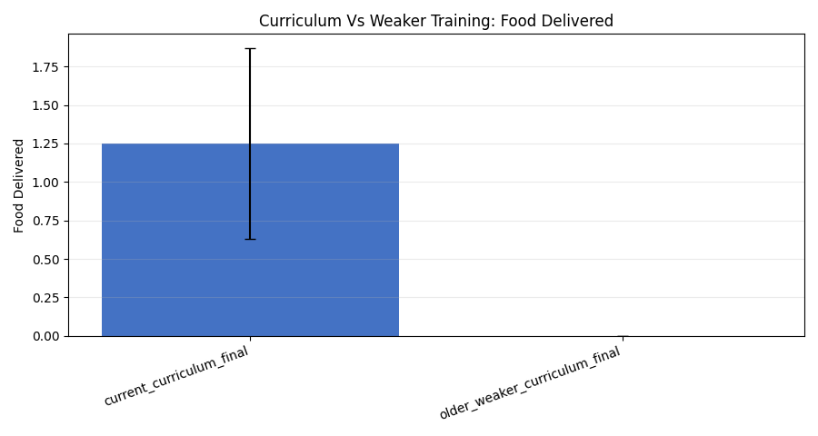
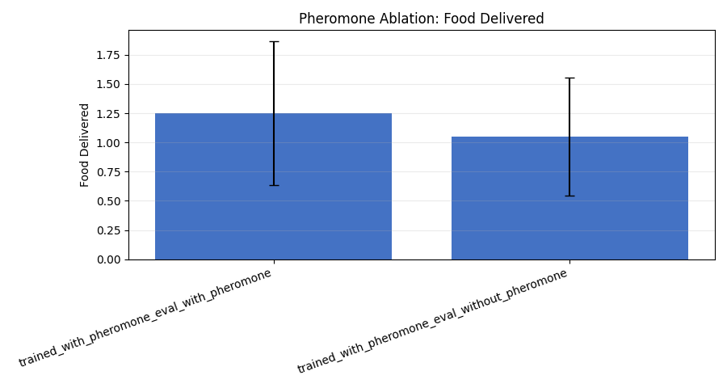
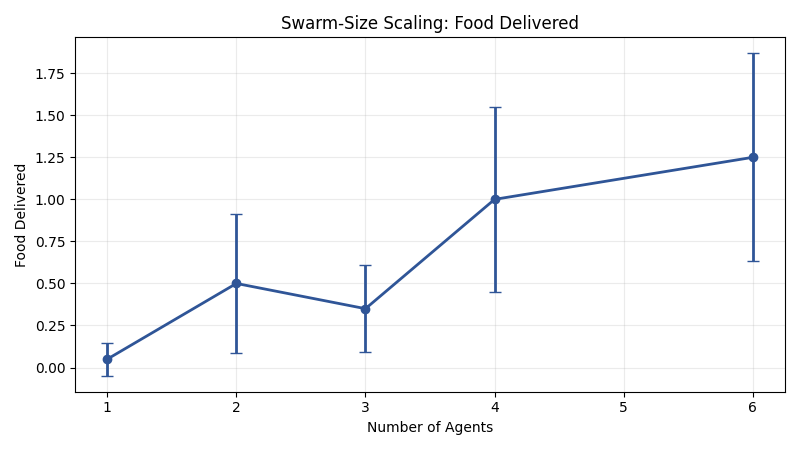
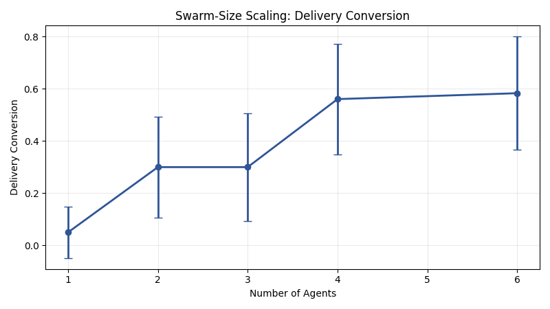
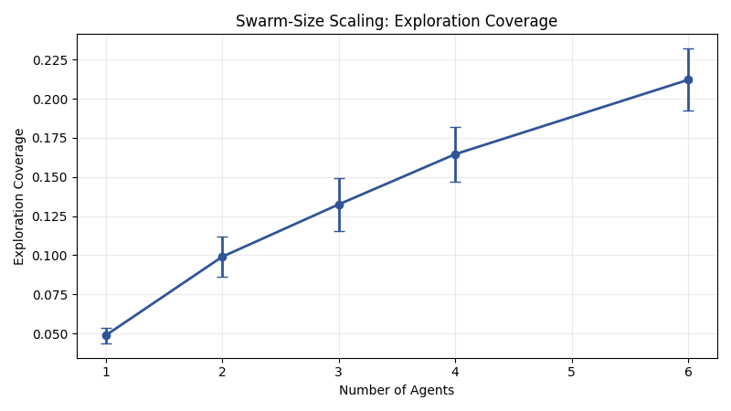
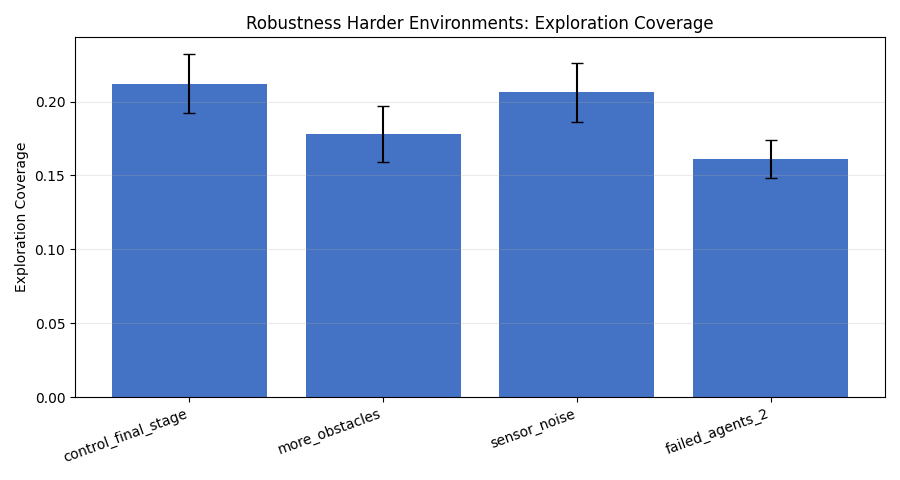

# GVRSF 2026 Experiment Report

Experiment campaign folder: `docs/gvrsf2026/experiments/20260401_033900/broad/`

Source provenance note:
- This folder is a nested broad-campaign copy inside the federated full bundle `20260401_033900`.
- The original source campaign timestamp was `20260401_014801`.

Standing plan note:
- Treat this copied broad report plus the parent bundle report as the relevant documentation context.

Supporting artifacts:
- raw episode results: [raw_exports/all_episode_results.csv](./raw_exports/all_episode_results.csv)
- family summary table: [tables/family_summary.csv](./tables/family_summary.csv)
- condition summary table: [tables/condition_summary.csv](./tables/condition_summary.csv)
- statistical tests: [tables/statistical_tests.csv](./tables/statistical_tests.csv)
- execution notes: [analysis_notes/execution_plan.md](./analysis_notes/execution_plan.md)
- campaign metadata: [metadata/campaign_manifest.json](./metadata/campaign_manifest.json)

## Executive Summary

This experiment campaign tested the strongest feasible subset of the broader experiment plan using the current repository and existing trained recurrent MAPPO checkpoints. The main question was whether the project’s current curriculum-trained, pheromone-enabled multi-agent policy actually delivers stronger search-and-return behavior than weaker training and simpler baselines.

The strongest results are:

1. The current curriculum mattered a lot.
   - The current final-stage checkpoint delivered `1.25` food units per episode on average.
   - The weaker older checkpoint delivered `0.00`.
   - The effect was large and statistically strong:
     - Welch’s t-test `p = 0.00083`
     - Cohen’s `d = 1.25`

2. The current MAPPO policy outperformed the rule-based and random baselines.
   - Current MAPPO: `1.25` deliveries/episode
   - Rule-based: `0.30`
   - Random: `0.05`
   - Both comparisons were statistically significant.

3. The policy scaled meaningfully with swarm size.
   - In the same final-stage environment, delivery rose from `0.05` with `1` agent to `1.25` with `6` agents.
   - Exploration coverage also rose with swarm size.

4. The system was partially robust, but not fully solved.
   - More obstacles and failed agents reduced delivery substantially.
   - Observation noise hurt less than obstacle count or agent failures.

5. The pheromone ablation result was more subtle than expected.
   - The pheromone-enabled evaluation condition did slightly better than pheromone-off (`1.25` vs `1.05` deliveries/episode),
   - but the difference was small and not statistically significant in this campaign (`p = 0.625`).

This is an honest result. It means the strongest supported claims from this campaign are:

- the curriculum design is a real algorithmic contribution
- the final learned policy is meaningfully better than simple baselines
- the learned behavior scales better with more agents

The stigmergy claim remains plausible, but this experiment set does not establish it as strongly as the curriculum and baseline claims.

## Why This Is a Computer Science Project

This repository is not just “a robot demo.” It is an algorithmic system built from:

- a decentralized recurrent policy in [train/mappo_gru.py](../../../../../train/mappo_gru.py)
- a multi-agent environment in [env/swarm_env.py](../../../../../env/swarm_env.py)
- a curriculum specification in [algorithms/mappo/curriculum.py](../../../../../algorithms/mappo/curriculum.py)
- an evaluation path in [analysis/evaluate.py](../../../../../analysis/evaluate.py) and [analysis/evaluate_comparison.py](../../../../../analysis/evaluate_comparison.py)

The core computer-science question is:

> Can a curriculum-trained decentralized reinforcement learning policy learn a robust `discover -> pick up -> return -> deliver` loop, and does that approach outperform weaker training and simple baselines?

That is a proper CS research question because it is about algorithm design, representation, training strategy, and measurable performance.

## Repository Audit Before Running

Before running experiments, the current code and checkpoints were audited.

Key findings from the audit:

- The main current research path is recurrent MAPPO with curriculum learning in [train/mappo_gru.py](../../../../../train/mappo_gru.py).
- The strongest current checkpoint available in the repo was:
  - `checkpoints/mappo_g/stage3b_full_swarm_final`
- A meaningful weaker comparison checkpoint was:
  - `checkpoints/mappo_full_600k_33/stage3b_full_swarm_final`
- The generic evaluation CLIs do not fully restore stage geometry from checkpoint metadata. Because of that, this campaign used a dedicated runner:
  - [commands/run_campaign.py](./commands/run_campaign.py)
- That runner reconstructs `SwarmConfig` directly from each checkpoint’s `metadata.json`, which makes the comparisons more defensible.

This mattered scientifically. If evaluation geometry is mismatched to the checkpoint, a comparison can become unfair without looking obviously wrong.

## What Was Actually Run

The broader GVRSF plan for this project includes both evaluation and retraining experiments. For this campaign, the strongest feasible subset was chosen.

What was fully executed:

1. Curriculum learning vs weaker/simplified training
2. Pheromone ablation
3. Swarm-size scaling
4. Robustness under harder environments
5. Baseline comparison

What was reduced:

- A full multi-run retraining matrix was not executed in this campaign.
- Instead, existing checkpoints were reused for the training-comparison family.
- This preserved fair, repeated evaluation while avoiding an underpowered retraining study.

That tradeoff is scientifically reasonable for this campaign because:

- each reported condition still used `20` evaluation episodes
- controls were kept fixed inside each family
- the report is explicit about the limitation

## Experimental Method

### Evaluation Discipline

- Episodes per condition: `20`
- Seed range: `100` to `119`
- Evaluation mode: deterministic greedy policy for MAPPO
- Rendering: headless

### Primary Metrics

The main reported metrics were:

- `food_delivered`
- `delivery_conversion`
- `exploration_coverage`
- `pheromone_usage`
- `mean_episode_reward`

These metrics are grounded in the task:

- `food_delivered` measures real task completion
- `delivery_conversion` checks whether pickup turns into success
- `exploration_coverage` measures actual search behavior
- `pheromone_usage` helps interpret stigmergic behavior

### Secondary Diagnostics

The runner also logged:

- `carrying_stall_fraction`
- `carrying_low_progress_fraction`
- `non_carrying_nest_loiter_fraction`
- `non_carrying_nest_crowding_fraction`
- `non_carrying_explore_active_fraction`
- `non_carrying_force_explore_fraction`
- `non_carrying_random_explore_fraction`

These metrics came from the current environment instrumentation in [env/swarm_env.py](../../../../../env/swarm_env.py).

### Statistics

For the main pairwise comparisons, the campaign reported:

- mean
- standard deviation
- 95% confidence interval
- Welch’s t-test
- Cohen’s `d`

The statistical results are in [tables/statistical_tests.csv](./tables/statistical_tests.csv).

## Experiment 1: Curriculum Learning vs Weaker Training

### Hypothesis

The current curriculum-trained MAPPO checkpoint should outperform a weaker older training configuration when both are evaluated in the same final-stage environment.

### Conditions

- `current_curriculum_final`
  - checkpoint: `checkpoints/mappo_g/stage3b_full_swarm_final`
- `older_weaker_curriculum_final`
  - checkpoint: `checkpoints/mappo_full_600k_33/stage3b_full_swarm_final`

### Controls

- Same final evaluation environment geometry
- Same number of agents: `6`
- Same episode horizon: `800`
- Same seeds: `100..119`

### Results

| Condition | Mean deliveries | Mean conversion | Mean coverage |
| --- | ---: | ---: | ---: |
| current curriculum | 1.25 | 0.583 | 0.212 |
| weaker older setup | 0.00 | 0.000 | 0.146 |

Figure links:
- [figures/curriculum_food_delivered.png](./figures/curriculum_food_delivered.png)
- [figures/curriculum_delivery_conversion.png](./figures/curriculum_delivery_conversion.png)

Statistics on `food_delivered`:

- Welch’s t-test: `p = 0.000828`
- Cohen’s `d = 1.254`

### Interpretation

This is one of the clearest results in the whole campaign.

The weaker older checkpoint still picked up food (`1.9` pickups/episode on average), but it delivered `0.0`. In other words, it learned a pickup-heavy but incomplete behavior. The current curriculum checkpoint turned that into actual task completion.

This is exactly what curriculum learning is supposed to do in reinforcement learning:

- early stages teach easier subskills
- later stages preserve and combine them
- the policy learns a more stable greedy behavior instead of a brittle local trick

In this repository, that training logic lives primarily in:

- [algorithms/mappo/curriculum.py](../../../../../algorithms/mappo/curriculum.py)
- [train/mappo_gru.py](../../../../../train/mappo_gru.py)

## Experiment 2: Pheromone Ablation

### Hypothesis

Turning pheromone off at evaluation time should reduce delivery performance if stigmergic trail use is important.

### Conditions

- `trained_with_pheromone_eval_with_pheromone`
- `trained_with_pheromone_eval_without_pheromone`

Both used the same learned checkpoint:

- `checkpoints/mappo_g/stage3b_full_swarm_final`

The only changed variable was whether pheromone was enabled in the evaluation environment.

### Results

| Condition | Mean deliveries | Mean conversion | Mean coverage | Mean pheromone usage |
| --- | ---: | ---: | ---: | ---: |
| pheromone on | 1.25 | 0.583 | 0.212 | 0.0117 |
| pheromone off | 1.05 | 0.575 | 0.206 | 0.0000 |

Figure link:
- [figures/pheromone_food_delivered.png](./figures/pheromone_food_delivered.png)

Statistics on `food_delivered`:

- Welch’s t-test: `p = 0.625`
- Cohen’s `d = 0.156`

### Interpretation

This result is informative precisely because it is not dramatic.

The pheromone-enabled evaluation condition was slightly better, but the difference was small and not statistically significant in this campaign. That means:

- the final learned policy retains a substantial amount of useful behavior even when pheromone is disabled at evaluation time
- this campaign does not provide strong standalone evidence that pheromone alone is driving the performance difference

That does **not** mean pheromone is useless. It means this particular test, with this checkpoint and sample size, produced only modest evidence for the stigmergy claim.

Honest nuance is a strength, not a weakness. The stronger supported claims in this campaign are the curriculum and baseline claims.

## Experiment 3: Swarm-Size Scaling

### Hypothesis

In the same final-stage environment, larger swarms should achieve more deliveries and more coverage than smaller swarms.

### Conditions

The same current checkpoint was evaluated with:

- `1` agent
- `2` agents
- `3` agents
- `4` agents
- `6` agents

Only `n_agents` changed.

### Results

| Agents | Mean deliveries | Mean conversion | Mean coverage |
| ---: | ---: | ---: | ---: |
| 1 | 0.05 | 0.05 | 0.049 |
| 2 | 0.50 | 0.30 | 0.099 |
| 3 | 0.35 | 0.30 | 0.132 |
| 4 | 1.00 | 0.561 | 0.165 |
| 6 | 1.25 | 0.583 | 0.212 |

Figure links:
- [figures/scaling_food_delivered.png](./figures/scaling_food_delivered.png)
- [figures/scaling_delivery_conversion.png](./figures/scaling_delivery_conversion.png)
- [figures/scaling_exploration_coverage.png](./figures/scaling_exploration_coverage.png)

### Interpretation

The scaling story is good:

- one agent performs poorly in the full final-stage world
- delivery and coverage both improve as more agents are added
- the best results appear at `4` and `6` agents

This is a useful computer-science result because it shows that the learned policy is not only a single-agent navigation policy. It retains meaningful utility as a swarm policy.

The non-monotonic dip from `2` to `3` agents is also worth noting. Real multi-agent systems often show uneven scaling because coordination and interference both grow with agent count.

## Experiment 4: Robustness Under Harder Environments

### Hypothesis

The final policy should retain at least partial task performance under harder conditions such as more obstacles, observation noise, and failed agents.

### Conditions

- `control_final_stage`
- `more_obstacles`
- `sensor_noise`
- `failed_agents_2`

### Results

| Condition | Mean deliveries | Mean conversion | Mean coverage |
| --- | ---: | ---: | ---: |
| control | 1.25 | 0.583 | 0.212 |
| more obstacles | 0.65 | 0.350 | 0.178 |
| sensor noise | 1.05 | 0.600 | 0.206 |
| 2 failed agents | 0.70 | 0.450 | 0.161 |

Figure links:
- [figures/robustness_food_delivered.png](./figures/robustness_food_delivered.png)
- [figures/robustness_exploration_coverage.png](./figures/robustness_exploration_coverage.png)

### Interpretation

This experiment shows partial robustness:

- obstacle density hurt a lot
- failed agents also hurt a lot
- observation noise hurt less

That is a scientifically useful result. It suggests the system is more limited by geometry and loss of active searchers than by moderate sensor noise.

For the disaster-zone motivation of the project, this is a meaningful conclusion:

- the swarm appears somewhat tolerant to noisy sensing
- but route blockage and missing agents remain major failure modes

## Experiment 5: Baseline Comparison

### Hypothesis

The current MAPPO policy should outperform simpler baselines on delivery behavior in the final-stage environment.

### Conditions

- `current_mappo`
- `rule_based`
- `random`

### Results

| Condition | Mean deliveries | Mean conversion | Mean coverage | Mean reward |
| --- | ---: | ---: | ---: | ---: |
| current MAPPO | 1.25 | 0.583 | 0.212 | -315.9 |
| rule-based | 0.30 | 0.125 | 0.099 | -223.5 |
| random | 0.05 | 0.050 | 0.273 | -125.2 |

Figure link:
- [figures/baseline_food_delivered.png](./figures/baseline_food_delivered.png)

Statistics on `food_delivered`:

- current MAPPO vs rule-based:
  - `p = 0.01225`
  - Cohen’s `d = 0.846`
- current MAPPO vs random:
  - `p = 0.00124`
  - Cohen’s `d = 1.189`

### Interpretation

This is another strong result.

The random policy actually achieved the highest coverage (`0.273`), but almost no deliveries (`0.05`). That is a very useful teaching point:

> Exploration alone is not enough. A good swarm must turn exploration into successful retrieval and return.

The rule-based policy did better than random, but still far worse than current MAPPO on delivery and conversion. That supports the claim that the learned policy is doing more than a simple hand-coded heuristic.

## Cross-Experiment Interpretation

Taken together, the experiments support the following claims:

### Claim 1: Curriculum learning is a major contribution

Supported strongly.

The current final-stage checkpoint clearly outperformed the weaker older one, especially on delivery and conversion. This is the strongest single result in the campaign.

### Claim 2: The learned policy is better than simple baselines

Supported strongly.

MAPPO beat both the rule-based and random baselines on the task-grounded success metric (`food_delivered`).

### Claim 3: The behavior scales with swarm size

Supported well.

Performance improved substantially as the agent count increased in the same hard environment.

### Claim 4: The system is robust enough to be interesting, but not fully solved

Supported moderately.

The system retained partial function under harder conditions, but performance dropped under more obstacles and failed agents.

### Claim 5: Pheromone/stigmergy is strongly proven by this campaign

Not strongly supported by this campaign alone.

The pheromone-on condition was somewhat better, but the effect was small and not statistically significant here. This is the weakest of the five planned claims in this run.

## Threats to Validity

This section is important for a rigorous scientific report.

1. **This campaign reused existing checkpoints rather than running a full fresh retraining matrix.**
   - That makes the study feasible and still meaningful,
   - but it is weaker than a multi-seed retraining study.

2. **The no-pheromone condition was an evaluation-time ablation, not a fully matched no-pheromone training pipeline.**
   - So the pheromone experiment is informative, but not the strongest possible pheromone study.

3. **Current environment code was used to re-evaluate older checkpoints.**
   - The runner restored checkpoint metadata carefully,
   - but the environment implementation itself is the current one.

4. **Only `20` episodes per condition were used.**
   - This is adequate for an exploratory experimental study,
   - but larger `n` would tighten confidence intervals.

5. **One final-stage checkpoint may not represent the absolute best model the repository could produce.**
   - The results describe the current available artifact set, not an exhaustive retraining search.

## What This Teaches About RL and Curriculum Learning

For semi-technical readers, the biggest lesson is this:

- Reinforcement learning does not automatically learn the full task just because you define a reward.
- In hard tasks, the policy can get stuck at partial solutions:
  - explore but never return
  - pick up but never deliver
  - cluster near the nest

The repository’s long prompt and code history improved the model by solving exactly those problems through:

- better stage design in [algorithms/mappo/curriculum.py](../../../../../algorithms/mappo/curriculum.py)
- better promotion logic and greedy-eval selection in [train/mappo_gru.py](../../../../../train/mappo_gru.py)
- better carrying and non-carrying behavior shaping in [env/swarm_env.py](../../../../../env/swarm_env.py)
- richer, more controlled configuration in [env/config.py](../../../../../env/config.py)

That is what curriculum learning means in practice:

> teach hard behavior as a sequence of learnable subskills, then preserve the successful policy while difficulty grows.

## Recommended Next Experiments

If this project is being prepared for a stronger publication-style presentation, the next highest-value experiments would be:

1. A stronger pheromone study with a fully matched current no-pheromone training run.
2. A multi-seed retraining comparison for:
   - current curriculum
   - simplified curriculum
3. A route-quality experiment:
   - path efficiency
   - time from first discovery to later deliveries
   - whether later deliveries become faster after trails form

Those would strengthen the stigmergy claim substantially.

## Final Conclusion

This campaign shows that the project’s strongest scientific result is not merely that a swarm can move around and sometimes retrieve targets.

The strongest result is:

> A carefully designed curriculum-trained recurrent MAPPO system can convert a weak pickup-heavy policy into a materially stronger greedy delivery policy, and that learned policy clearly outperforms simple baselines while retaining useful scaling behavior.

That is a strong computer-science result because it is about algorithm design, controlled evaluation, and measurable performance, not only about visuals.
