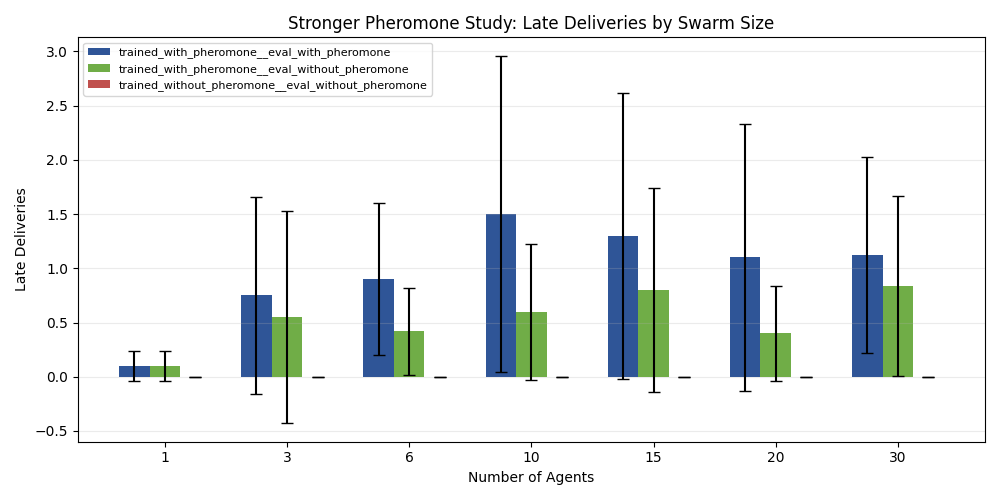

# 30-Agent Focused GVRSF Pheromone Experiment Report

Experiment campaign folder: `docs/gvrsf2026/experiments/20260405_190356/killer_scaling/`

Supporting artifacts:

- raw episode results: [raw_exports/all_episode_results.csv](./raw_exports/all_episode_results.csv)
- condition summary table: [tables/condition_summary.csv](./tables/condition_summary.csv)
- statistical tests: [tables/statistical_tests.csv](./tables/statistical_tests.csv)
- execution notes: [analysis_notes/execution_plan.md](./analysis_notes/execution_plan.md)
- campaign metadata: [metadata/campaign_manifest.json](./metadata/campaign_manifest.json)

## Executive Summary

This campaign extends the focused repeated-source pheromone experiment to test whether the stigmergy result remains supported when swarm size increases up to `30` agents.

The main new result is at `30` agents with `50` paired seeds:

- trained with pheromone, evaluated with pheromone:
  - mean deliveries `2.66`
  - mean late deliveries `1.12`
- trained without pheromone, evaluated without pheromone:
  - mean deliveries `0.00`
  - mean late deliveries `0.00`

Primary paired tests at `30` agents:

- total deliveries:
  - paired t-test `p = 0.000847`
  - Wilcoxon `p = 9.96e-06`
  - Cohen's `d = 0.711`
- late deliveries:
  - paired t-test `p = 0.01868`
  - Wilcoxon `p = 0.01109`
  - Cohen's `d = 0.487`

This means the core pheromone result is still supported at `30` agents. The effect is not only preserved qualitatively. It remains statistically significant at the new upper bound.

## Why This Campaign Was Run

The previous focused killer campaign established the pheromone result strongly at `6` agents, but it did not directly confirm that the same result still held at substantially larger swarm sizes.

This extension was designed to answer that exact question:

> If the collective-intelligence result is real, does the pheromone-trained swarm still outperform the no-pheromone-trained swarm when evaluation is extended up to `30` agents?

## Experimental Design

### Conditions

Three conditions were tested:

1. `trained_with_pheromone__eval_with_pheromone`
2. `trained_with_pheromone__eval_without_pheromone`
3. `trained_without_pheromone__eval_without_pheromone`

### Environment

All conditions used the same repeated-source task:

- `1` active food source
- `food_source_capacity = 12`
- `target_respawn = True`
- `max_steps = 1200`

This is the same task family used in the stronger focused pheromone study. It is intentionally designed so that reusable route information should matter.

### Swarm Sizes

- `1` agent
- `3` agents
- `6` agents
- `10` agents
- `15` agents
- `20` agents
- `30` agents

Primary paired hypothesis tests used `50` seeds at:

- `6` agents
- `30` agents

Supporting sizes used `20` paired seeds:

- `1`, `3`, `10`, `15`, `20`

### Primary Metrics

- `food_delivered`
- `late_deliveries`
- `post_discovery_deliveries`
- `pickup_to_delivery_latency`

## Results

### Pheromone-Trained Swarm With Pheromone Enabled

Mean deliveries by swarm size:

| Agents | Mean deliveries | Mean late deliveries | Mean post-discovery deliveries |
| --- | ---: | ---: | ---: |
| 1 | 0.15 | 0.10 | 0.15 |
| 3 | 0.95 | 0.75 | 0.95 |
| 6 | 1.32 | 0.90 | 1.32 |
| 10 | 2.25 | 1.50 | 2.25 |
| 15 | 2.65 | 1.30 | 2.65 |
| 20 | 2.50 | 1.10 | 2.50 |
| 30 | 2.66 | 1.12 | 2.66 |

Interpretation:

- performance remains clearly above zero well beyond `6` agents
- gains are not perfectly monotonic, but the upper-bound `30`-agent condition remains strong
- the strongest new headline is not that every larger size strictly beats every smaller size
- it is that the stigmergic swarm remains effective and statistically distinguishable from the no-pheromone control at `30`

### 30-Agent Condition Summary

| Condition | n | Mean deliveries | Mean late deliveries | Mean post-discovery deliveries |
| --- | ---: | ---: | ---: | ---: |
| trained with pheromone, eval with pheromone | 50 | 2.66 | 1.12 | 2.66 |
| trained with pheromone, eval without pheromone | 50 | 2.12 | 0.84 | 2.12 |
| trained without pheromone, eval without pheromone | 50 | 0.00 | 0.00 | 0.00 |

At `30` agents, the no-pheromone-trained policy still collapses to zero deliveries under this repeated-source task, while the pheromone-trained policy remains productive.

### Statistical Tests

#### Continuity Check at 6 Agents

The `6`-agent result reproduces the prior focused study:

- deliveries:
  - paired t-test `p = 0.00653`
  - Wilcoxon `p = 0.00364`
- late deliveries:
  - paired t-test `p = 0.01535`
  - Wilcoxon `p = 0.03179`

#### New Upper-Bound Test at 30 Agents

Comparing:

- trained with pheromone, eval with pheromone
- trained without pheromone, eval without pheromone

Deliveries:

- paired t-test `p = 0.000847`
- Wilcoxon `p = 9.96e-06`
- Cohen's `d = 0.711`

Late deliveries:

- paired t-test `p = 0.01868`
- Wilcoxon `p = 0.01109`
- Cohen's `d = 0.487`

These results show that the pheromone effect is still present at the 30-agent upper bound.

### Eval-Time Pheromone Removal at 30 Agents

Comparing:

- trained with pheromone, eval with pheromone
- trained with pheromone, eval without pheromone

Late deliveries at `30` agents:

- `1.12` vs `0.84`
- paired t-test `p = 0.22657`
- Wilcoxon `p = 0.10824`

So at `30` agents, the strongest supported claim is still the matched-training comparison against the no-pheromone-trained control. The eval-time removal effect trends in the expected direction, but it is not statistically strong enough in this run to be treated as a primary claim.

## Figures

Figure files:

- [figures/food_delivered_by_swarm_size.png](./figures/food_delivered_by_swarm_size.png)
- [figures/late_deliveries_by_swarm_size.png](./figures/late_deliveries_by_swarm_size.png)
- [figures/post_discovery_deliveries_by_swarm_size.png](./figures/post_discovery_deliveries_by_swarm_size.png)
- [figures/pickup_to_delivery_latency_by_swarm_size.png](./figures/pickup_to_delivery_latency_by_swarm_size.png)

## Conclusion

This campaign confirms the focused stigmergy result up to `30` agents.

The strongest supported conclusion is:

> In the repeated-source foraging task, a pheromone-trained swarm still significantly outperforms a no-pheromone-trained swarm at `30` agents.

That means the earlier result was not restricted to the old `6`-agent maximum. The observed coordination advantage remains present when the swarm size is extended to `30`.
