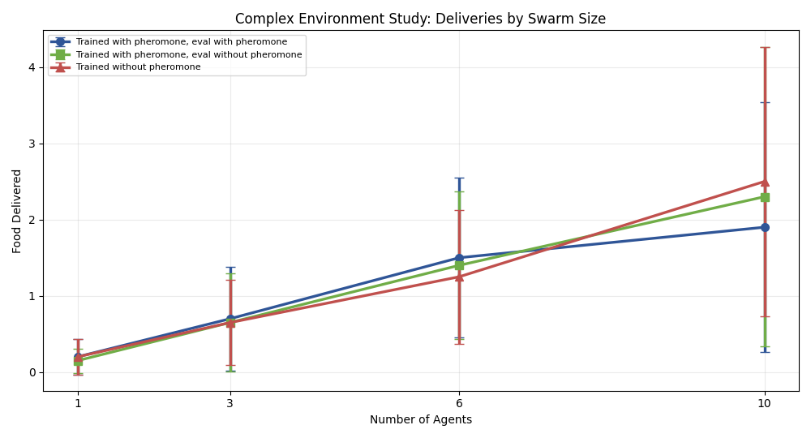
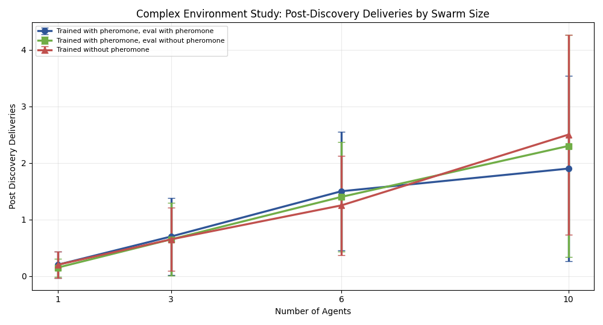
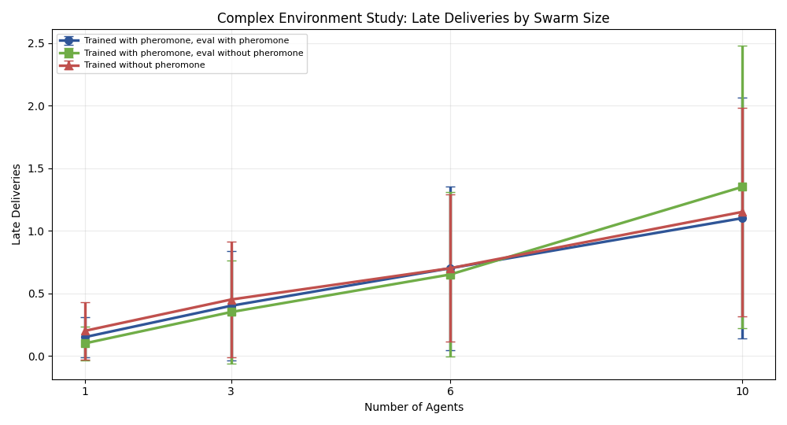

# Complex-Environment Stigmergy Study

## Stage max_10

**Experiment bundle folder:** `docs/gvrsf2026/experiments/20260407_030407/`
**Primary report:** [report.md](./report.md)

## Abstract

This paper evaluates the hypothesis that pheromone-based coordination becomes more useful in a more complex repeated-source environment. Using same-curriculum matched checkpoints and `20` paired seeds per condition, the study compares three conditions across swarm sizes `1`, `3`, `6`, and `10`.

At `10` agents, the pheromone-enabled condition reached mean `food_delivered = 1.90` compared with `2.30` for trained-with-pheromone but evaluated without pheromone and `2.50` for the true no-pheromone matched control. The paired comparison against the true no-pheromone control gave `p = 0.280` for `food_delivered` and `p = 0.280` for `post_discovery_deliveries`. By the predeclared rule, the stage is **not promising**.

## Main Comparison

## Extension Decision

The predeclared recommendation from this stage is to **stop at max_10 and do not extend**.
