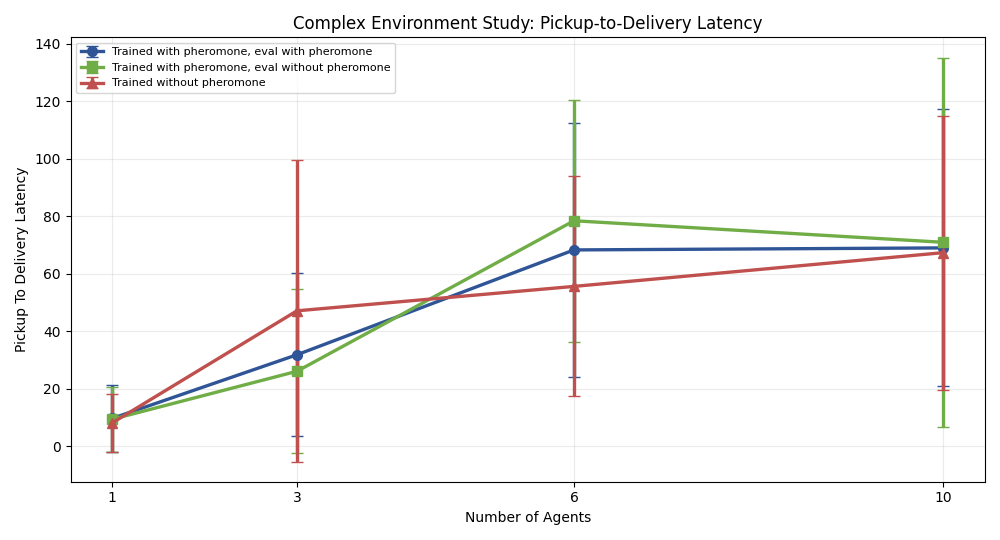

# Complex Environment Hypothesis Report: Stage max_10

## Bundle

**Bundle folder:** `docs/gvrsf2026/experiments/20260407_030407/`

## Abstract

This bundle tests the hypothesis that a more complex repeated-source environment makes pheromone-based stigmergy more valuable. The study uses same-curriculum matched checkpoints, one repeated source, higher obstacle count, farther target placement, a longer horizon, and swarm sizes `1`, `3`, `6`, and `10` with `20` paired seeds per condition.

At `10` agents, the pheromone-enabled condition reached mean `food_delivered = 1.90` versus `2.30` for trained-with-pheromone but eval-without-pheromone and `2.50` for the true no-pheromone matched control. The paired test against the true no-pheromone control gave `p = 0.280` for `food_delivered` and `p = 0.280` for `post_discovery_deliveries`. By the predeclared extension rule, this stage is **not promising**, so the recommendation is: **stop at max_10 and do not extend**.

## Design

- same-curriculum matched checkpoints
- one repeated source
- `food_source_capacity = 15`
- `n_obstacles = 24`
- `max_steps = 1400`
- target constrained farther from the nest
- swarm sizes: `1`, `3`, `6`, `10`
- conditions:
  - trained with pheromone, eval with pheromone
  - trained with pheromone, eval without pheromone
  - trained without pheromone, eval without pheromone

## Figures

## `10`-Agent Checkpoint For Extension Decision

- with pheromone: `food_delivered = 1.90`
- trained with pheromone, eval without pheromone: `food_delivered = 2.30`
- true no-pheromone control: `food_delivered = 2.50`
- paired `food_delivered` vs true no-pheromone:
  - `p = 0.280`
  - `cohens_d = -0.154`
- paired `post_discovery_deliveries` vs true no-pheromone:
  - `p = 0.280`
  - `cohens_d = -0.154`

## Conclusion

This stage is **not promising** under the predeclared extension rule. The next action is to **stop at max_10 and do not extend**.
