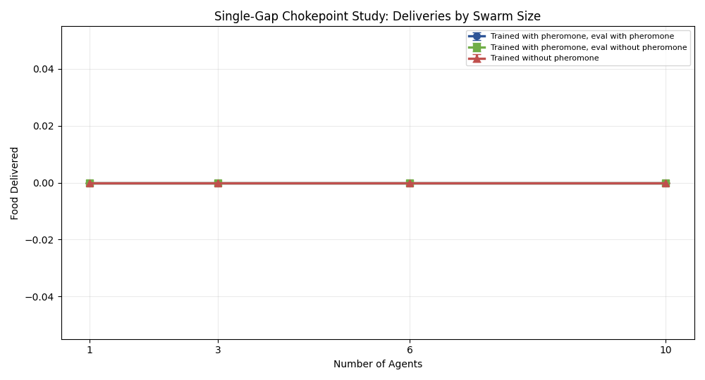
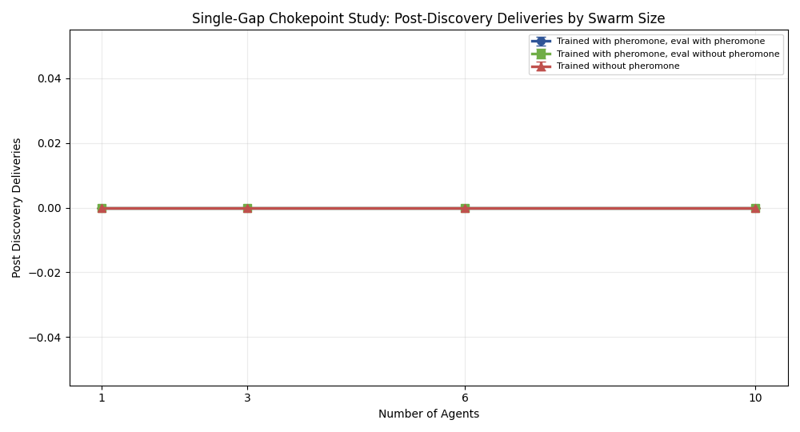

# Single-Gap Chokepoint Stigmergy Study

## Stage max_10

**Experiment bundle folder:** `docs/gvrsf2026/experiments/20260407_032817/`
**Primary report:** [report.md](./report.md)

## Abstract

This paper evaluates whether pheromone-based coordination becomes more useful when the swarm must repeatedly traverse a single chokepoint route. Using same-curriculum matched checkpoints and `20` paired seeds per condition, the study compares three conditions across swarm sizes `1`, `3`, `6`, and `10`.

At `10` agents, the pheromone-enabled condition reached mean `food_delivered = 0.00` compared with `0.00` for trained-with-pheromone but evaluated without pheromone and `0.00` for the true no-pheromone matched control. The paired comparison against the true no-pheromone control gave `p = nan` for `food_delivered` and `p = nan` for `post_discovery_deliveries`. By the predeclared rule, the stage is **not promising**.

## Main Comparison

## Extension Decision

The predeclared recommendation from this stage is to **stop at max_10 and do not extend**.
