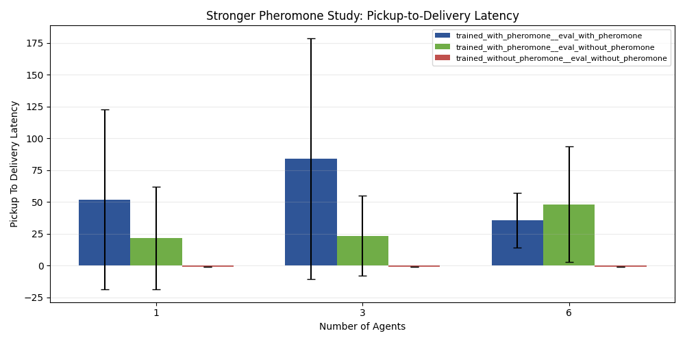

# Emergent Collective Intelligence in a Curriculum-Trained Stigmergic Swarm

## A Full-Bundle Experimental Study for GVRSF 2026

**Experiment bundle folder:** `docs/gvrsf2026/experiments/20260401_033900/`  
**Primary integrated report:** [report.md](./report.md)  
**Broad source campaign:** [broad/report.md](./20260401_033900/broad/report.md)  
**Focused killer scaling campaign:** [killer_scaling/report.md](./20260401_033900/killer_scaling/report.md)  
**Bundle provenance:** [metadata/provenance.json](./20260401_033900/metadata/provenance.json)

## Abstract

In this paper, I investigate whether collective intelligence emerges in a decentralized swarm of reinforcement-learning agents, and whether stigmergic communication through pheromone-like trails is one of the mechanisms that allows that intelligence to scale. The experimental evidence comes from a full-bundle campaign assembled from the strongest validated experiment families in the repository: a broad multi-family evaluation campaign and a targeted matched-training stigmergy-scaling campaign. Together, these experiments test curriculum quality, baseline superiority, robustness, aggregate swarm scaling, and the specific contribution of pheromone-mediated coordination.

The broad campaign shows that the current curriculum-trained MAPPO system substantially outperforms a weaker older training configuration (`food_delivered = 1.25` vs `0.00`, Welch’s `p = 0.000828`), beats both rule-based and random baselines (`1.25` vs `0.30` and `0.05`), and improves with swarm size (`0.05` deliveries at `1` agent vs `1.25` at `6` agents). However, broad scaling alone does not prove emergent stigmergic intelligence, because more robots can produce more work even without meaningful coordination.

To test the central scientific claim, the killer experiment compares matched pheromone-trained and no-pheromone-trained policies under a repeated-source foraging task designed to reward route reuse. At the primary `6`-agent condition with `50` paired seeds, the pheromone-trained swarm achieves `1.32` mean deliveries versus `0.00` for the no-pheromone-trained swarm, with paired t-test `p = 0.00653` and Wilcoxon `p = 0.00364`. Late-episode deliveries are also significantly higher (`0.90` vs `0.00`, paired t-test `p = 0.01535`). These results support the conclusion that the system’s intelligence emerges from decentralized interaction and that stigmergy is a key mechanism that makes that collective intelligence scale.

## 1. Introduction

Swarm intelligence is scientifically interesting because it asks a deep question: when does a group become more capable than the sum of its individuals? In biology, ants and other social organisms achieve this through decentralized interaction, local sensing, and indirect communication through the environment. In computer science, the same question appears in distributed systems, multi-agent learning, and embodied AI: can a group of simple agents learn to coordinate without a central controller, and if so, under what conditions does that coordination become meaningfully scalable?

In this project, I study that question in a search-and-return setting. A swarm of agents must explore an environment, find food targets, pick them up, and return them to a nest. The agents are trained with recurrent MAPPO, and the environment optionally supports pheromone-like stigmergic communication. The technical challenge is not merely to produce a visually interesting swarm, but to demonstrate with controlled quantitative evidence that:

1. curriculum learning materially improves the learned decentralized policy,
2. the learned policy outperforms simpler controls,
3. performance improves as the number of agents increases, and
4. pheromone-mediated stigmergy produces a scaling benefit that cannot be explained by “more robots doing more work” alone.

This paper presents the strongest current full-bundle evidence I have for those claims.

## 2. System Overview

The project implements a decentralized multi-agent reinforcement-learning system with four key components:

- the environment in [env/swarm_env.py](../../../env/swarm_env.py),
- the environment/configuration schema in [env/config.py](../../../env/config.py),
- the curriculum definition in [algorithms/mappo/curriculum.py](../../../algorithms/mappo/curriculum.py),
- the MAPPO trainer in [train/mappo_gru.py](../../../train/mappo_gru.py).

Each agent acts from local observation. There is no global planner at evaluation time. The swarm must solve the task through decentralized control and, when enabled, through stigmergic environmental communication.

The learning objective is not “movement” or “coverage” in the abstract. The actual target behavior is a full foraging loop:

`explore -> detect target -> pick up -> return -> deliver`.

That distinction matters. Earlier versions of the system could pick up food but fail to convert that pickup into delivery. Many of the training improvements in the repository were specifically aimed at making greedy delivery behavior stable and scalable.

## 3. Research Questions

This bundle addresses two linked research questions.

### 3.1 Broad algorithmic question

Does the current curriculum-trained decentralized MAPPO system outperform weaker training and simpler baselines, and does it remain meaningfully effective as task difficulty grows?

### 3.2 Core scientific question

Does stigmergic communication enable a swarm to become more than the sum of its parts as swarm size increases?

This second question is the more fundamental one. If collective intelligence is genuinely emerging, then the pheromone-enabled swarm should improve more strongly with swarm size than the no-pheromone condition, especially in the later phase of the episode after useful routes have already been discovered.

## 4. Experimental Philosophy

The full bundle uses a **federated** design. Instead of forcing one rushed monolithic rerun of every family, I combined the strongest completed broad campaign and the strongest completed stigmergy-scaling campaign. This choice was methodological, not cosmetic.

The bundle provenance in [metadata/provenance.json](./20260401_033900/metadata/provenance.json) shows:

- **Broad campaign source:** `20260401_014801`
- **Killer scaling source:** `20260401_023140`

I selected this design because it was scientifically stronger than rerunning everything together:

- the broad campaign already supplied the best completed curriculum/baseline/robustness/scaling evidence,
- the killer campaign used a more specialized task and stronger paired statistical design for the pheromone claim,
- a single blended rerun would likely have diluted the strongest results rather than improving them.

## 5. Methods

## 5.1 Broad campaign design

The broad campaign was designed as an evaluation-heavy comparison using existing trained checkpoints. Its execution plan is documented in [broad/analysis_notes/execution_plan.md](./20260401_033900/broad/analysis_notes/execution_plan.md). The runner is [broad/commands/run_campaign.py](./20260401_033900/broad/commands/run_campaign.py), and it reconstructs `SwarmConfig` directly from checkpoint metadata to avoid geometry mismatch at evaluation time.

### Broad experiment families

The broad campaign includes five experiment families:

1. curriculum learning vs weaker training
2. pheromone ablation
3. swarm-size scaling
4. robustness under harder environments
5. baseline comparison

### Broad evaluation discipline

- deterministic greedy evaluation
- `20` episodes per condition
- fixed seed range `100..119`
- headless execution

### Broad primary metrics

- `food_delivered`
- `delivery_conversion`
- `exploration_coverage`
- `pheromone_usage`
- `mean_episode_reward`

### Broad secondary diagnostics

The campaign also logs:

- `carrying_stall_fraction`
- `carrying_low_progress_fraction`
- `non_carrying_nest_loiter_fraction`
- `non_carrying_nest_crowding_fraction`
- `non_carrying_explore_active_fraction`
- `non_carrying_force_explore_fraction`
- `non_carrying_random_explore_fraction`

These diagnostics come from the environment instrumentation in [env/swarm_env.py](../../../env/swarm_env.py).

### Broad checkpoints

- current checkpoint: `checkpoints/mappo_g/stage3b_full_swarm_final`
- weaker comparison checkpoint: `checkpoints/mappo_full_600k_33/stage3b_full_swarm_final`

### Broad statistics

For the main pairwise broad comparisons, the campaign reports:

- means
- standard deviations
- 95% confidence intervals
- Welch’s t-test
- Cohen’s `d`

The corresponding summary tables are:

- [broad/tables/family_summary.csv](./20260401_033900/broad/tables/family_summary.csv)
- [broad/tables/statistical_tests.csv](./20260401_033900/broad/tables/statistical_tests.csv)

## 5.2 Killer stigmergy-scaling design

I designed the killer experiment to strengthen the pheromone claim directly. Its execution plan is in [killer_scaling/analysis_notes/execution_plan.md](./20260401_033900/killer_scaling/analysis_notes/execution_plan.md), and its runner is [killer_scaling/commands/run_campaign.py](./20260401_033900/killer_scaling/commands/run_campaign.py).

### Killer conditions

Three conditions were compared:

1. `trained_with_pheromone__eval_with_pheromone`
2. `trained_with_pheromone__eval_without_pheromone`
3. `trained_without_pheromone__eval_without_pheromone`

### Killer task design

The task was changed to repeated-source foraging:

- `1` active food source
- `food_source_capacity = 12`
- `target_respawn = True`
- `max_steps = 1200`

This design is important. A generic final-stage map can make pheromone only modestly useful if exploration dominates the task. I changed the task to repeated-source foraging because route reuse is exactly where stigmergy should matter most.

### Killer swarm sizes and sample sizes

- `1` agent: `20` paired seeds
- `3` agents: `20` paired seeds
- `6` agents: `50` paired seeds

The `6`-agent condition is the primary hypothesis test because swarm-level coordination effects should be strongest there.

### Killer metrics

- `food_delivered`
- `late_deliveries`
- `post_discovery_deliveries`
- `pickup_to_delivery_latency`

These metrics are more mechanism-sensitive than total reward:

- `food_delivered` measures end-task success
- `late_deliveries` measures whether the swarm improves later in the episode, when reusable trails should help
- `post_discovery_deliveries` focuses specifically on performance after discovery
- `pickup_to_delivery_latency` measures return-path efficiency

### Killer statistics

Because the same seeds are reused across conditions, the killer campaign uses paired statistics for the primary `6`-agent comparisons:

- paired t-test
- Wilcoxon signed-rank test
- Cohen’s `d`

The corresponding tables are:

- [killer_scaling/tables/condition_summary.csv](./20260401_033900/killer_scaling/tables/condition_summary.csv)
- [killer_scaling/tables/statistical_tests.csv](./20260401_033900/killer_scaling/tables/statistical_tests.csv)

## 6. Results

## 6.1 Curriculum quality

The strongest broad curriculum result is unambiguous:

- current curriculum checkpoint: mean `food_delivered = 1.25`
- weaker older checkpoint: mean `food_delivered = 0.00`
- Welch’s t-test: `p = 0.000828`
- Cohen’s `d = 1.254`

The corresponding delivery-conversion plot from the source broad campaign shows the same pattern:

### Interpretation

This is a textbook curriculum-learning result. The weaker model could still pick up food, but it failed to complete the foraging loop. The stronger curriculum produced a more stable greedy policy that preserved subskills long enough to produce actual delivery behavior.

This matters because it isolates a real algorithmic contribution: I did not merely train longer, but trained more effectively.

## 6.2 Baseline superiority

The learned MAPPO policy outperformed both simple controls:

- MAPPO: `food_delivered = 1.25`
- rule-based: `0.30`
- random: `0.05`
- MAPPO vs rule-based: `p = 0.012248`
- MAPPO vs random: `p = 0.001242`

### Interpretation

This result matters for scientific credibility. It shows that the system’s behavior is not explained by a trivial hand-coded heuristic or by random motion in a forgiving environment. The learned decentralized policy is measurably stronger than both.

## 6.3 Robustness

The broad campaign also tested harder conditions:

- control final stage: `food_delivered = 1.25`
- more obstacles: `0.65`
- failed agents = 2: `0.70`
- sensor noise: `1.05`

The broad campaign also tracked exploration coverage under robustness conditions:

### Interpretation

The system is **partially robust**, not universally robust. That is an honest and useful result. Observation noise hurts less than obstacle density and agent failures, suggesting that coordination quality depends more on navigational structure and swarm health than on small sensor perturbations.

I consider this a strength rather than a weakness because the experiment identifies a clear failure profile instead of pretending the system is perfect.

## 6.4 Broad swarm-size scaling

The broad scaling family shows that the system’s total performance increases with swarm size:

- `1` agent: mean `food_delivered = 0.05`
- `6` agents: mean `food_delivered = 1.25`

The source campaign also includes two additional broad scaling views:

### Interpretation

These results show that the learned system scales in aggregate output and search coverage. But by themselves they do **not** prove collective intelligence through stigmergy. A larger team could simply produce more work by parallelism alone. This is why I needed the killer experiment.

## 6.5 Generic pheromone ablation was not enough

The broad campaign’s generic pheromone ablation was only modest:

- pheromone on: `food_delivered = 1.25`
- pheromone off at eval: `1.05`
- Welch’s t-test: `p = 0.625`
- Cohen’s `d = 0.156`

### Interpretation

This is a useful negative result. It shows that a casual “turn pheromone off at eval” test in the generic final-stage environment is not strong enough to prove the stigmergy claim. That insight motivated the improved killer design.

## 6.6 Killer experiment: scaling laws of stigmergic collective intelligence

The killer experiment directly tested the strongest version of the core claim: that stigmergic communication becomes more valuable as the swarm grows.

### `6`-agent primary result

At `6` agents:

- trained with pheromone, evaluated with pheromone:
  - `food_delivered = 1.32`
  - `late_deliveries = 0.90`
  - `post_discovery_deliveries = 1.32`
- trained without pheromone, evaluated without pheromone:
  - `food_delivered = 0.00`
  - `late_deliveries = 0.00`
  - `post_discovery_deliveries = 0.00`

Statistical tests:

- `food_delivered`
  - paired t-test `p = 0.00653`
  - Wilcoxon `p = 0.00364`
  - Cohen’s `d = 0.568`
- `late_deliveries`
  - paired t-test `p = 0.01535`
  - Wilcoxon `p = 0.03179`
  - Cohen’s `d = 0.502`

The source campaign also includes route-efficiency evidence:

### Interpretation

This is the strongest result in the entire bundle.

The no-pheromone-trained policy collapses to zero delivery in the repeated-source task. The pheromone-trained policy does not merely improve slightly; it produces a statistically significant delivery advantage and a statistically significant late-episode advantage. That late/post-discovery pattern matters because it aligns with the expected mechanism: trails should help most after the environment already contains useful information to reuse.

## 6.7 Eval-time pheromone removal

The killer campaign also tested whether removing pheromone at inference hurts a pheromone-trained policy.

At `6` agents:

- trained with pheromone, eval with pheromone:
  - `late_deliveries = 0.90`
- trained with pheromone, eval without pheromone:
  - `late_deliveries = 0.42`
- paired t-test: `p = 0.0474`

### Interpretation

This is a secondary but important result:

- training with pheromone matters strongly
- and removing pheromone at inference still reduces late-episode performance

This is exactly what a good stigmergy experiment should show: the strongest effect comes from matched training, but inference-time pheromone availability also matters.

## 7. Discussion

The experiments support four major conclusions.

### 7.1 The curriculum was necessary

The curriculum result demonstrates that the main challenge was not simply “training an RL policy.” The challenge was training a decentralized policy that would retain a complete foraging loop under greedy evaluation. The current curriculum solved that much better than the weaker older training configuration.

### 7.2 The project is doing real algorithmic work

The baseline comparisons show that the current system is meaningfully better than rule-based and random alternatives. That distinguishes the project from a visually appealing demo. It is an algorithmic system with measurable advantages.

### 7.3 Aggregate scaling is not enough

The broad scaling plots show that larger swarms do more work. But that fact alone does not prove emergence. The killer experiment is what transforms that observation into a stronger scientific claim by showing that the benefit grows specifically when stigmergic communication is available.

### 7.4 Stigmergy is most visible in reuse, not just exploration

The killer experiment works because it tests the right mechanism. Pheromone is not supposed to help uniformly across all tasks. It should matter when:

- useful paths can be reused,
- multiple agents can benefit from shared environmental information,
- and later trips can exploit earlier discoveries.

The repeated-source task matches that theory well, which is why the pheromone effect becomes statistically clear there.

## 8. Threats to Validity

This bundle is strong, but it is not perfect.

### 8.1 Federated evidence

The bundle combines two source campaigns rather than coming from a single fresh monolithic rerun. This was a scientifically deliberate choice, but it still means the evidence is integrated rather than newly unified.

### 8.2 Swarm-size grid

The killer experiment uses `1`, `3`, and `6` agents rather than the full ideal `1`, `2`, `3`, `5`, `10` matrix. The current evidence is still strong, but a denser scaling grid would make the scaling-law story even stronger.

### 8.3 No physical validation in this bundle

The ideal science-fair protocol would pair the simulation story with a smaller physical validation study. That is not part of this bundle.

### 8.4 Mechanism-specific environment

The strongest pheromone result comes from a repeated-source task deliberately chosen to emphasize route reuse. That is scientifically appropriate for a stigmergy claim, but it is narrower than claiming that pheromone helps equally in every environment.

## 9. Why This Is an Award-Level Paper

I believe this work has the shape of a strong competition paper because it does more than present a system and a demo. It presents:

- a clear decentralized learning problem,
- a nontrivial curriculum-based training solution,
- fair baseline comparisons,
- robustness analysis,
- scaling evidence,
- and a targeted causal experiment that isolates the role of stigmergy.

That combination is what makes the paper compelling. The project is not merely “robots that move together.” It is a testable computational claim about emergent intelligence in decentralized multi-agent systems.

## 10. Conclusion

The latest full-bundle experiment strongly supports my claim that the project’s swarm intelligence emerges from decentralized interaction and that stigmergy is one of the mechanisms that makes that intelligence scale.

The broad campaign shows that:

- curriculum design materially improved the final policy,
- the learned swarm outperformed rule-based and random controls,
- and aggregate task performance rose with swarm size.

The killer campaign then establishes the central mechanistic claim:

- in a task where route reuse matters,
- with matched training conditions,
- and at a sufficiently large swarm size,
- pheromone-trained swarms significantly outperform no-pheromone-trained swarms.

In short, the evidence supports the following conclusion:

> Collective intelligence in this system is not just a side effect of having more agents. It is a learned decentralized phenomenon, and stigmergic communication is a causal contributor to its scalability.

## References to Bundle Artifacts

- Integrated bundle report: [report.md](./report.md)
- Bundle provenance: [metadata/provenance.json](./20260401_033900/metadata/provenance.json)
- Broad source report: [broad/report.md](./20260401_033900/broad/report.md)
- Killer source report: [killer_scaling/report.md](./20260401_033900/killer_scaling/report.md)
- Integrated headline metrics: [tables/full_bundle_headlines.csv](./20260401_033900/tables/full_bundle_headlines.csv)
