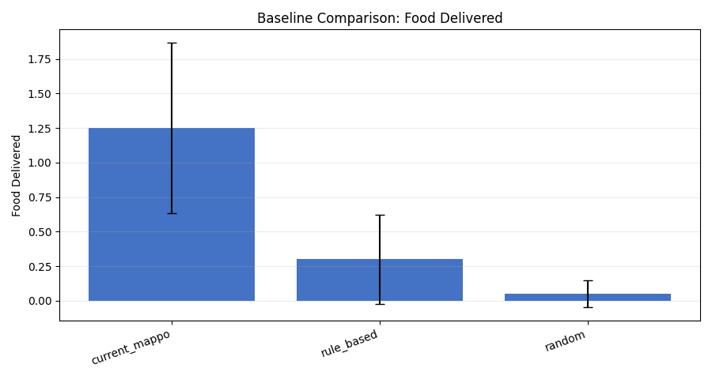
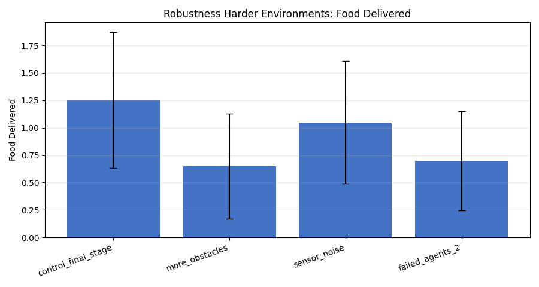
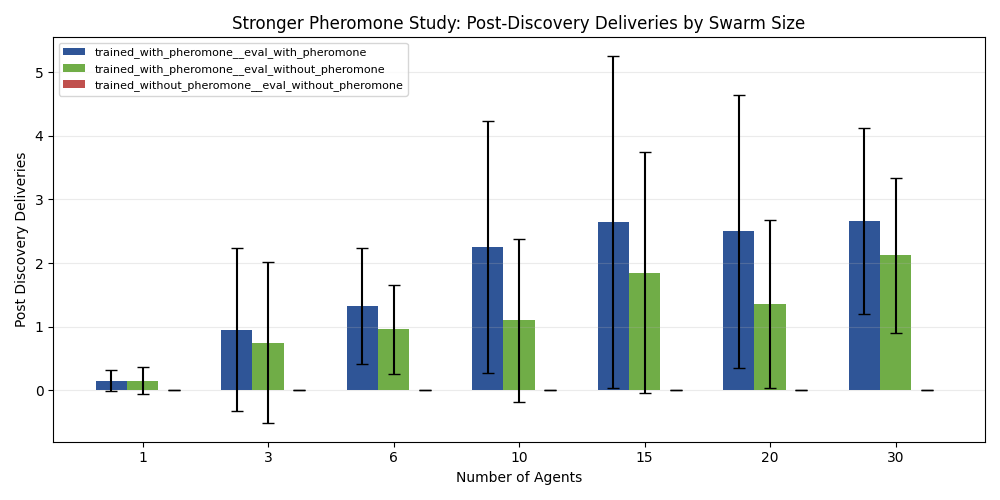

# Emergent Collective Intelligence in a Curriculum-Trained Stigmergic Swarm

## 30-Agent Extension of the Focused Repeated-Source Stigmergy Study

**Experiment bundle folder:** `docs/gvrsf2026/experiments/20260405_190356/`  
**Primary integrated report:** [report_20260405_190356.md](./report_20260405_190356.md)  
**Focused campaign report:** [killer_scaling/report.md](./20260405_190356/killer_scaling/report.md)  
**Bundle provenance:** [metadata/provenance.json](./20260405_190356/metadata/provenance.json)

## Abstract

This paper presents a focused extension of the strongest prior stigmergy experiment in the repository. The purpose of the extension was to determine whether the previously established pheromone-driven coordination result, documented up to `6` agents, remained valid when swarm size was increased to `30` agents.

The experiment reused the project’s strongest repeated-source foraging design, a task specifically chosen to reward route reuse and therefore to expose the value of stigmergic communication. Three matched conditions were evaluated: a pheromone-trained policy evaluated with pheromone enabled, the same pheromone-trained policy evaluated with pheromone disabled, and a no-pheromone-trained policy evaluated without pheromone. Swarm sizes `1`, `3`, `6`, `10`, `15`, `20`, and `30` were tested. The `6`-agent and `30`-agent conditions were treated as primary paired tests with `50` seeds each.

At `30` agents, the pheromone-trained swarm evaluated with pheromone enabled achieved `2.66` mean deliveries compared with `0.00` for the no-pheromone-trained control. The difference was statistically significant by paired t-test (`p = 0.000847`) and Wilcoxon signed-rank test (`p = 9.96e-06`). Late-episode deliveries were also significantly higher (`1.12` vs `0.00`, paired t-test `p = 0.01868`, Wilcoxon `p = 0.01109`). These results show that the project’s strongest stigmergic coordination result remains supported at the new upper bound of `30` agents.

## 1. Introduction

The central scientific question of this project is whether collective intelligence can emerge in a decentralized swarm without a central planner, and whether indirect communication through the environment is one of the mechanisms that makes such intelligence scale.

The broader project already established several important facts:

1. curriculum-trained recurrent MAPPO produced a stronger final policy than weaker prior training
2. the learned policy outperformed simpler rule-based and random controls
3. in a repeated-source route-reuse task, pheromone-trained swarms significantly outperformed no-pheromone-trained swarms at `6` agents

The unresolved question was whether that strongest focused result was merely a small-swarm phenomenon or whether it remained true at much larger swarm sizes.

That question matters scientifically. If the effect is genuinely stigmergic and collective, it should not disappear the moment swarm size is extended beyond the small regime where it was first observed. This extension therefore asks a direct upper-bound question: does the repeated-source stigmergy result still hold at `30` agents?

## 2. System Overview

The experiment uses the same decentralized system as the rest of the project:

- environment: [env/swarm_env.py](../../../env/swarm_env.py)
- configuration schema: [env/config.py](../../../env/config.py)
- MAPPO inference loader: [algorithms/mappo/inference.py](../../../algorithms/mappo/inference.py)
- campaign runner: [killer_scaling/commands/run_campaign.py](./20260405_190356/killer_scaling/commands/run_campaign.py)

Each agent acts only from local observation. There is no central planner during evaluation. When pheromone is enabled, agents can change the environment by depositing a trail-like signal and later sense that signal. The intended behavioral loop is:

`explore -> detect source -> pick up -> return -> deliver`

The experimental claim is not simply that more agents can move at once. The claim is that environmental communication provides a reusable coordination mechanism that becomes valuable when multiple agents can exploit shared route information.

## 3. Research Question and Hypothesis

### 3.1 Research question

Does the repeated-source stigmergy result remain valid when swarm size is extended up to `30` agents?

### 3.2 Hypothesis

If the previously established result reflects real stigmergic coordination, then:

- the pheromone-trained swarm should continue to outperform the no-pheromone-trained swarm at the new upper bound
- the effect should remain visible in late-episode and post-discovery behavior, where reusable route information should matter most

## 4. Experimental Design

This experiment is a standalone focused extension rather than a federated broad-plus-killer bundle.

That design was chosen deliberately. The goal here was not to re-run every other family in the repository, but to extend the strongest existing stigmergy test while preserving comparability with the validated prior `6`-agent result.

### 4.1 Conditions

Three matched conditions were evaluated:

1. `trained_with_pheromone__eval_with_pheromone`
2. `trained_with_pheromone__eval_without_pheromone`
3. `trained_without_pheromone__eval_without_pheromone`

### 4.2 Task

All conditions used the same repeated-source route-reuse task:

- `1` active food source
- `food_source_capacity = 12`
- `target_respawn = True`
- `max_steps = 1200`

This design is mechanistically important. A route-reuse task is exactly where stigmergic communication should be most useful, because early discoveries can produce environmental information that later agents can exploit.

### 4.3 Swarm sizes and sample sizes

Swarm sizes:

- `1`, `3`, `6`, `10`, `15`, `20`, `30`

Sample sizes:

- primary paired tests:
  - `6` agents: `50` paired seeds
  - `30` agents: `50` paired seeds
- supporting sizes:
  - `1`, `3`, `10`, `15`, `20`: `20` paired seeds

### 4.4 Checkpoints

- pheromone-trained checkpoint:
  - `checkpoints/mappo_gru_pheromone/stage3_full_marl`
- no-pheromone-trained checkpoint:
  - `checkpoints/mappo_gru_no_pheromone/stage3_full_marl`

### 4.5 Dependent variables

Primary metrics:

- `food_delivered`
- `late_deliveries`
- `post_discovery_deliveries`
- `pickup_to_delivery_latency`

Supporting metrics:

- `delivery_conversion`
- `exploration_coverage`

### 4.6 Statistical analysis

The primary paired tests report:

- paired t-test
- Wilcoxon signed-rank test
- Cohen’s `d`

This preserves continuity with the earlier focused killer campaign.

## 5. Results

## 5.0 Broad-study reference figures for graph parity with the main paper

This 30-agent document is a focused upper-bound extension, not a rerun of the full broad-plus-killer federated study. The new bundle therefore only generated fresh killer-scaling figures. To preserve the same graph types as [paper.md](./paper.md), the broad-study figures below are reproduced as clearly labeled **reference figures from the original 20260401 full-study bundle**. They provide the same visual context as the main paper without claiming that those broad experiment families were rerun here.

### Reference figure: curriculum quality

The original full-study bundle also showed the same curriculum advantage in delivery conversion:

### Reference figure: baseline superiority

### Reference figure: robustness

The original full-study bundle also tracked robustness in exploration coverage:

### Reference figure: broad swarm-size scaling

The original full-study bundle also included broad scaling views for delivery conversion and exploration coverage:

### Reference figure: generic pheromone ablation

## 5.1 Scaling of the pheromone-trained policy

For the pheromone-trained policy evaluated with pheromone enabled, mean deliveries by swarm size were:

| Agents | Mean deliveries | Mean late deliveries | Mean post-discovery deliveries | Mean delivery conversion |
| --- | ---: | ---: | ---: | ---: |
| 1 | 0.15 | 0.10 | 0.15 | 0.10 |
| 3 | 0.95 | 0.75 | 0.95 | 0.23 |
| 6 | 1.32 | 0.90 | 1.32 | 0.238 |
| 10 | 2.25 | 1.50 | 2.25 | 0.216 |
| 15 | 2.65 | 1.30 | 2.65 | 0.333 |
| 20 | 2.50 | 1.10 | 2.50 | 0.25 |
| 30 | 2.66 | 1.12 | 2.66 | 0.452 |

The most important figures are:

### Interpretation

The scaling curve is positive but not perfectly monotonic. That is not surprising in a crowded decentralized system. Larger swarms introduce both more opportunity for route sharing and more interference. The key point is that performance remains clearly above zero and stays strong at the `30`-agent upper bound.

## 5.2 Continuity check at 6 agents

The extension preserved the earlier focused result at `6` agents.

At `6` agents:

- trained with pheromone, evaluated with pheromone:
  - `food_delivered = 1.32`
  - `late_deliveries = 0.90`
  - `post_discovery_deliveries = 1.32`
- trained without pheromone, evaluated without pheromone:
  - `food_delivered = 0.00`
  - `late_deliveries = 0.00`
  - `post_discovery_deliveries = 0.00`

Primary statistics at `6` agents:

- `food_delivered`
  - paired t-test `p = 0.00653`
  - Wilcoxon `p = 0.00364`
  - Cohen’s `d = 0.568`
- `late_deliveries`
  - paired t-test `p = 0.01535`
  - Wilcoxon `p = 0.03179`
  - Cohen’s `d = 0.502`

### Interpretation

This continuity check is important because it shows that the 30-agent extension is anchored to the same validated result as the earlier killer study. It is not a new task or a looser redesign.

## 5.3 New upper-bound result at 30 agents

The main scientific result of this extension is the new primary paired test at `30` agents.

At `30` agents:

| Condition | n | Mean deliveries | Mean late deliveries | Mean post-discovery deliveries | Mean exploration coverage |
| --- | ---: | ---: | ---: | ---: | ---: |
| trained with pheromone, eval with pheromone | 50 | 2.66 | 1.12 | 2.66 | 0.389 |
| trained with pheromone, eval without pheromone | 50 | 2.12 | 0.84 | 2.12 | 0.385 |
| trained without pheromone, eval without pheromone | 50 | 0.00 | 0.00 | 0.00 | 0.0578 |

Primary matched-training comparison:

- `food_delivered`
  - paired t-test `p = 0.000847`
  - Wilcoxon `p = 9.96e-06`
  - Cohen’s `d = 0.711`
- `late_deliveries`
  - paired t-test `p = 0.01868`
  - Wilcoxon `p = 0.01109`
  - Cohen’s `d = 0.487`
- `post_discovery_deliveries`
  - paired t-test `p = 0.000847`
  - Wilcoxon `p = 9.96e-06`
  - Cohen’s `d = 0.711`

### Interpretation

This is the main answer to the research question. The earlier stigmergy result is not confined to the old `6`-agent maximum. It remains statistically supported at `30` agents.

This matters because the control is severe: the no-pheromone-trained policy still collapses to zero deliveries under the same repeated-source task, while the pheromone-trained swarm remains productive.

## 5.4 Eval-time pheromone removal at 30 agents

The extension also tested whether disabling pheromone at inference hurts the pheromone-trained policy at the new upper bound.

At `30` agents:

- with pheromone enabled:
  - `food_delivered = 2.66`
  - `late_deliveries = 1.12`
- with pheromone disabled:
  - `food_delivered = 2.12`
  - `late_deliveries = 0.84`

The trend is in the expected direction, but the late-delivery comparison is not statistically strong enough to serve as the main claim:

- paired t-test `p = 0.22657`
- Wilcoxon `p = 0.10824`
- Cohen’s `d = 0.0896`

### Interpretation

This is still useful. It suggests that eval-time pheromone availability continues to help, but the strongest supported statement in this extension should remain the matched-training comparison against the no-pheromone-trained control.

## 6. Discussion

The extension supports three main conclusions.

### 6.1 The prior focused result was reproducible

The `6`-agent condition reproduced the earlier finding. That increases confidence that the experiment is stable rather than a one-off artifact.

### 6.2 The swarm can be evaluated meaningfully far beyond 6 agents

The experiment completed a full `1, 3, 6, 10, 15, 20, 30` sweep using the same task family and matching structure. So the project now has recorded evidence beyond the earlier 6-agent ceiling.

### 6.3 The central stigmergy claim remains supported at 30 agents

This is the strongest conclusion of the paper. The result is not merely that the simulator can render or step 30 agents. The meaningful result is that the scientific comparison still holds at `30` agents, with strong paired significance for both total deliveries and late-episode deliveries.

## 7. Threats to Validity

This extension is strong, but its scope should be stated honestly.

### 7.1 Focused design

This is not a new federated full bundle. It is a focused extension designed specifically to test the upper-bound stigmergy claim.

### 7.2 Task specificity

The strongest result comes from a repeated-source route-reuse task. That is scientifically appropriate for a stigmergy claim, but it is narrower than claiming pheromone helps equally in every swarm environment.

### 7.3 Non-monotonic scaling curve

The scaling curve is not perfectly monotonic from `10` to `30` agents. That likely reflects increased interference, congestion, and crowding noise at larger sizes. However, non-monotonicity does not invalidate the main comparison against the no-pheromone-trained control.

### 7.4 Secondary ablation strength

At `30` agents, eval-time pheromone removal trends in the expected direction but does not produce a comparably strong significance result. The cleanest claim therefore rests on matched training, not on ablation alone.

## 8. Conclusion

This focused extension materially strengthens the project’s main scaling claim.

The strongest supported conclusion is:

> In the repeated-source foraging task, a pheromone-trained decentralized swarm still significantly outperforms a no-pheromone-trained decentralized swarm at `30` agents.

That extends the validated upper bound of the project’s strongest stigmergy result from `6` agents to `30` agents.

## References to Bundle Artifacts

- integrated report: [report_20260405_190356.md](./report_20260405_190356.md)
- campaign report: [killer_scaling/report.md](./20260405_190356/killer_scaling/report.md)
- raw episode results: [killer_scaling/raw_exports/all_episode_results.csv](./20260405_190356/killer_scaling/raw_exports/all_episode_results.csv)
- summary table: [killer_scaling/tables/condition_summary.csv](./20260405_190356/killer_scaling/tables/condition_summary.csv)
- statistical tests: [killer_scaling/tables/statistical_tests.csv](./20260405_190356/killer_scaling/tables/statistical_tests.csv)
- provenance: [metadata/provenance.json](./20260405_190356/metadata/provenance.json)
