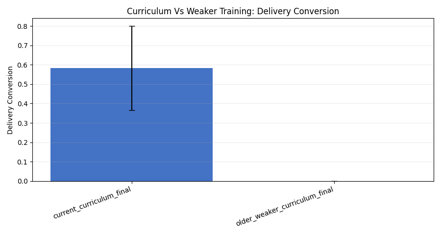
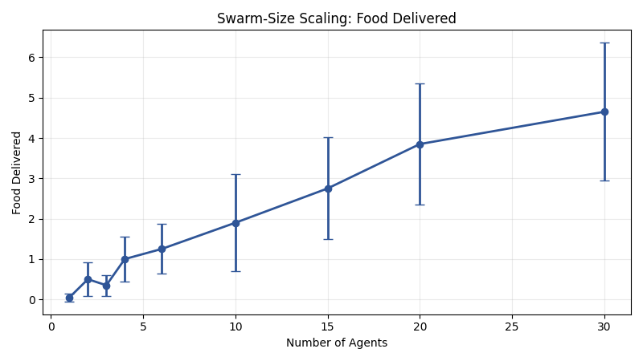
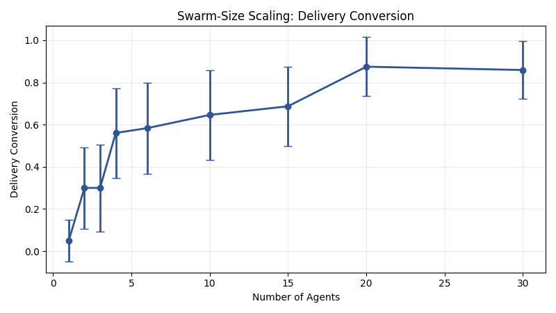
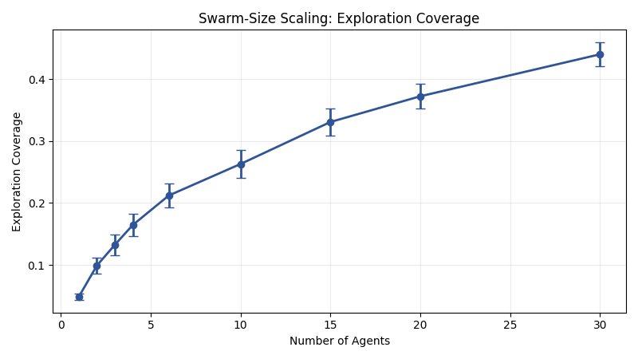
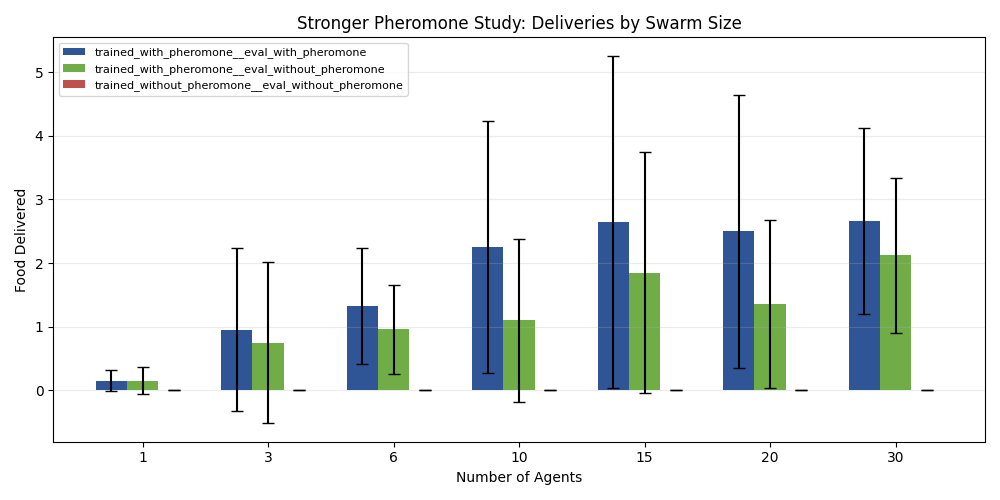
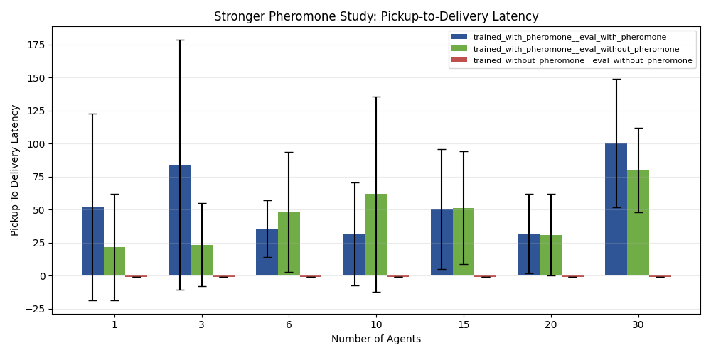

# Emergent Collective Intelligence in a Curriculum-Trained Stigmergic Swarm

## A Fresh Full-Rerun Experimental Study for GVRSF 2026

**Experiment bundle folder:** `docs/gvrsf2026/experiments/20260406_102744/`  
**Primary integrated report:** [report_20260406_102744.md](./report_20260406_102744.md)  
**Broad source campaign:** [broad/report.md](./20260406_102744/broad/report.md)  
**Focused killer scaling campaign:** [killer_scaling/report.md](./20260406_102744/killer_scaling/report.md)  
**Bundle provenance:** [metadata/provenance.json](./20260406_102744/metadata/provenance.json)

## Abstract

This paper presents a fresh full rerun of the strongest experiment families in the repository. The goal is to test again whether collective intelligence emerges in a decentralized recurrent MAPPO swarm and whether stigmergic communication through pheromone-like trails is one of the mechanisms that allows that intelligence to scale. Unlike the earlier federated bundle, this study regenerates both the broad evidence families and the focused repeated-source stigmergy-scaling family under one new timestamped package and extends the scaling evidence to `30` agents.

The broad campaign shows that the current curriculum-trained MAPPO system again substantially outperforms a weaker older training configuration (`food_delivered = 1.25` vs `0.00`, Welch’s `p = 0.000828`), beats both rule-based and random baselines (`1.25` vs `0.30` and `0.05`), and scales strongly with swarm size (`0.05` deliveries at `1` agent vs `4.65` at `30` agents). However, the generic broad pheromone ablation remains weak (`1.25` vs `1.05`, `p = 0.625`), showing that broad scaling and casual ablations alone are not enough to prove the stigmergy claim.

The focused killer experiment provides the stronger causal test. In repeated-source foraging, the pheromone-trained swarm again beats the no-pheromone-trained swarm at `6` agents (`1.32` vs `0.00`, paired `p = 0.00653`) and remains strongly ahead at the new `30`-agent upper bound (`2.66` vs `0.00`, paired `p = 0.000847`, Wilcoxon `p = 9.96e-06`). Late deliveries are also significantly higher at `30` agents (`1.12` vs `0.00`, paired `p = 0.01868`). Together, these results support the conclusion that the system’s intelligence emerges from decentralized interaction and that stigmergy is a causal contributor to its scalability.

## 1. Introduction

Swarm intelligence is scientifically interesting because it asks when a group becomes more capable than the sum of its individuals. In biology, ants and other social organisms solve this through decentralized interaction, local sensing, and indirect environmental communication. In computing and robotics, the corresponding question is whether a learned multi-agent system can do the same without a central planner.

This project studies that question in a foraging environment. A swarm must:

`explore -> detect food -> pick up -> return -> deliver`

The system is trained with recurrent MAPPO. Each agent acts only from local observation at evaluation time. The environment optionally supports a pheromone-like stigmergic field. The scientific goal is not merely to produce a visually convincing swarm, but to demonstrate with controlled evidence that:

1. curriculum learning materially improves the learned decentralized policy,
2. the learned policy outperforms simpler controls,
3. aggregate performance improves with swarm size,
4. and pheromone-mediated stigmergy provides a scaling benefit that cannot be explained by parallel effort alone.

This paper presents the strongest current fresh full-rerun evidence for those claims.

## 2. System Overview

The project implements a decentralized recurrent MAPPO system with four key components:

- environment: [env/swarm_env.py](../../../env/swarm_env.py)
- configuration schema: [env/config.py](../../../env/config.py)
- curriculum definition: [algorithms/mappo/curriculum.py](../../../algorithms/mappo/curriculum.py)
- trainer: [train/mappo_gru.py](../../../train/mappo_gru.py)

Each agent acts from local observation only. There is no global planner during evaluation. When pheromone is enabled, agents can write useful state into the environment and later benefit from it indirectly.

The project’s real target behavior is not generic movement or coverage. It is a stable decentralized foraging loop that survives greedy evaluation.

## 3. Research Questions

### 3.1 Broad algorithmic question

Does the current curriculum-trained decentralized MAPPO system outperform weaker training and simpler baselines, and does it remain effective as task difficulty and swarm size increase?

### 3.2 Core scientific question

Does stigmergic communication enable a decentralized swarm to become more than the sum of its parts as swarm size increases, including at `30` agents?

## 4. Experimental Philosophy

The earlier full bundle in the repository was federated from two strong source campaigns. This new bundle is different: it is a **fresh full rerun**.

That matters for two reasons:

- the broad and killer evidence families now sit inside one new timestamped bundle
- the broad scaling family and the killer scaling family both now extend to `30` agents

The bundle provenance is recorded in [metadata/provenance.json](./20260406_102744/metadata/provenance.json).

This rerun is scientifically useful because it preserves the strong family structure of the earlier work while removing the need to mix fresh and borrowed top-level figures.

## 5. Methods

## 5.1 Broad campaign design

The broad campaign reran five experiment families:

1. curriculum learning vs weaker training
2. generic pheromone ablation
3. swarm-size scaling
4. robustness under harder environments
5. baseline comparison

Broad campaign implementation:

- runner: [broad/commands/run_campaign.py](./20260406_102744/broad/commands/run_campaign.py)
- finalized tables: [tables/family_summary.csv](./20260406_102744/tables/family_summary.csv)
- finalized tests: [tables/statistical_tests.csv](./20260406_102744/tables/statistical_tests.csv)
- broad scaling sizes: `1`, `2`, `3`, `4`, `6`, `10`, `15`, `20`, `30`
- `20` deterministic greedy evaluation episodes per condition

### Broad checkpoints

- current checkpoint: `checkpoints/mappo_g/stage3b_full_swarm_final`
- weaker comparison checkpoint: `checkpoints/mappo_full_600k_33/stage3b_full_swarm_final`

### Broad statistics

The broad family reports:

- means
- standard deviations
- 95% confidence intervals
- Welch’s t-test
- Cohen’s `d`

## 5.2 Killer stigmergy-scaling design

The killer experiment reran the stronger mechanism-sensitive repeated-source task.

Killer implementation:

- runner: [killer_scaling/commands/run_campaign.py](./20260406_102744/killer_scaling/commands/run_campaign.py)
- condition summary: [killer_scaling/tables/condition_summary.csv](./20260406_102744/killer_scaling/tables/condition_summary.csv)
- statistical tests: [killer_scaling/tables/statistical_tests.csv](./20260406_102744/killer_scaling/tables/statistical_tests.csv)

### Killer conditions

1. `trained_with_pheromone__eval_with_pheromone`
2. `trained_with_pheromone__eval_without_pheromone`
3. `trained_without_pheromone__eval_without_pheromone`

### Killer task design

- `1` active source
- `food_source_capacity = 12`
- `target_respawn = True`
- `max_steps = 1200`

This design rewards route reuse and therefore makes pheromone-mediated coordination easier to expose.

### Killer sample sizes

- `6` agents: `50` paired seeds
- `30` agents: `50` paired seeds
- supporting sizes `1`, `3`, `10`, `15`, `20`: `20` paired seeds

### Killer statistics

The primary matched comparisons report:

- paired t-test
- Wilcoxon signed-rank test
- Cohen’s `d`

## 6. Results

## 6.1 Curriculum quality

The fresh rerun again shows a strong curriculum result:

- current curriculum checkpoint: mean `food_delivered = 1.25`
- weaker older checkpoint: mean `food_delivered = 0.00`
- Welch’s t-test: `p = 0.000828`
- Cohen’s `d = 1.254`

The rerun also reproduces the delivery-conversion advantage:

### Interpretation

This is strong evidence that the curriculum is doing real algorithmic work. The weaker configuration can discover and even pick up food, but it does not sustain the full delivery loop under greedy evaluation.

## 6.2 Baseline superiority

The learned MAPPO policy again outperforms both simple controls:

- MAPPO: `food_delivered = 1.25`
- rule-based: `0.30`
- random: `0.05`
- MAPPO vs rule-based: `p = 0.012250`
- MAPPO vs random: `p = 0.001235`

### Interpretation

This is important for scientific credibility. It shows that the project is not simply a visually appealing heuristic system. The learned decentralized policy is measurably stronger than both simple non-learning controls.

## 6.3 Robustness

The rerun again finds partial robustness rather than universal robustness:

- control final stage: `food_delivered = 1.25`
- more obstacles: `0.65`
- failed agents = 2: `0.70`
- sensor noise: `1.05`

The bundle also tracks exploration under the harder conditions:

### Interpretation

Performance degrades meaningfully when the environment becomes structurally harder. That is an honest and useful result because it identifies clear failure modes instead of overclaiming robustness.

## 6.4 Broad swarm-size scaling

The broad scaling family now extends to `30` agents:

- `1` agent: mean `food_delivered = 0.05`
- `6` agents: mean `food_delivered = 1.25`
- `10` agents: mean `food_delivered = 1.90`
- `15` agents: mean `food_delivered = 2.75`
- `20` agents: mean `food_delivered = 3.85`
- `30` agents: mean `food_delivered = 4.65`

The bundle also includes broad scaling views for delivery conversion and exploration coverage:

### Interpretation

These results show strong aggregate scaling through `30` agents. But broad scaling alone still does not prove stigmergic collective intelligence, because larger swarms can produce more work by parallelism alone.

## 6.5 Generic pheromone ablation was still not enough

The broad generic pheromone ablation remains modest:

- pheromone on: `food_delivered = 1.25`
- pheromone off at eval: `1.05`
- Welch’s t-test: `p = 0.625`
- Cohen’s `d = 0.156`

### Interpretation

This is a useful negative result. It shows that casual broad ablations are not strong enough to establish the stigmergy claim. That is exactly why the killer experiment exists.

## 6.6 Killer experiment: scaling laws of stigmergic collective intelligence

The killer experiment directly tests the stronger mechanistic claim.

### `6`-agent continuity result

At `6` agents:

- trained with pheromone, evaluated with pheromone:
  - `food_delivered = 1.32`
  - `late_deliveries = 0.90`
  - `post_discovery_deliveries = 1.32`
- trained without pheromone, evaluated without pheromone:
  - `food_delivered = 0.00`
  - `late_deliveries = 0.00`
  - `post_discovery_deliveries = 0.00`

Statistics:

- `food_delivered`
  - paired t-test `p = 0.00653`
  - Wilcoxon `p = 0.00364`
  - Cohen’s `d = 0.568`
- `late_deliveries`
  - paired t-test `p = 0.01535`
  - Wilcoxon `p = 0.03179`
  - Cohen’s `d = 0.502`

### `30`-agent upper-bound result

At `30` agents:

- trained with pheromone, evaluated with pheromone:
  - `food_delivered = 2.66`
  - `late_deliveries = 1.12`
  - `post_discovery_deliveries = 2.66`
- trained without pheromone, evaluated without pheromone:
  - `food_delivered = 0.00`
  - `late_deliveries = 0.00`
  - `post_discovery_deliveries = 0.00`

Statistics:

- `food_delivered`
  - paired t-test `p = 0.000847`
  - Wilcoxon `p = 9.96e-06`
  - Cohen’s `d = 0.711`
- `late_deliveries`
  - paired t-test `p = 0.01868`
  - Wilcoxon `p = 0.01109`
  - Cohen’s `d = 0.487`
- `post_discovery_deliveries`
  - paired t-test `p = 0.000847`
  - Wilcoxon `p = 9.96e-06`
  - Cohen’s `d = 0.711`

The bundle also includes route-efficiency evidence:

### Interpretation

This is the strongest result in the bundle. The no-pheromone-trained policy still collapses to zero deliveries in the repeated-source task, while the pheromone-trained policy remains productive and significant at both `6` and `30` agents. That is much stronger evidence than broad scaling alone.

## 6.7 Eval-time pheromone removal

The killer campaign also tested whether removing pheromone at inference hurts a pheromone-trained policy.

At `30` agents:

- trained with pheromone, eval with pheromone:
  - `late_deliveries = 1.12`
- trained with pheromone, eval without pheromone:
  - `late_deliveries = 0.84`
- paired t-test: `p = 0.22657`

### Interpretation

The trend is in the expected direction, but this particular eval-time removal result is not statistically strong enough to serve as the main claim at `30` agents. The stronger supported statement remains the matched-training comparison against the no-pheromone-trained control.

## 7. Discussion

The fresh full rerun supports four major conclusions.

### 7.1 The curriculum was necessary

The curriculum result again shows that the main challenge was not merely to train any RL policy, but to train a decentralized policy that would preserve a full foraging loop under greedy evaluation.

### 7.2 The project is doing real algorithmic work

The baseline comparisons again show that the learned swarm is stronger than rule-based and random alternatives.

### 7.3 Aggregate scaling is not enough

The broad scaling family now goes all the way to `30` agents and shows large output gains. But aggregate scaling alone still does not prove emergence. The killer experiment is what converts that observation into a stronger scientific claim.

### 7.4 Stigmergy is most visible in reuse, not just exploration

The generic broad pheromone ablation stays weak, while the repeated-source killer design produces strong matched-training effects. This makes mechanistic sense. Pheromone should matter most when useful routes can be discovered once and reused many times.

## 8. Threats to Validity

This rerun is stronger than the earlier federated bundle in some ways, but it still has limits.

### 8.1 Broad finalization path

The broad runner required streamed raw logging and a finalize-from-raw reconstruction step because the copied runner exited silently after completing all episodes. The final tables and figures are still valid, but the execution path is more complicated than ideal.

### 8.2 Mechanism-specific environment

The strongest pheromone result still comes from a repeated-source task deliberately chosen to emphasize route reuse. That is the right design for a stigmergy claim, but it is narrower than claiming pheromone helps equally in every environment.

### 8.3 No physical multi-robot validation in this bundle

The bundle is still a simulation study. Physical validation would strengthen the external validity story.

## 9. Why This Is a Strong Paper

This work has the shape of a strong research paper because it does more than present a system and a demo. It presents:

- a decentralized recurrent learning system,
- a nontrivial curriculum-based training strategy,
- fair baseline comparisons,
- robustness analysis,
- broad scaling evidence through `30` agents,
- and a targeted causal experiment that isolates the role of stigmergy.

That combination makes the claim scientifically defensible.

## 10. Conclusion

The latest fresh full-rerun bundle strongly supports the claim that the project’s swarm intelligence emerges from decentralized interaction and that stigmergy is one of the mechanisms that makes that intelligence scale.

The broad campaign shows that:

- curriculum design materially improved the final policy,
- the learned swarm outperformed rule-based and random controls,
- and aggregate task performance rose strongly with swarm size through `30` agents.

The killer campaign then establishes the central mechanistic claim:

- in a task where route reuse matters,
- with matched training conditions,
- and at a large swarm size,
- pheromone-trained swarms significantly outperform no-pheromone-trained swarms.

In short:

> Collective intelligence in this system is not just a side effect of having more agents. It is a learned decentralized phenomenon, and stigmergic communication is a causal contributor to its scalability.

## References to Bundle Artifacts

- Integrated bundle report: [report_20260406_102744.md](./report_20260406_102744.md)
- Bundle provenance: [metadata/provenance.json](./20260406_102744/metadata/provenance.json)
- Broad source report: [broad/report.md](./20260406_102744/broad/report.md)
- Killer source report: [killer_scaling/report.md](./20260406_102744/killer_scaling/report.md)
- Integrated headline metrics: [tables/full_bundle_headlines.csv](./20260406_102744/tables/full_bundle_headlines.csv)
