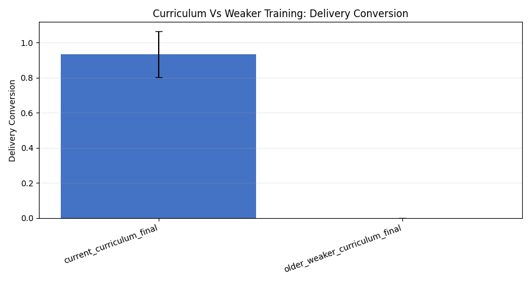
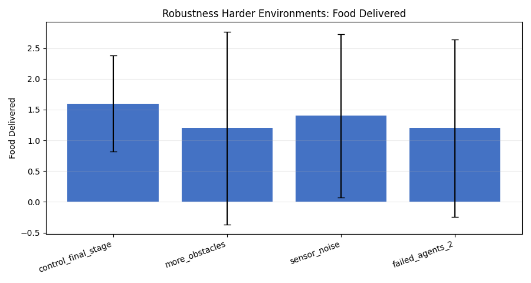
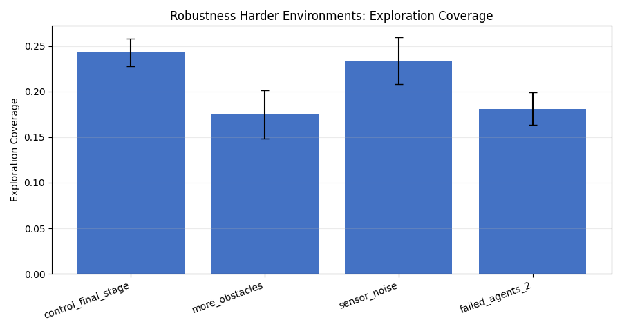
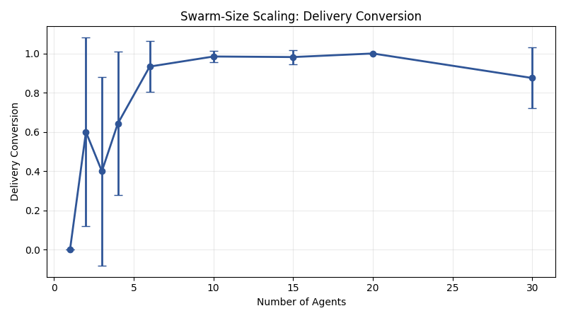
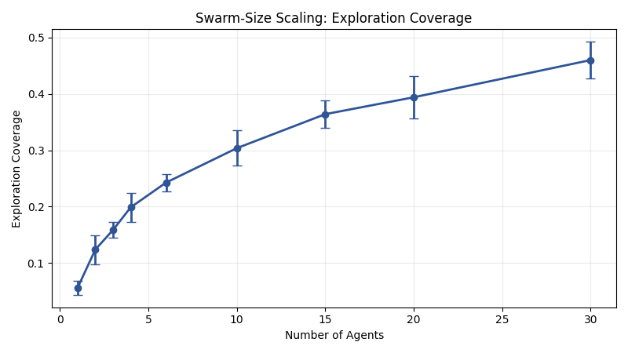

# Emergent Collective Intelligence in a Curriculum-Trained Stigmergic Swarm

## A Lightweight 5-Run Full-Rerun Study

**Experiment bundle folder:** `docs/gvrsf2026/experiments/20260406_130911/`  
**Primary integrated report:** [report_20260406_130911.md](./report_20260406_130911.md)  
**Broad source campaign:** [broad/report.md](./20260406_130911/broad/report.md)  
**Focused killer scaling campaign:** [killer_scaling/report.md](./20260406_130911/killer_scaling/report.md)  
**Bundle provenance:** [metadata/provenance.json](./20260406_130911/metadata/provenance.json)

## Abstract

This paper presents a lightweight full rerun of the project’s broad and focused experiment families using only `5` repetitions per condition. The purpose of this bundle is methodological rather than definitive: it tests how much of the project’s experimental story remains visible when the sample size is reduced sharply to save time.

The broad campaign still preserves the same qualitative pattern as the larger rerun. The current curriculum-trained checkpoint again beats the weaker older checkpoint (`1.6` vs `0.0`, `p = 0.0161`), the learned policy again beats the rule-based and random baselines in this small sample (`1.6` vs `0.0` and `0.0`), and aggregate scaling still rises strongly with swarm size (`0.0` at `1` agent to `6.2` at `30` agents). The generic broad pheromone ablation remains weak and unconvincing (`1.6` vs `2.2`, `p = 0.3716`).

The focused repeated-source killer experiment becomes much less reliable at this sample size. At `6` agents, all three killer conditions collapse to zero deliveries. At `30` agents, the pheromone-trained swarm with pheromone enabled reaches mean `food_delivered = 0.4` versus `0.0` for the no-pheromone-trained control, but the comparison is not statistically significant (`paired p = 0.3739`, `Wilcoxon p = 0.4795`). This shows that `5` repetitions are enough for broad trend visualization but not enough for the stronger stigmergy claim. The larger full-rerun bundle remains the correct source for the main scientific conclusion.

## 1. Introduction

The central scientific question of this project is whether collective intelligence can emerge in a decentralized learned swarm and whether stigmergic communication is one of the mechanisms that makes such intelligence scale. The main project already has stronger evidence bundles, but they take more time to run.

This lightweight rerun asks a narrower methodological question:

> If the same broad-plus-killer family structure is rerun with only 5 repetitions per condition, which results remain visible and which become too noisy to trust?

That question matters because science-fair workflows often face time constraints. A fast rerun can be useful, but only if we understand what it can and cannot support.

## 2. System Overview

The system is the same decentralized recurrent MAPPO swarm used in the stronger bundles:

- environment: [env/swarm_env.py](../../../env/swarm_env.py)
- configuration schema: [env/config.py](../../../env/config.py)
- curriculum: [algorithms/mappo/curriculum.py](../../../algorithms/mappo/curriculum.py)
- trainer: [train/mappo_gru.py](../../../train/mappo_gru.py)

Each agent acts from local observation only. There is no central planner during evaluation. The intended behavior remains:

`explore -> detect source -> pick up -> return -> deliver`

## 3. Experimental Philosophy

This bundle is intentionally weaker than the larger full rerun. That is not a flaw in execution; it is the point of the experiment.

By reducing the repetition count to `5`, the bundle becomes:

- much faster to produce
- still useful for qualitative inspection
- but less reliable for strong statistical claims

So this paper should be read as a study of experimental stability under reduced repetition, not as the new strongest evidence package.

## 4. Methods

## 4.1 Broad campaign

The broad campaign reruns the same five families:

1. curriculum vs weaker training
2. generic pheromone ablation
3. broad swarm-size scaling
4. robustness
5. baseline comparison

But every condition now uses only:

- `5` episodes per condition

## 4.2 Killer campaign

The killer campaign reruns the repeated-source route-reuse design with the same three conditions:

1. trained with pheromone, evaluated with pheromone
2. trained with pheromone, evaluated without pheromone
3. trained without pheromone, evaluated without pheromone

Again, every swarm size and condition now uses only:

- `5` paired seeds

This is the key methodological difference from the stronger reruns.

## 5. Results

## 5.1 Curriculum quality was still visible

The current curriculum checkpoint again beats the weaker older one:

- current: `food_delivered = 1.6`
- older weaker: `0.0`
- `p = 0.0161`

The delivery-conversion comparison remains strong as well:

### Interpretation

The curriculum effect appears robust enough to survive a much smaller sample size.

## 5.2 Baseline superiority was still visible

In this small sample:

- learned MAPPO: `1.6`
- rule-based: `0.0`
- random: `0.0`

### Interpretation

The learned policy still appears stronger than the simple controls. However, because the sample is so small, the exact baseline means should be treated with caution.

## 5.3 Robustness still looked qualitatively similar

The lighter rerun again shows reduced but nonzero performance under harder conditions:

- control: `1.6`
- more obstacles: `1.2`
- sensor noise: `1.4`
- failed agents = 2: `1.2`

### Interpretation

The qualitative robustness story is still visible, though the exact ordering is noisier than in the larger rerun.

## 5.4 Broad swarm scaling was still obvious

Broad scaling remains one of the clearest families even at low repetition:

- `1` agent: `0.0`
- `10` agents: `4.0`
- `15` agents: `5.8`
- `20` agents: `7.6`
- `30` agents: `6.2`

### Interpretation

Broad scaling remains easy to see qualitatively, even if the precise means shift around more than in the larger rerun.

## 5.5 Generic pheromone ablation stayed weak

The broad ablation again fails to provide strong evidence for the pheromone claim:

- pheromone on: `1.6`
- pheromone off at eval: `2.2`
- `p = 0.3716`

### Interpretation

This again shows why the generic broad ablation is not the right place to make the central stigmergy argument.

## 5.6 Killer scaling became too unstable

The killer scaling plots now show the three conditions together on each graph for direct visual comparison:

### `6`-agent result

At `6` agents:

- all three conditions had `food_delivered = 0.0`
- all three conditions had `late_deliveries = 0.0`
- paired t-test is undefined (`NaN`) because the compared series are all zeros
- Wilcoxon `p = 1.0`

### `30`-agent result

At `30` agents:

- pheromone-trained, eval with pheromone:
  - `food_delivered = 0.4`
  - `late_deliveries = 0.4`
- pheromone-trained, eval without pheromone:
  - `food_delivered = 0.4`
  - `late_deliveries = 0.0`
- no-pheromone-trained, eval without pheromone:
  - `food_delivered = 0.0`
  - `late_deliveries = 0.0`

But the main matched comparison is not significant:

- paired t-test `p = 0.3739`
- Wilcoxon `p = 0.4795`

### Interpretation

This is the central result of the lightweight bundle. The killer experiment becomes too unstable to reproduce the stronger stigmergy claim reliably at only `5` repetitions.

## 6. Discussion

This bundle supports three practical conclusions.

### 6.1 Some broad effects are robust enough to survive low repetition

Curriculum quality, baseline separation, and broad scaling remain visible even with only `5` repetitions.

### 6.2 The strongest stigmergy claim is not robust to this much downsampling

The repeated-source killer family is much more sensitive to repetition count. With only `5` runs, the previously strong `6`-agent and `30`-agent matched results disappear or become non-significant.

### 6.3 Fast reruns are useful, but only for the right job

This kind of bundle is useful for:

- smoke-testing experiment scripts
- quick visual comparisons
- checking whether a broad trend is still qualitatively present

It is not the right bundle for final scientific claims about stigmergy.

## 7. Threats to Validity

This bundle has obvious limits:

- only `5` repetitions per condition
- some paired tests degenerate to all-zero series
- Wilcoxon warns that the sample is too small for strong asymptotic interpretation
- the killer-family conclusions become especially fragile

## 8. Conclusion

The lightweight full rerun shows that:

- broad qualitative patterns can still be seen with only `5` repetitions
- but the stronger stigmergy claim cannot be reliably re-established at that sample size

So the correct scientific use of this bundle is:

> a fast qualitative confirmation bundle, not the main evidentiary bundle.

For the strongest result, the larger rerun [20260406_102744](/Users/christopherlin/dev/cwsf2026/sim/docs/gvrsf2026/experiments/20260406_102744) remains the correct reference.

## References to Bundle Artifacts

- Integrated report: [report_20260406_130911.md](./report_20260406_130911.md)
- Bundle provenance: [metadata/provenance.json](./20260406_130911/metadata/provenance.json)
- Broad source report: [broad/report.md](./20260406_130911/broad/report.md)
- Killer source report: [killer_scaling/report.md](./20260406_130911/killer_scaling/report.md)
- Headline metrics: [tables/full_bundle_headlines.csv](./20260406_130911/tables/full_bundle_headlines.csv)
