# Emergent Collective Intelligence in a Curriculum-Trained Stigmergic Swarm

## An Explicit 8-Seed Full-Rerun Study

**Experiment bundle folder:** `docs/gvrsf2026/experiments/20260406_132534/`  
**Primary integrated report:** [report_20260406_132534.md](./report_20260406_132534.md)  
**Broad source campaign:** [broad/report.md](./20260406_132534/broad/report.md)  
**Focused killer scaling campaign:** [killer_scaling/report.md](./20260406_132534/killer_scaling/report.md)  
**Bundle provenance:** [metadata/provenance.json](./20260406_132534/metadata/provenance.json)

## Abstract

This paper presents a fresh full rerun of the project’s broad and focused experiment families using exactly `8` repetitions per condition with the explicit seed list `2, 4, 6, 25, 32, 33, 36, 41`. The goal of this bundle is methodological rather than final: it tests whether a medium-cost rerun can preserve the broad project story while recovering more of the focused stigmergy signal than the earlier `5`-run bundle.

The broad campaign again preserves the same qualitative pattern as the larger rerun. The current curriculum-trained checkpoint beats the weaker older checkpoint (`3.875` vs `0.0`, `p = 0.000201`), the learned policy beats the rule-based and random baselines (`3.875` vs `0.375` and `0.0`), and aggregate scaling still rises strongly with swarm size (`0.625` at `1` agent to `5.625` at `30` agents). The generic broad pheromone ablation remains weak and non-diagnostic (`3.875` vs `3.25`, `p = 0.3790`).

The focused repeated-source killer experiment becomes clearer than the `5`-run bundle, but still does not reach the strength of the large rerun. At `6` agents, the pheromone-trained swarm with pheromone enabled reaches mean `food_delivered = 0.125` versus `0.0` for the no-pheromone-trained control, but the matched comparison is not significant (`paired p = 0.3506`, `Wilcoxon p = 0.5465`). At `30` agents, the pheromone-trained swarm with pheromone enabled reaches mean `food_delivered = 1.5` versus `0.0`, and the Wilcoxon result improves to `p = 0.0650`, but the comparison still does not cross conventional significance thresholds. This bundle therefore supports the broad algorithmic story and a clearer high-swarm visual stigmergy advantage, but not a definitive re-establishment of the strongest stigmergy claim.

## 1. Introduction

The central scientific question of this project is whether collective intelligence can emerge in a decentralized learned swarm and whether stigmergic communication is one of the mechanisms that makes such intelligence scale. The main project already has stronger evidence bundles, but those runs are slower and more expensive to repeat.

This explicit 8-seed rerun asks a narrower methodological question:

> If the same broad-plus-killer family structure is rerun with a medium-size fixed seed subset, which results remain stable and which still require the larger rerun?

That question matters because a useful scientific workflow needs to know not only which result is strongest, but how much evidence remains after reducing repetition count.

## 2. System Overview

The system is the same decentralized recurrent MAPPO swarm used in the stronger bundles:

- environment: [env/swarm_env.py](../../../env/swarm_env.py)
- configuration schema: [env/config.py](../../../env/config.py)
- curriculum: [algorithms/mappo/curriculum.py](../../../algorithms/mappo/curriculum.py)
- trainer: [train/mappo_gru.py](../../../train/mappo_gru.py)

Each agent acts from local observation only. There is no central planner during evaluation. The intended behavior remains:

`explore -> detect source -> pick up -> return -> deliver`

## 3. Experimental Philosophy

This bundle is intentionally intermediate:

- stronger than the `5`-run bundle
- weaker than the large full rerun
- useful for comparing experimental stability across repetition counts

By fixing the same explicit `8`-seed set across the broad and killer families, the bundle becomes easier to compare and easier to reproduce.

## 4. Methods

## 4.1 Broad campaign

The broad campaign reruns the same five families:

1. curriculum vs weaker training
2. generic pheromone ablation
3. broad swarm-size scaling
4. robustness
5. baseline comparison

Every condition now uses only:

- `8` episodes per condition

## 4.2 Killer campaign

The killer campaign reruns the repeated-source route-reuse design with the same three conditions:

1. trained with pheromone, evaluated with pheromone
2. trained with pheromone, evaluated without pheromone
3. trained without pheromone, evaluated without pheromone

Again, every swarm size and condition now uses only:

- `8` paired seeds

The explicit seeds are:

- `2, 4, 6, 25, 32, 33, 36, 41`

This is the key methodological difference from both earlier reruns.

## 5. Results

## 5.1 Curriculum quality was still very clear

The current curriculum checkpoint again beats the weaker older one:

- current: `food_delivered = 3.875`
- older weaker: `0.0`
- `p = 0.000201`

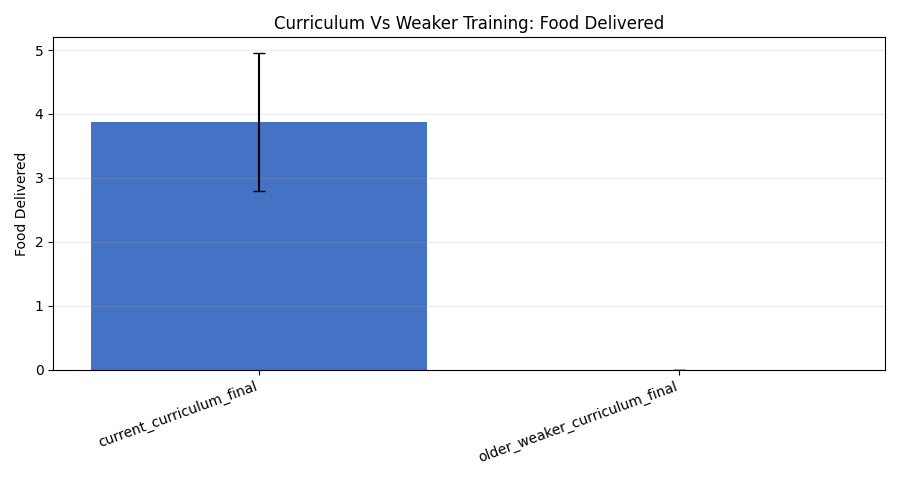

The delivery-conversion comparison remains strong as well:

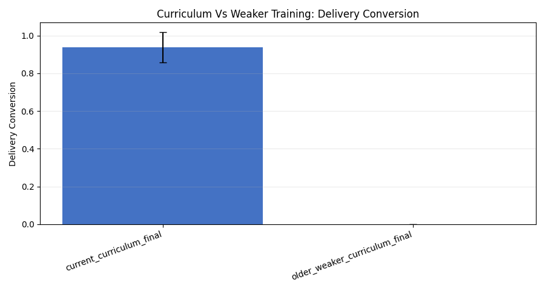

### Interpretation

The curriculum effect appears very robust. It remains easy to see even after substantially reducing repetition relative to the large rerun.

## 5.2 Baseline superiority was still clear

In this medium-size sample:

- learned MAPPO: `3.875`
- rule-based: `0.375`
- random: `0.0`

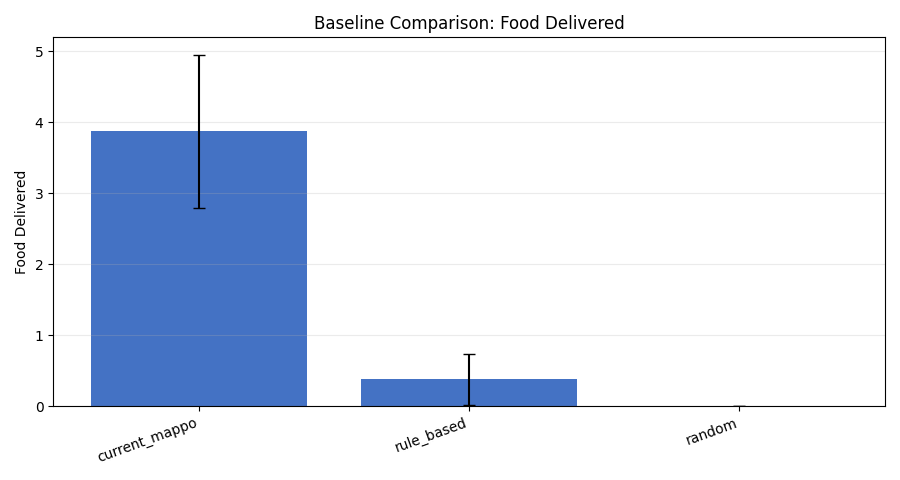

### Interpretation

The learned policy still separates cleanly from both simple controls.

## 5.3 Robustness still looked qualitatively similar

The rerun again shows reduced but nonzero performance under harder conditions:

- control: `3.875`
- more obstacles: `1.625`
- sensor noise: `3.25`
- failed agents = 2: `2.75`

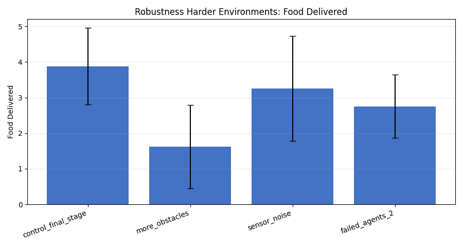

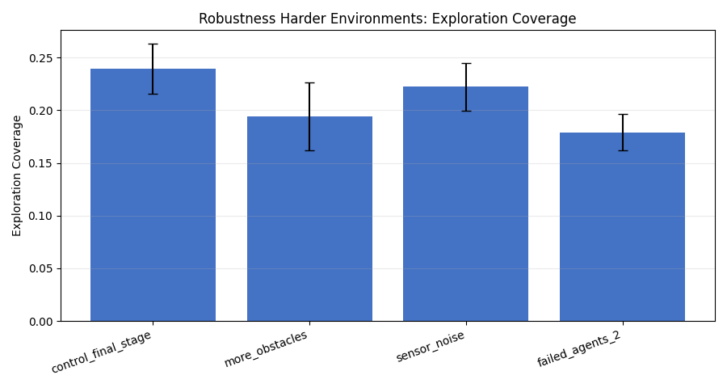

### Interpretation

The robustness story is still visible. Harder settings reduce performance, but the current trained policy does not collapse completely.

## 5.4 Broad swarm scaling was still obvious

Broad scaling remains one of the clearest families even at reduced repetition:

- `1` agent: `0.625`
- `2` agents: `0.875`
- `3` agents: `1.5`
- `4` agents: `2.25`
- `6` agents: `3.875`
- `10` agents: `3.75`
- `15` agents: `4.875`
- `20` agents: `5.0`
- `30` agents: `5.625`

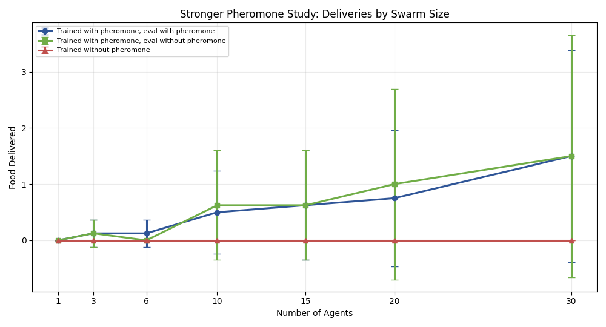

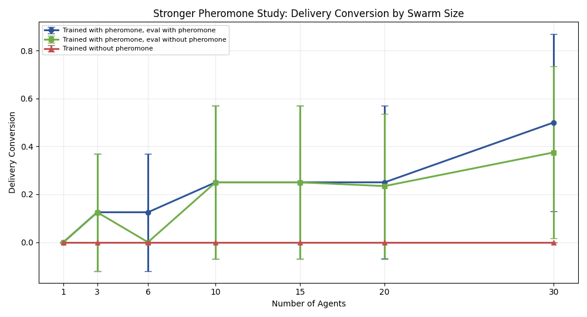

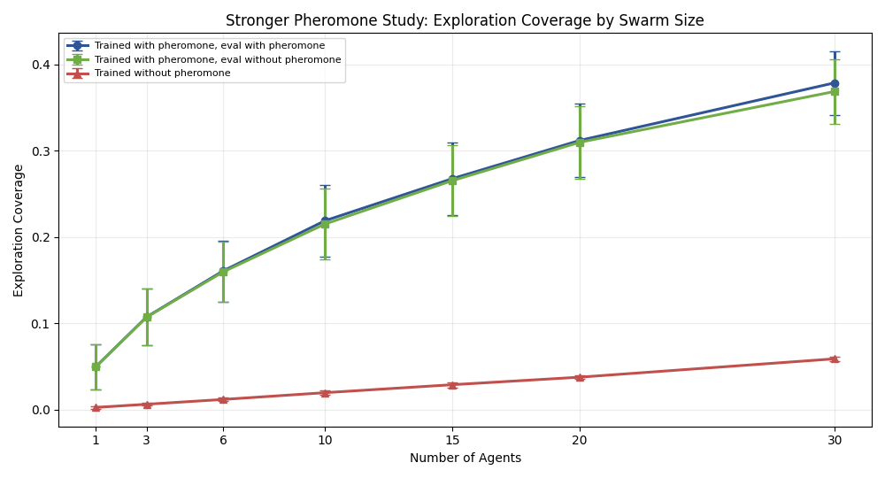

### Interpretation

Broad scaling remains easy to see qualitatively, but the figure shown here is the 3-condition killer comparison so the reader can directly compare pheromone-enabled and no-pheromone trajectories across swarm size.

## 5.5 Generic pheromone ablation stayed weak

The broad ablation again fails to provide strong evidence for the pheromone claim:

- pheromone on: `3.875`
- pheromone off at eval: `3.25`
- `p = 0.3790`

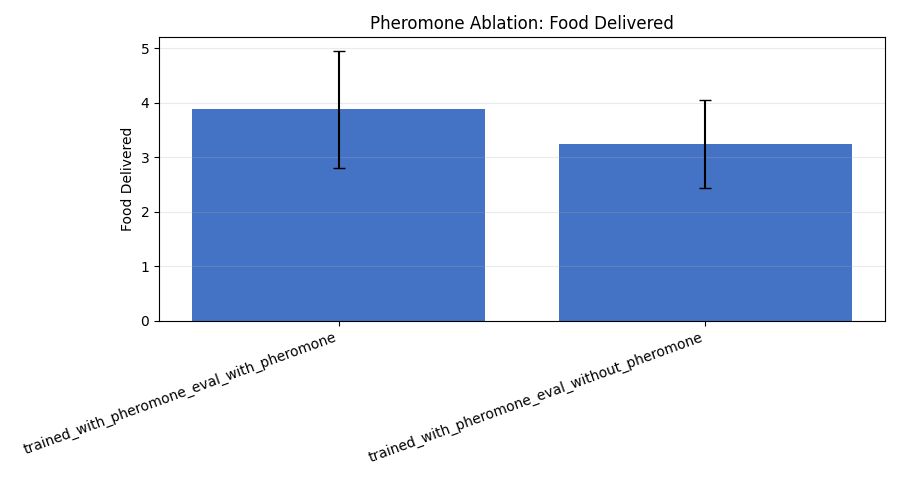

### Interpretation

This again shows why the generic broad ablation is not the right place to make the central stigmergy argument.

## 5.6 Killer scaling became clearer than in the 5-run bundle, but still not decisive

This section contains the main cross-condition comparison plots for the paper. Unlike the broad scaling figure above, every killer scaling graph overlays all 3 conditions on the same axes so that the pheromone and no-pheromone trajectories can be compared directly.

The killer scaling plots show the three conditions together on each graph for direct visual comparison:

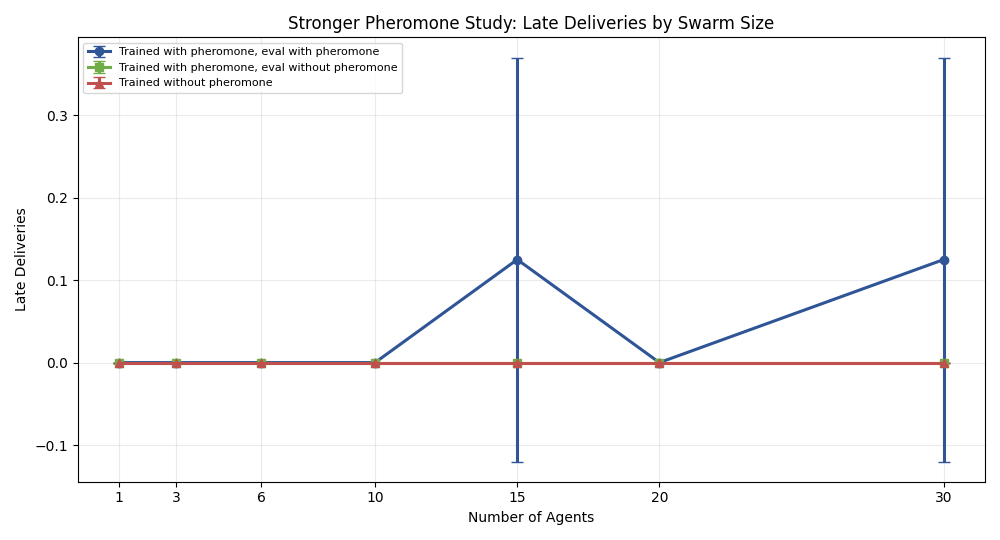

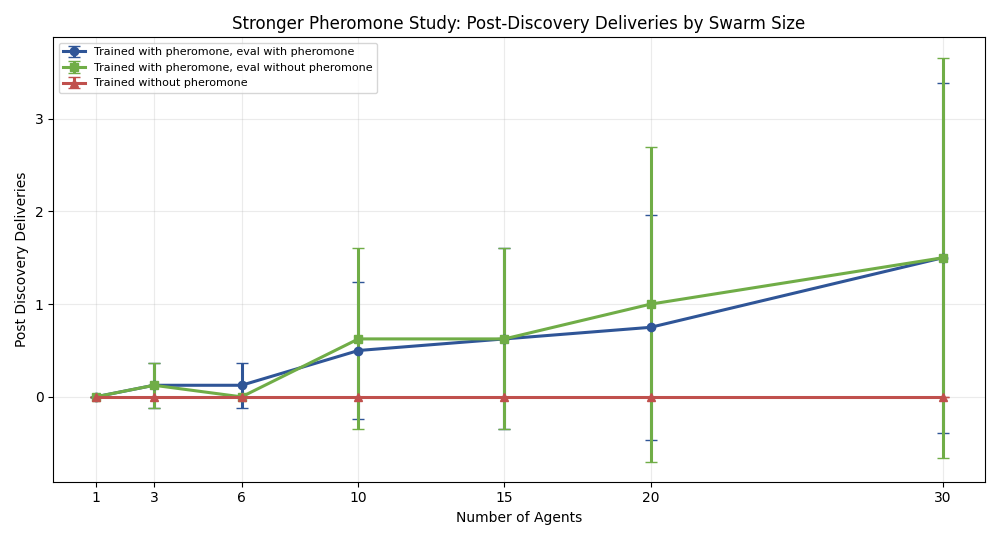

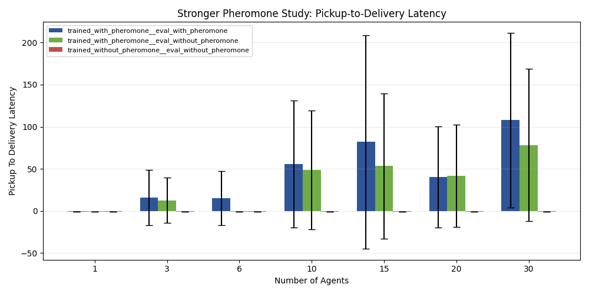

These are the key visual comparison figures for the stigmergy question in this bundle.

### `6`-agent result

At `6` agents:

- pheromone-trained, eval with pheromone:
  - `food_delivered = 0.125`
- pheromone-trained, eval without pheromone:
  - `food_delivered = 0.0`
- no-pheromone-trained, eval without pheromone:
  - `food_delivered = 0.0`

But the main matched comparison is still not significant:

- paired t-test `p = 0.3506`
- Wilcoxon `p = 0.5465`

### `30`-agent result

At `30` agents:

- pheromone-trained, eval with pheromone:
  - `food_delivered = 1.5`
  - `late_deliveries = 0.125`
- pheromone-trained, eval without pheromone:
  - `food_delivered = 1.5`
  - `late_deliveries = 0.0`
- no-pheromone-trained, eval without pheromone:
  - `food_delivered = 0.0`
  - `late_deliveries = 0.0`

The main matched comparison improves substantially relative to the `5`-run bundle, but still does not cross standard significance thresholds:

- paired t-test `p = 0.1635`
- Wilcoxon `p = 0.0650`

### Interpretation

This is the central result of the 8-seed bundle. The killer experiment becomes visibly clearer than in the `5`-run bundle, especially at `30` agents, but the statistical evidence is still not strong enough to replace the large rerun.

## 6. Discussion

This bundle supports three practical conclusions.

### 6.1 Broad algorithmic effects are stable

Curriculum quality, baseline separation, robustness, and broad scaling remain visible at `8` runs per condition.

### 6.2 The strongest stigmergy claim is only partially restored

The repeated-source killer family becomes stronger than in the `5`-run bundle, especially at `30` agents, but still remains underpowered compared with the large rerun.

### 6.3 Medium-cost reruns are useful for confirmation, not final proof

This kind of bundle is useful for:

- checking whether the broad project story still holds
- comparing replication stability across seed budgets
- producing a faster medium-strength confirmation set

It is still not the right bundle for the strongest final scientific claim about stigmergy.

## 7. Threats to Validity

This bundle still has clear limits:

- only `8` repetitions per condition
- killer-family paired tests are still underpowered
- late-delivery metrics remain sparse
- the explicit seed subset may not perfectly represent the larger seed distribution

## 8. Conclusion

The 8-seed full rerun shows that:

- the broad project story remains stable
- the high-swarm repeated-source pheromone advantage becomes visually clearer than in the `5`-run rerun
- but the strongest stigmergy claim is still not re-established at conventional statistical significance

So the correct scientific use of this bundle is:

> a medium-cost confirmation bundle that sits between the 5-run quick-look bundle and the large full rerun.

For the strongest result, the larger rerun [20260406_102744](./20260406_102744) remains the main evidentiary reference.

## References to Bundle Artifacts

- Integrated report: [report_20260406_132534.md](./report_20260406_132534.md)
- Bundle provenance: [metadata/provenance.json](./20260406_132534/metadata/provenance.json)
- Broad source report: [broad/report.md](./20260406_132534/broad/report.md)
- Killer source report: [killer_scaling/report.md](./20260406_132534/killer_scaling/report.md)
- Headline metrics: [tables/full_bundle_headlines.csv](./20260406_132534/tables/full_bundle_headlines.csv)
