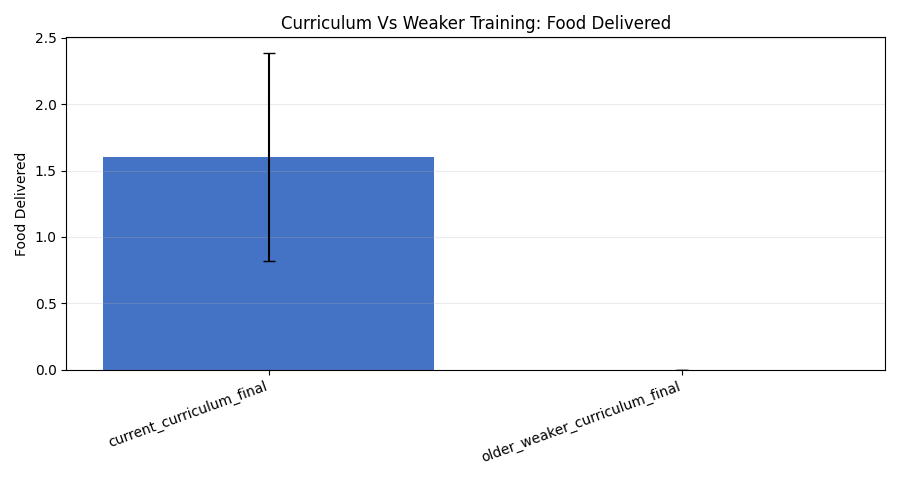
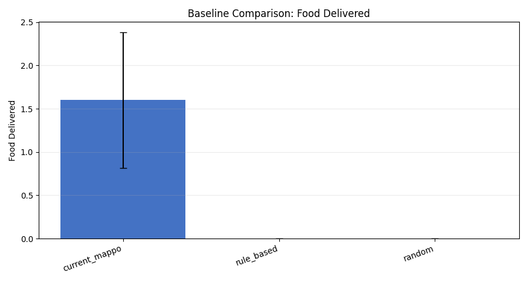
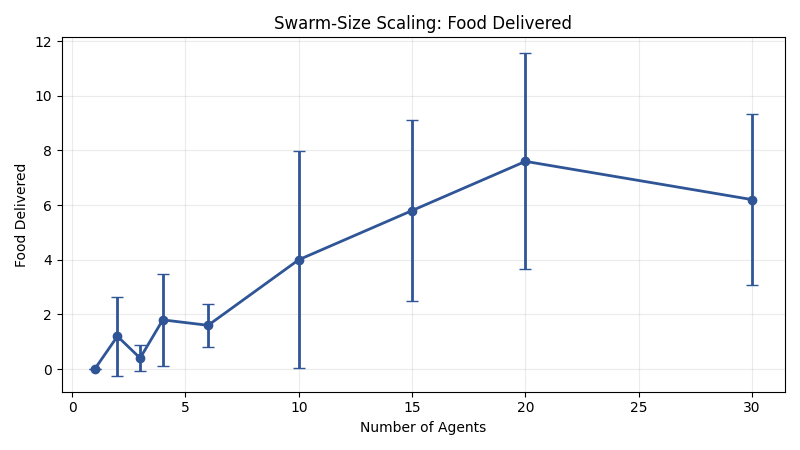
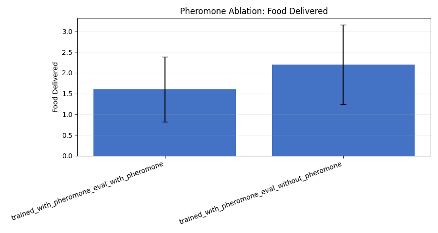
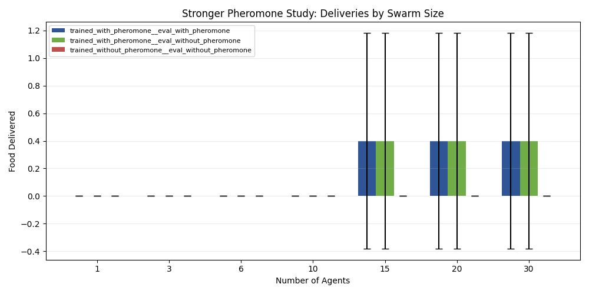
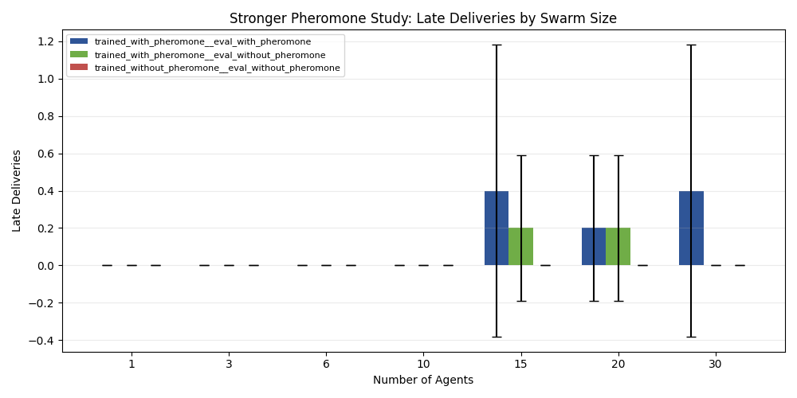
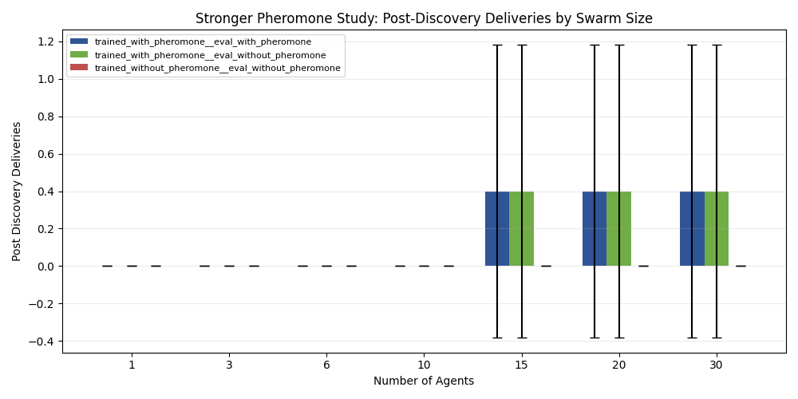
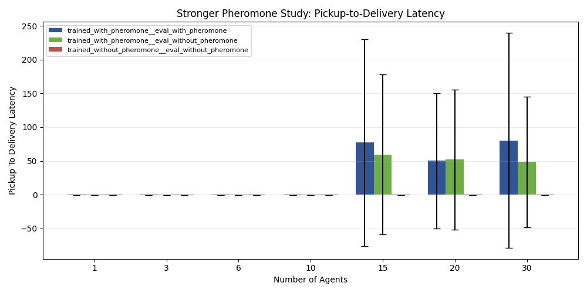

# GVRSF 2026 Experimental Lab Report

## Project Title

**Lightweight 5-Run Full Rerun of the Curriculum-Trained Stigmergic Swarm**

## Overview

This report presents a faster, lower-repetition full rerun of the project’s broad and focused experiment families. The purpose of this bundle was not to replace the larger rerun, but to answer a practical question: if the full family structure is rerun with only `5` repetitions per condition, what conclusions still remain visible, and which ones become too noisy to support strongly?

This bundle preserves the same broad families and the same focused repeated-source stigmergy family, but uses only `5` repetitions per condition. As a result, it is much faster but scientifically weaker.

## Experiment Bundle

**Bundle folder:** `docs/gvrsf2026/experiments/20260406_130911/`

Supporting artifacts:

- integrated headline table: [tables/full_bundle_headlines.csv](./20260406_130911/tables/full_bundle_headlines.csv)
- provenance metadata: [metadata/provenance.json](./20260406_130911/metadata/provenance.json)
- broad campaign report: [broad/report.md](./20260406_130911/broad/report.md)
- focused killer campaign report: [killer_scaling/report.md](./20260406_130911/killer_scaling/report.md)
- integrated paper version: [paper_20260406_130911.md](./paper_20260406_130911.md)

## Abstract

This lightweight rerun repeats the project’s broad and killer experiment families with only `5` repetitions per condition. The broad campaign still shows the same qualitative pattern as the larger rerun: the current curriculum-trained checkpoint beats the weaker older checkpoint (`1.6` vs `0.0`, `p = 0.0161`), the learned MAPPO policy beats both rule-based and random baselines (`1.6` vs `0.0` for both baselines in this small sample), and broad scaling still rises strongly with swarm size (`0.0` deliveries at `1` agent vs `6.2` at `30` agents).

The focused killer campaign, however, becomes much less stable at this sample size. At `6` agents, all three killer conditions collapsed to `0.0` deliveries. At `30` agents, the pheromone-trained swarm with pheromone enabled reached mean `food_delivered = 0.4`, while the no-pheromone-trained control remained at `0.0`, but the matched comparison was not statistically significant (`paired p = 0.3739`, `Wilcoxon p = 0.4795`).

The main conclusion of this bundle is therefore methodological: `5` repetitions are enough to preserve the broad qualitative trends, but not enough to reproduce the stronger stigmergy claim reliably. The larger-sample bundle remains the right one for the main scientific conclusion.

## 1. Background

The project studies decentralized swarm foraging with recurrent MAPPO agents. Each agent acts only from local observations. There is no central planner during evaluation. Agents must solve the loop:

`explore -> discover -> pick up -> return -> deliver`

When pheromone is enabled, the environment provides a potential stigmergic communication channel. The main scientific question is whether that environmental channel creates a meaningful coordination advantage.

## 2. Why This Bundle Was Run

The earlier full rerun under [20260406_102744](/Users/christopherlin/dev/cwsf2026/sim/docs/gvrsf2026/experiments/20260406_102744) was stronger but slower. This new bundle was run to see what happens if the same full experiment structure is repeated with only `5` runs per condition.

That makes this bundle useful as a quick-look study, but not as the strongest final evidence package.

## 3. Experimental Design

This bundle reruns:

1. broad curriculum/baseline/robustness/scaling/ablation families
2. the focused repeated-source killer stigmergy family

All conditions in this bundle use only `5` repetitions.

### Broad family repetition

- `5` episodes per condition

### Killer family repetition

- `5` paired seeds per condition at every swarm size

This is the central methodological change relative to the larger rerun.

## 4. Results

## 4.1 Curriculum quality remained visible

From [tables/family_summary.csv](./20260406_130911/tables/family_summary.csv):

- current curriculum checkpoint:
  - `food_delivered = 1.6`
- weaker older checkpoint:
  - `food_delivered = 0.0`

From [tables/statistical_tests.csv](./20260406_130911/tables/statistical_tests.csv):

- Welch’s t-test `p = 0.01613`

Figure:

### Interpretation

Even with only `5` runs, the curriculum effect stays visible. That suggests this broad claim is relatively robust.

## 4.2 Baseline superiority remained visible

From [tables/family_summary.csv](./20260406_130911/tables/family_summary.csv):

- learned MAPPO: `1.6`
- rule-based: `0.0`
- random: `0.0`

Figure:

### Interpretation

The learned policy still looks stronger than the simple controls in this small sample. However, the exact baseline means are clearly more fragile than in the larger rerun, so they should not be overinterpreted.

## 4.3 Broad scaling still looked strong

From [tables/family_summary.csv](./20260406_130911/tables/family_summary.csv):

- `1` agent: `food_delivered = 0.0`
- `6` agents: `1.6`
- `10` agents: `4.0`
- `15` agents: `5.8`
- `20` agents: `7.6`
- `30` agents: `6.2`

Figure:

### Interpretation

The broad scaling curve still rises strongly, although it is noticeably noisier and less smooth. This is exactly what you would expect from reducing the repetition count so aggressively.

## 4.4 Broad pheromone ablation was weak again

From [tables/family_summary.csv](./20260406_130911/tables/family_summary.csv):

- pheromone on at eval: `food_delivered = 1.6`
- pheromone off at eval: `food_delivered = 2.2`

From [tables/statistical_tests.csv](./20260406_130911/tables/statistical_tests.csv):

- `p = 0.3716`

Figure:

### Interpretation

The broad generic ablation is not strong enough to support a stigmergy claim in this lightweight rerun either. That is consistent with the larger rerun and reinforces the need for the stronger repeated-source killer design.

## 4.5 Killer scaling with only 5 runs became unstable

The killer scaling figures now show all three conditions together in each graph:

- trained with pheromone, evaluated with pheromone
- trained with pheromone, evaluated without pheromone
- trained without pheromone, evaluated without pheromone

Figures:

### What happened at 6 agents

From [killer_scaling/tables/condition_summary.csv](./20260406_130911/killer_scaling/tables/condition_summary.csv):

- all three 6-agent conditions had `food_delivered = 0.0`
- all three 6-agent conditions had `late_deliveries = 0.0`

From [killer_scaling/tables/statistical_tests.csv](./20260406_130911/killer_scaling/tables/statistical_tests.csv):

- Wilcoxon `p = 1.0`
- paired t-test is `NaN` because the compared series are all zeros

### What happened at 30 agents

From [killer_scaling/tables/condition_summary.csv](./20260406_130911/killer_scaling/tables/condition_summary.csv):

- trained with pheromone, eval with pheromone:
  - `food_delivered = 0.4`
  - `late_deliveries = 0.4`
- trained with pheromone, eval without pheromone:
  - `food_delivered = 0.4`
  - `late_deliveries = 0.0`
- trained without pheromone, eval without pheromone:
  - `food_delivered = 0.0`
  - `late_deliveries = 0.0`

From [killer_scaling/tables/statistical_tests.csv](./20260406_130911/killer_scaling/tables/statistical_tests.csv):

- matched `30`-agent food-delivered comparison:
  - paired t-test `p = 0.3739`
  - Wilcoxon `p = 0.4795`

### Interpretation

The lightweight rerun does not reproduce the stronger stigmergy result reliably. It hints in the same direction at `30` agents, but the evidence is far too weak to claim confirmation.

## 5. Main Conclusion

This bundle supports a practical conclusion about experimental design:

> A `5`-run full rerun is enough to preserve broad qualitative trends, but not enough to reproduce the stronger stigmergy claim reliably.

That means:

- use this bundle for quick checks and visual comparisons
- do not use it as the main evidence bundle for the final scientific claim
- use the larger rerun [20260406_102744](/Users/christopherlin/dev/cwsf2026/sim/docs/gvrsf2026/experiments/20260406_102744) when the goal is strong statistical support

## 6. Limitations

- only `5` repetitions per condition
- killer-family paired tests become noisy or degenerate
- some comparisons produce all-zero series, leading to `NaN` paired t-test outputs
- this bundle is intentionally fast, not maximally rigorous

## 7. Evidence Trail

- provenance: [metadata/provenance.json](./20260406_130911/metadata/provenance.json)
- headline table: [tables/full_bundle_headlines.csv](./20260406_130911/tables/full_bundle_headlines.csv)
- broad report: [broad/report.md](./20260406_130911/broad/report.md)
- killer report: [killer_scaling/report.md](./20260406_130911/killer_scaling/report.md)
- paper version: [paper_20260406_130911.md](./paper_20260406_130911.md)
