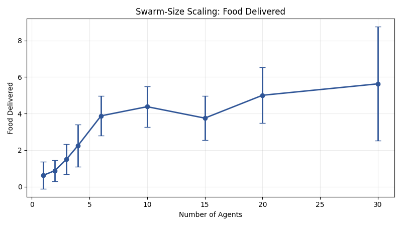

# GVRSF 2026 Experimental Lab Report

## Project Title

**Medium-Cost 8-Seed Full Rerun of the Curriculum-Trained Stigmergic Swarm**

## Overview

This report presents a fresh full rerun of the project’s broad and focused experiment families using an explicit fixed seed set of `8` runs per condition: `2, 4, 6, 25, 32, 33, 36, 41`.

The purpose of this bundle was to sit between the two earlier extremes:

- the stronger but slower larger rerun in [20260406_102744](./20260406_102744)
- the much faster but weaker `5`-run rerun in [20260406_130911](./20260406_130911)

This bundle preserves the same broad families and the same focused repeated-source killer stigmergy family, but uses a medium-size explicit seed subset.

## Experiment Bundle

**Bundle folder:** `docs/gvrsf2026/experiments/20260406_132534/`

Supporting artifacts:

- integrated headline table: [tables/full_bundle_headlines.csv](./20260406_132534/tables/full_bundle_headlines.csv)
- provenance metadata: [metadata/provenance.json](./20260406_132534/metadata/provenance.json)
- broad campaign report: [broad/report.md](./20260406_132534/broad/report.md)
- focused killer campaign report: [killer_scaling/report.md](./20260406_132534/killer_scaling/report.md)
- integrated paper version: [paper_20260406_132534.md](./paper_20260406_132534.md)

## Abstract

This medium-cost rerun repeats the project’s broad and killer experiment families with `8` runs per condition using a fixed explicit seed set. The broad campaign again shows the same qualitative pattern as the larger rerun: the current curriculum-trained checkpoint beats the weaker older checkpoint (`3.875` vs `0.0`, `p = 0.000201`), the learned MAPPO policy beats both rule-based and random baselines (`3.875` vs `0.375` and `0.0`), and broad scaling still rises strongly with swarm size (`0.625` deliveries at `1` agent vs `5.625` at `30` agents).

The focused killer campaign is stronger than the `5`-run bundle but still much weaker than the large rerun. At `6` agents, the pheromone-trained swarm with pheromone enabled reached mean `food_delivered = 0.125` versus `0.0` for the no-pheromone-trained control, but the matched comparison was not significant (`paired p = 0.3506`, `Wilcoxon p = 0.5465`). At `30` agents, the pheromone-trained swarm with pheromone enabled reached mean `food_delivered = 1.5` versus `0.0` for the no-pheromone-trained control, with the matched comparison improving but still not crossing the usual significance threshold (`paired p = 0.1635`, `Wilcoxon p = 0.0650`).

The main conclusion of this bundle is methodological: `8` explicit runs are enough to preserve the broad algorithmic story and to restore a clearer visual pheromone advantage at high swarm size, but they are still not enough to reproduce the stronger stigmergy claim at conventional statistical confidence.

## 1. Background

The project studies decentralized swarm foraging with recurrent MAPPO agents. Each agent acts only from local observations. There is no central planner during evaluation. Agents must solve the loop:

`explore -> discover -> pick up -> return -> deliver`

When pheromone is enabled, the environment provides a potential stigmergic communication channel. The main scientific question is whether that environmental channel creates a meaningful coordination advantage, especially as swarm size increases.

## 2. Why This Bundle Was Run

The earlier full rerun under [20260406_102744](./20260406_102744) was stronger but slower. The later bundle under [20260406_130911](./20260406_130911) was much faster but too noisy to support the stronger stigmergy claim.

This new bundle was run to test a middle ground:

> If the same full experiment structure is repeated with `8` explicit seeds per condition, do the broad conclusions remain stable, and does the killer stigmergy signal become clearer than in the `5`-run bundle?

That makes this bundle useful as a medium-cost confirmation study.

## 3. Experimental Design

This bundle reruns:

1. broad curriculum/baseline/robustness/scaling/ablation families
2. the focused repeated-source killer stigmergy family

All conditions in this bundle use the same explicit seed set:

- `2, 4, 6, 25, 32, 33, 36, 41`

### Broad family repetition

- `8` episodes per condition

### Killer family repetition

- `8` paired seeds per condition at every swarm size

This is the central methodological change relative to the larger rerun and the `5`-run rerun.

## 4. Results

## 4.1 Curriculum quality remained very clear

From [tables/family_summary.csv](./20260406_132534/tables/family_summary.csv):

- current curriculum checkpoint:
  - `food_delivered = 3.875`
- weaker older checkpoint:
  - `food_delivered = 0.0`

From [tables/statistical_tests.csv](./20260406_132534/tables/statistical_tests.csv):

- Welch’s t-test `p = 0.000201`

Figure:

### Interpretation

Even with a much smaller sample than the large rerun, the curriculum effect stays obvious. This broad claim appears robust.

## 4.2 Baseline superiority remained clear

From [tables/family_summary.csv](./20260406_132534/tables/family_summary.csv):

- learned MAPPO: `3.875`
- rule-based: `0.375`
- random: `0.0`

Figure:

### Interpretation

The learned policy still clearly separates from both simple baselines in this bundle.

## 4.3 Broad scaling still looked strong

From [tables/family_summary.csv](./20260406_132534/tables/family_summary.csv):

- `1` agent: `food_delivered = 0.625`
- `6` agents: `3.875`
- `10` agents: `3.75`
- `15` agents: `4.875`
- `20` agents: `5.0`
- `30` agents: `5.625`

Figure:

### Interpretation

The broad scaling curve still rises strongly overall, though it is not perfectly monotonic at every intermediate size. This broad figure is a one-condition scaling plot, so it shows only how the main trained policy changes with swarm size. It is not the cross-condition comparison figure.

## 4.4 Broad pheromone ablation remained weak

From [tables/family_summary.csv](./20260406_132534/tables/family_summary.csv):

- pheromone on at eval: `food_delivered = 3.875`
- pheromone off at eval: `food_delivered = 3.25`

From [tables/statistical_tests.csv](./20260406_132534/tables/statistical_tests.csv):

- `p = 0.3790`

Figure:

### Interpretation

The broad generic ablation is still not strong enough to support the stigmergy claim by itself. That remains consistent with the larger rerun and reinforces the need for the repeated-source killer design.

## 4.5 Killer scaling with 8 seeds was visibly better than the 5-run bundle, but still not significant

This is the main cross-condition comparison section of the report. Unlike the broad scaling figure above, every graph in this section compares all 3 killer conditions directly on the same axes.

The killer scaling figures show all three conditions together in each graph:

- trained with pheromone, evaluated with pheromone
- trained with pheromone, evaluated without pheromone
- trained without pheromone, evaluated without pheromone

These are the figures to use when asking whether pheromone-enabled training and evaluation produce a visibly different scaling pattern from the two comparison conditions.

Figures:

### What happened at 6 agents

From [killer_scaling/tables/condition_summary.csv](./20260406_132534/killer_scaling/tables/condition_summary.csv):

- trained with pheromone, eval with pheromone:
  - `food_delivered = 0.125`
  - `late_deliveries = 0.0`
- trained with pheromone, eval without pheromone:
  - `food_delivered = 0.0`
  - `late_deliveries = 0.0`
- trained without pheromone, eval without pheromone:
  - `food_delivered = 0.0`
  - `late_deliveries = 0.0`

From [killer_scaling/tables/statistical_tests.csv](./20260406_132534/killer_scaling/tables/statistical_tests.csv):

- matched `6`-agent food-delivered comparison:
  - paired t-test `p = 0.3506`
  - Wilcoxon `p = 0.5465`

### What happened at 30 agents

From [killer_scaling/tables/condition_summary.csv](./20260406_132534/killer_scaling/tables/condition_summary.csv):

- trained with pheromone, eval with pheromone:
  - `food_delivered = 1.5`
  - `late_deliveries = 0.125`
- trained with pheromone, eval without pheromone:
  - `food_delivered = 1.5`
  - `late_deliveries = 0.0`
- trained without pheromone, eval without pheromone:
  - `food_delivered = 0.0`
  - `late_deliveries = 0.0`

From [killer_scaling/tables/statistical_tests.csv](./20260406_132534/killer_scaling/tables/statistical_tests.csv):

- matched `30`-agent food-delivered comparison:
  - paired t-test `p = 0.1635`
  - Wilcoxon `p = 0.0650`

### Interpretation

This bundle restores a clearer visual 30-agent separation than the `5`-run bundle, but it still does not reach conventional significance thresholds. The signal is stronger, but still not strong enough to replace the large rerun as the main evidence bundle.

## 5. Main Conclusion

This bundle supports a practical conclusion about experimental design:

> An `8`-seed full rerun is enough to preserve the broad algorithmic story and to recover a clearer high-swarm visual stigmergy advantage, but it is still not enough to re-establish the strongest stigmergy claim with standard statistical confidence.

That means:

- use this bundle as a medium-cost confirmation study
- use it for visual comparison against the `5`-run bundle
- do not use it as the main evidence bundle for the final stigmergy claim
- use the larger rerun [20260406_102744](./20260406_102744) when the goal is strong statistical support

## 6. Limitations

- only `8` repetitions per condition
- killer-family paired tests are still underpowered
- several late-delivery comparisons remain sparse or nearly degenerate
- this bundle is stronger than the `5`-run rerun, but still intentionally cheaper than the large rerun

## 7. Evidence Trail

- provenance: [metadata/provenance.json](./20260406_132534/metadata/provenance.json)
- headline table: [tables/full_bundle_headlines.csv](./20260406_132534/tables/full_bundle_headlines.csv)
- broad report: [broad/report.md](./20260406_132534/broad/report.md)
- killer report: [killer_scaling/report.md](./20260406_132534/killer_scaling/report.md)
- paper version: [paper_20260406_132534.md](./paper_20260406_132534.md)
