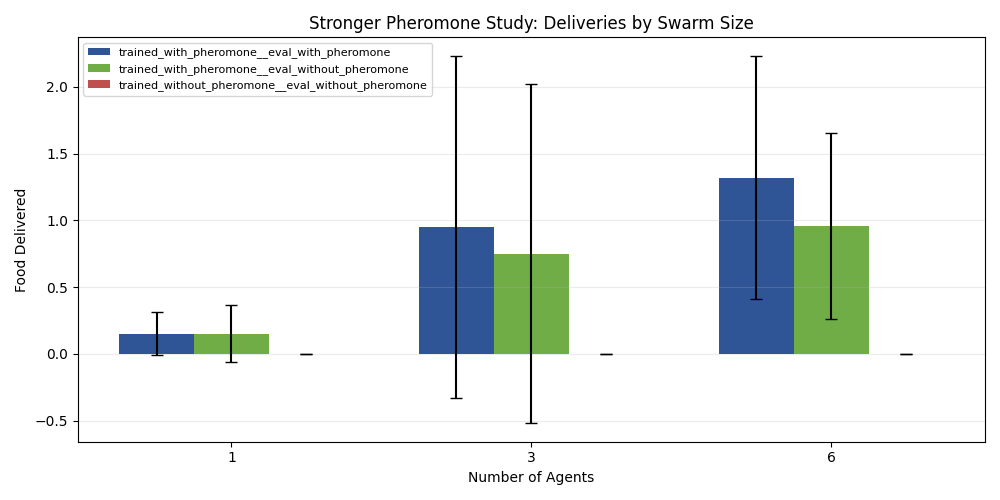

# Board Draft: GVRSF 2026

## Title

**Stigmergy Is All You Need**  
**Artificial Collective Intelligence: Carpenter Ant-Inspired Stigmergic Swarm Robotics for Decentralized Systems Using Deep Reinforcement Learning**

Short subtitle:

**A multi-agent reinforcement learning system learns to explore, find targets, and return them to a nest without a central controller.**

Suggested visual:
- one large hero screenshot of the swarm with pheromone heatmap visible

Use this document as a **board-content draft**, not as a script to print word-for-word.  
The strongest board will use short text blocks, large figures, and live demos.

---

## Motivation and Big Idea

Most robot systems rely on central coordination. Real insect swarms do not.  
This project asks a deeper computer-science question:

> Can a group of decentralized learning agents become collectively intelligent through local sensing and environmental communication alone?

I built a swarm-reinforcement-learning system in which agents:
- explore a 2D world
- find food targets
- pick them up
- return them to a nest
- communicate indirectly through pheromone-like trails

The key result is not just that the swarm works.  
The key result is that:

**the system scales better with more agents, and the advantage grows when stigmergic communication is enabled.**

### Origin Story

Last summer, I found carpenter ants in our house. Instead of immediately trying to get rid of them, I watched how they moved through the house. Individual ants seemed simple and almost random, but together they explored the environment in a systematic way.

That observation made me ask a computer-science question:

> Can intelligence emerge from many simple agents interacting locally, rather than from one very powerful centralized system?

Nature suggests that the answer may be yes. Individual ants are limited, yet ant colonies can display remarkably effective collective behavior. This project explores that same idea in artificial systems by training a decentralized robot swarm to coordinate through local sensing and stigmergic communication.

The key biological idea is **stigmergy**:

> agents do not need direct commands from each other to coordinate. They can change the environment, and later agents can use those changes as information.

In ants, that information is often carried by pheromone trails. In this project, the same idea becomes the central computer-science hypothesis:

**stigmergic communication may be one of the mechanisms that allows collective intelligence to emerge and scale.**

### Research Question

**Does stigmergic communication enable a decentralized swarm to become more than the sum of its parts as swarm size increases?**

Secondary questions:
- Does curriculum learning materially improve the final learned behavior?
- Does the learned swarm outperform simple rule-based and random baselines?
- How robust is the swarm under harder environments?

### Hypothesis

If collective intelligence is truly emerging through stigmergy, then:

- swarms with pheromone communication should outperform swarms without it
- the performance gap should increase as swarm size increases
- the largest effect should appear after the first useful route is discovered
- curriculum learning should be necessary to produce reliable greedy delivery behavior

In short:

**If stigmergy matters, the swarm should not just work better. It should scale better.**

### Why This Is Computer Science

This is not just a robotics demo. It is a study in:

- decentralized algorithms
- multi-agent reinforcement learning
- curriculum learning
- emergent behavior
- indirect communication through the environment

Core code:
- environment: [env/swarm_env.py](../../../env/swarm_env.py)
- configuration: [env/config.py](../../../env/config.py)
- curriculum: [algorithms/mappo/curriculum.py](../../../algorithms/mappo/curriculum.py)
- MAPPO trainer: [train/mappo_gru.py](../../../train/mappo_gru.py)

### Formal Reinforcement Learning Theory

This project is based on a formal reinforcement-learning framework, not just trial-and-error training.

At a high level, each agent learns a **policy**:

> `pi(a | o)`

which means:

- given an observation `o`
- what action `a` should the agent choose?

Because the agents must cooperate, the project uses **MAPPO**:

- **Multi-Agent Proximal Policy Optimization**

The main theoretical ideas are:

1. **Actor-Critic learning**
- the **actor** learns what action to take
- the **critic** learns how good the current state is

2. **Advantage estimation**
- the algorithm updates the policy based on whether an action performed better or worse than expected

3. **Clipped PPO updates**
- policy updates are limited so learning stays stable instead of changing too aggressively in one step

4. **Recurrent memory**
- because agents have only partial observations, the model uses recurrence to remember useful recent information

### Bellman Idea

One of the core ideas in reinforcement learning is the **Bellman equation**:

> the value of a state depends on the immediate reward plus the value of what comes next

A compact form is:

> `V(s) = E[r + gamma * V(s')]`

Why this matters here:

- an agent should not only ask “Did I get reward right now?”
- it should also ask “Did this move make future success more likely?”

That is exactly the challenge in this project:

- exploration may not pay off immediately
- following or laying a pheromone trail may only help later
- returning to the nest matters because of future delivery reward

So Bellman-style value estimation is central to learning the full swarm behavior, not just one-step reactions.

### Where the Mathematics Appears in Code

In [train/mappo_gru.py](../../../train/mappo_gru.py), the main RL parameters are explicit:

- `gamma = 0.99`
- `gae_lambda = 0.95`
- `clip_ratio = 0.2`
- `entropy_coef`
- `value_coef`

The implementation of **Generalized Advantage Estimation (GAE)** is in:

- [`_compute_gae(...)`](../../../train/mappo_gru.py)

That function computes:

- the **advantage**
- the **return**

using discounted future reward and the critic’s value estimate.

The core **PPO update** is also implemented in [train/mappo_gru.py](../../../train/mappo_gru.py), where the code computes:

- `ratio = exp(new_log_probs - old_log_probs)`
- `surrogate1`
- `surrogate2`
- the clipped actor loss

That is the formal PPO idea:

> improve the policy, but clip the update so it does not move too far in one step

The actual neural-network actor and critic are implemented in:

- [algorithms/mappo/networks.py](../../../algorithms/mappo/networks.py)

There are two key models:

1. `SharedGRUActor`
- maps local observation to action logits
- represents the learned policy

2. `CentralizedGRUCritic`
- estimates the value of the training-time global state
- stabilizes learning by evaluating how promising the current situation is

Why this matters:

- the swarm behavior is not hand-coded
- it is learned through a formal actor-critic optimization process
- the mathematics of PPO, GAE, value estimation, and recurrent policy learning are implemented directly in the training code

In this project, the **critic** is the component most closely tied to the Bellman idea:

- it estimates how good the current state is
- those value estimates are then used to compute advantages and returns
- that is how the system learns long-horizon behaviors like:
  - explore first
  - find target
  - then return and deliver later

Board takeaway:

**The project’s swarm intelligence comes from a formal reinforcement-learning algorithm, not from manually scripted behavior.**

### Code Snippets for the Board

These short snippets are useful on the board because they connect the theory directly to the implementation.

**1. PPO / GAE hyperparameters**  
From [train/mappo_gru.py](../../../train/mappo_gru.py):

```python
gamma: float = 0.99
gae_lambda: float = 0.95
clip_ratio: float = 0.2
entropy_coef: float = 0.01
value_coef: float = 0.5
```

Why it matters:
- `gamma` controls discounted future reward
- `gae_lambda` controls advantage estimation
- `clip_ratio` is the core PPO stability term

**2. Generalized Advantage Estimation (GAE)**  
From [`_compute_gae(...)`](../../../train/mappo_gru.py):

```python
delta = rewards[t] + gamma * next_value * mask - values[t]
last_adv = delta + gamma * gae_lambda * mask * last_adv
advantages[t] = last_adv
returns = advantages + values
```

Why it matters:
- this is where the algorithm computes whether actions were better or worse than expected
- that advantage signal is what trains the policy

**3. PPO clipped objective**  
From the PPO update in [train/mappo_gru.py](../../../train/mappo_gru.py):

```python
ratio = torch.exp(new_log_probs - mb_old_log_probs)
surrogate1 = ratio * mb_advantages
surrogate2 = torch.clamp(
    ratio, 1.0 - mappo_cfg.clip_ratio, 1.0 + mappo_cfg.clip_ratio
) * mb_advantages
actor_loss = -torch.min(surrogate1, surrogate2).mean()
```

Why it matters:
- this is the formal PPO idea in code
- the update is clipped so the policy improves without changing too violently in one step

**4. Actor and critic networks**  
From [algorithms/mappo/networks.py](../../../algorithms/mappo/networks.py):

```python
class SharedGRUActor(nn.Module):
    """Shared recurrent actor that maps local observations to action logits."""

class CentralizedGRUCritic(nn.Module):
    """Recurrent centralized critic over the training-time global state."""
```

Why it matters:
- the **actor** chooses actions
- the **critic** evaluates states
- the **GRU** gives the agents memory under partial observability

Presentation tip:

Put these in a small “Theory in Code” box beside the theory section, with arrows from:
- `gamma`, `gae_lambda`, `clip_ratio`
- to the ideas:
  - discounted reward
  - advantage estimation
  - PPO stability

That makes the board feel much more rigorous and computer-science-forward.

## How the System Works

### System Overview

Each agent has only local information. There is no global planner.

The swarm must learn the full task loop:

**explore -> detect -> pick up -> return -> deliver**

The environment also supports pheromone-like stigmergy:
- agents can leave trails
- other agents can use those trails later
- useful information is stored in the environment, not in a central controller

That makes stigmergy more than a visual effect. It acts as a form of **environmental memory**:

- earlier agents leave information behind
- later agents reuse that information
- coordination happens through the world itself, not through a central brain

Suggested visual:
- simple system diagram with:
  - local observation
  - policy network
  - action
  - pheromone field
  - nest
  - targets

### Why Curriculum Learning Was Necessary

Training the full task directly was unstable. Early versions often:
- showed success only during stochastic training
- failed in greedy evaluation
- got stuck near the nest
- picked up food without delivering it

To solve this, I built a staged curriculum in [algorithms/mappo/curriculum.py](../../../algorithms/mappo/curriculum.py):

- easy single-agent stages
- return-to-nest stages
- cluttered bridge stages
- obstacle-delivery stages
- small-swarm stages
- full-swarm stages

The trainer in [train/mappo_gru.py](../../../train/mappo_gru.py) then:
- trains stage by stage
- runs greedy evaluation
- promotes only when performance is good enough

Key idea:

**Do not ask the model to solve the hardest problem first. Teach one missing subskill at a time.**

Suggested visual:
- compact curriculum ladder graphic from single-agent to full-swarm

## How I Tested It

### Experimental Design

The strongest experiment bundle is here:
- [docs/gvrsf2026/experiments/report.md](../experiments/report.md)
- paper version: [docs/gvrsf2026/experiments/paper.md](../experiments/paper.md)

The bundle combines:

1. **Broad campaign**
- curriculum vs weaker training
- baseline comparison
- robustness
- general swarm-size scaling

2. **Killer experiment**
- matched pheromone vs no-pheromone training
- repeated-source foraging task
- swarm sizes `1`, `3`, `6`
- paired random seeds
- strongest statistical test at `6` agents

Why the killer experiment matters:

Broad scaling alone only shows that more agents can do more work.  
The killer experiment tests whether:

**more agents + stigmergy > more agents alone**

That is the scientific core of the project. If the pheromone condition scales much better than the no-pheromone condition, then stigmergy is not just present in the system. It is **causally important**.

---

### Variables

### Independent variables

- swarm size
- pheromone enabled vs disabled
- baseline policy type in control experiments
- environment difficulty in robustness tests

### Dependent variables

- `food_delivered`
- `delivery_conversion`
- `exploration_coverage`
- `late_deliveries`
- `post_discovery_deliveries`
- `pickup_to_delivery_latency`

### Controls

- fixed evaluation seeds per comparison family
- same checkpoint within ablations
- same environment geometry within each controlled comparison
- deterministic greedy evaluation for learned policies

## What the Data Show

### Main Result 1: Curriculum Learning Worked

Current final curriculum checkpoint vs weaker older training:

- current checkpoint: **1.25 deliveries/episode**
- weaker checkpoint: **0.00 deliveries/episode**
- Welch t-test: **p = 0.000828**

Interpretation:

The weaker model could still pick up food, but it failed to complete the task.  
The curriculum turned pickup-heavy behavior into real delivery.


Board takeaway:

**The training strategy was a major algorithmic contribution, not just a detail.**

### Main Result 2: The Learned Swarm Beat Baselines

- MAPPO: **1.25 deliveries/episode**
- Rule-based: **0.30**
- Random: **0.05**

Statistics:
- MAPPO vs rule-based: **p = 0.012**
- MAPPO vs random: **p = 0.0012**


Board takeaway:

**The swarm’s behavior is learned and measurably better than simple controls.**

### Main Result 3: Performance Scaled with Swarm Size

In the broad campaign:

- `1` agent: **0.05 deliveries**
- `6` agents: **1.25 deliveries**


Important note:

This alone does **not** prove collective intelligence.  
More robots can do more total work even without good coordination.

That is why the next experiment is the most important one.

Board takeaway:

**Scaling alone is not enough. The real question is whether stigmergy changes how scaling works.**

### Main Result 4: The Killer Experiment

### Scaling Laws of Stigmergic Collective Intelligence

Question:

**Does the swarm improve much more strongly with size when stigmergy is enabled?**

Design:
- matched training conditions
- repeated-source task where route reuse matters
- paired-seed evaluation
- swarm sizes `1`, `3`, `6`
- primary test at `6` agents with `50` paired seeds

At `6` agents:

- pheromone-trained, pheromone-on:
  - **1.32 deliveries**
  - **0.90 late deliveries**
- no-pheromone-trained:
  - **0.00 deliveries**
  - **0.00 late deliveries**

Statistics:
- total deliveries:
  - paired t-test **p = 0.00653**
  - Wilcoxon **p = 0.00364**
- late deliveries:
  - paired t-test **p = 0.01535**
  - Wilcoxon **p = 0.03179**




Board takeaway:

**The pheromone advantage becomes much stronger at larger swarm sizes.**  
That is the core evidence of emergent collective intelligence.

This is the strongest stigmergy result in the project:

- without stigmergy, larger swarms do not achieve the same coordinated benefit
- with stigmergy, later agents can exploit information left by earlier agents
- the widening gap suggests that the environment itself becomes part of the swarm’s collective memory

### Why the Pheromone Result Is Scientifically Strong

The strongest effect appears in:
- **late deliveries**
- **post-discovery deliveries**

That is exactly what should happen if pheromone trails are useful.

Why?
- Early in the episode, nobody has found a good route yet.
- Later in the episode, the swarm can reuse information already left in the environment.

So the result is not just “pheromone exists.”  
It is:

**pheromone improves route reuse after discovery, especially at larger swarm sizes.**

That is exactly what stigmergy predicts.

### Robustness

Harder conditions reduced performance, but did not destroy it completely.

Examples:
- more obstacles: **0.65 deliveries**
- 2 failed agents: **0.70 deliveries**
- sensor noise: **1.05 deliveries**
- control: **1.25 deliveries**


Board takeaway:

**The system is partially robust, but obstacle density and robot failures still matter.**

This is an honest limitation, not a hidden one.

## Why It Matters Beyond the Simulation

### Real-World Application

Ants are explorers. They are effective not because any one ant has a complete map, but because the colony can search, leave useful traces, and gradually build collective knowledge of the environment.

That is why decentralized swarm systems are especially valuable in places where:

- communication infrastructure is unreliable
- centralized control is fragile
- the environment changes too quickly for a fixed plan to remain useful

One important example is **disaster response**.

In a disaster zone, rescuers may know where they are and where they ultimately want to go, but they may not have anything like Google Maps:

- roads may be blocked
- buildings may collapse
- communication networks may fail
- conditions may change from minute to minute

In that setting, a decentralized stigmergic swarm could help with:

- search and rescue
- exploration of unstable environments
- locating survivors or hazards
- building up useful environmental information even when direct communication is limited

The value of this project is therefore not only biological inspiration.  
It is that the same stigmergic principle that helps ants explore can also help artificial systems operate in places where centralized intelligence is least reliable.

Board takeaway:

**This kind of swarm is promising for search-and-rescue in environments where communication is weak, maps are incomplete, and centralized control is too fragile.**

### Physical Robot System and Live Demo

This project is not only a simulation study. We also built physical swarm robots and a live demonstration setup.

This is also a project about **physical AI**:

- intelligence is not only simulated on a screen
- it is embodied in robots that sense, move, and act in the real world
- the goal is to study how learned collective intelligence can exist in physical systems, not just virtual ones

At the presentation table, I can point to:

- the physical robots
- the mission-control interface
- the live digital pheromone display

What the demo shows:

- each robot acts locally
- the robots do not rely on a central brain telling each one exactly where to go
- the system can visualize **digital pheromone** in mission control, making the stigmergic coordination visible to judges in real time

This is important because it lets the audience see both:

- the **quantitative evidence** from the experiment bundle
- the **embodied system** that the algorithms are meant to support

Board takeaway:

**The project combines algorithmic evidence with physical AI, making the swarm behavior both measurable and embodied.**

### Simulation Demo for Judges

In addition to the physical robots, I also want to show judges the simulation directly.

Why the simulation demo matters:

- it makes the learned swarm behavior easy to see
- it shows exploration, trail formation, and return-to-nest behavior clearly
- it lets judges connect the graphs on the board to the actual behavior that produced them

What I can point out during the demo:

- agents spreading out to explore
- targets being found and picked up
- pheromone heatmaps forming over time
- agents returning to the nest
- the difference between stronger and weaker coordination patterns

This is especially useful because some swarm behaviors are easier to visualize in simulation than on a small physical arena. The simulation helps judges see the collective pattern, while the physical robots show that the system is real and embodied.

Board takeaway:

**The simulation demo shows the swarm’s learned behavior clearly, and the physical demo shows that the same ideas can be embodied in real robots.**

### Robot Architecture

Each robot is part of a larger decentralized system.

High-level architecture:

1. **On-board robot**
- sensing
- local control
- motion execution

2. **Mission control / coordination layer**
- receives robot state updates
- visualizes the swarm
- displays digital pheromone and task state

3. **Swarm intelligence layer**
- decentralized decision-making
- local observations
- stigmergic information sharing through the environment or digital pheromone field

Why this matters:

- the robots are physically simple
- the intelligence comes from interaction, not from putting a huge computer on each robot
- the architecture mirrors the scientific claim of the project: simple agents can produce complex collective behavior through decentralized coordination

Suggested visual:

- labeled system diagram:
  - robot hardware
  - sensing
  - local policy
  - wireless link / mission control
  - digital pheromone visualization
  - swarm-level behavior

### From Simulation to Real Robots

One important challenge in this project is not just training intelligent behavior in simulation, but transferring that intelligence to physical robots.

Why train in simulation first?

- simulation is faster
- it is safer
- thousands of episodes can be run without damaging hardware
- curriculum learning is much easier to iterate in software than on physical robots

How the transition works:

1. **Train the policy in simulation**
- the swarm learns exploration, pickup, return, and stigmergic coordination in the simulated environment

2. **Extract the learned decision-making**
- the trained policy becomes the intelligence layer that guides robot behavior

3. **Map that intelligence onto the physical system**
- robot sensors provide the real-world inputs
- the local controller executes the actions
- mission control provides digital pheromone and system-level visualization

4. **Validate sim-to-real behavior**
- compare whether the physical robots show the same qualitative trends as the simulation:
  - decentralized exploration
  - trail use
  - return-to-goal behavior

Why this matters scientifically:

- simulation lets us test the algorithm rigorously
- hardware shows that the idea is not just virtual
- together, they form a stronger story than either one alone

Board takeaway:

**Simulation is where the swarm learns efficiently; the physical robots are where that learned intelligence becomes embodied and testable in the real world.**

## Final Takeaways

### What the Experiments Show

This project demonstrates:

1. **Decentralization**
- no central controller is required

2. **Emergence**
- performance improves at the group level

3. **Causal importance of stigmergy**
- the swarm scales much better with pheromone than without it
- the strongest differences appear after discovery, when environmental memory should matter most

4. **Scalability**
- the approach becomes more useful as the swarm grows

This is why the project is scientifically stronger than a simple robot demo.

### Limitations

Current limitations:

- the strongest scaling experiment uses `1`, `3`, `6` agents rather than the full ideal `1`, `2`, `3`, `5`, `10`
- robustness is partial, not universal
- the strongest pheromone result comes from a repeated-source task designed to emphasize route reuse
- this board summarizes simulation evidence; a smaller physical validation study would strengthen the project further

These are real limitations, and they are clearly stated in the full paper.

### Conclusion

The results support this conclusion:

> Collective intelligence in this system emerges from decentralized interaction, and stigmergic communication is a key mechanism that makes that intelligence scale.

In other words:

- more robots alone do not explain the results
- better coordination explains the results
- stigmergy is one of the mechanisms that enables that coordination
- the environment is not just where the swarm acts; it becomes part of how the swarm stores and uses information

This is the main scientific contribution of the project.

### Judges’ Summary

If a judge asks, “What is your biggest result?”, answer:

**My most important experiment tested whether the swarm becomes more efficient as it grows, and whether that improvement depends on stigmergic communication. The data show that larger swarms improve much more strongly when pheromone communication is enabled, especially after useful routes have already been discovered. That is evidence that the intelligence is emerging at the swarm level, not just from individual robots acting alone.**

---

## Suggested Board Layout

### Left column
- Title
- Motivation and Big Idea
- Research Question / Hypothesis
- Why This Is Computer Science
- How the System Works

### Center column
- Curriculum Learning
- Experimental Design / Variables
- Main Result 1: curriculum
- Main Result 2: baselines
- Main Result 3: broad scaling

### Right column
- Main Result 4: killer experiment
- Robustness
- Real-World Application
- Physical Demo / Simulation Demo / Sim-to-Real
- Final Takeaways / Judges’ Summary

---

## Optional Footer

Full experiment bundle:
- [experiments/report.md](../experiments/report.md)

Full paper:
- [experiments/paper.md](../experiments/paper.md)

Training retrospective:
- [docs/building_curriculum_training.md](../../building_curriculum_training.md)
