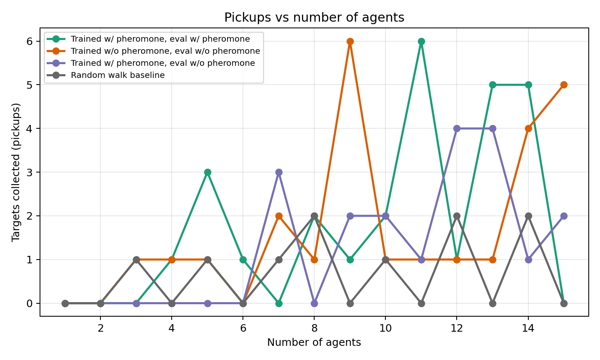
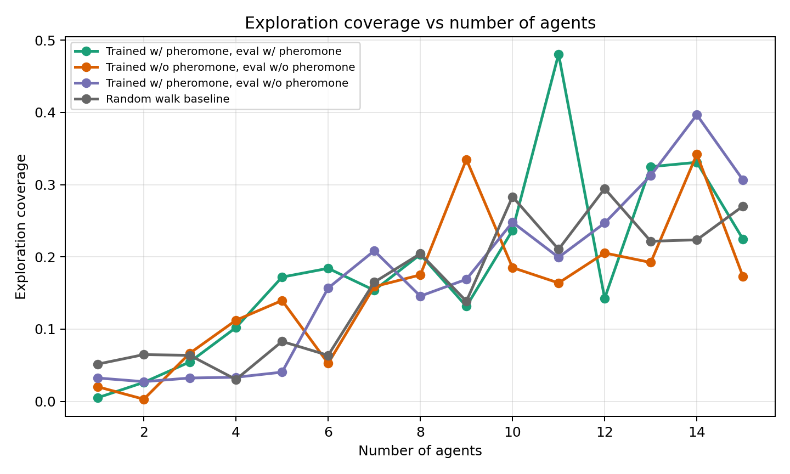
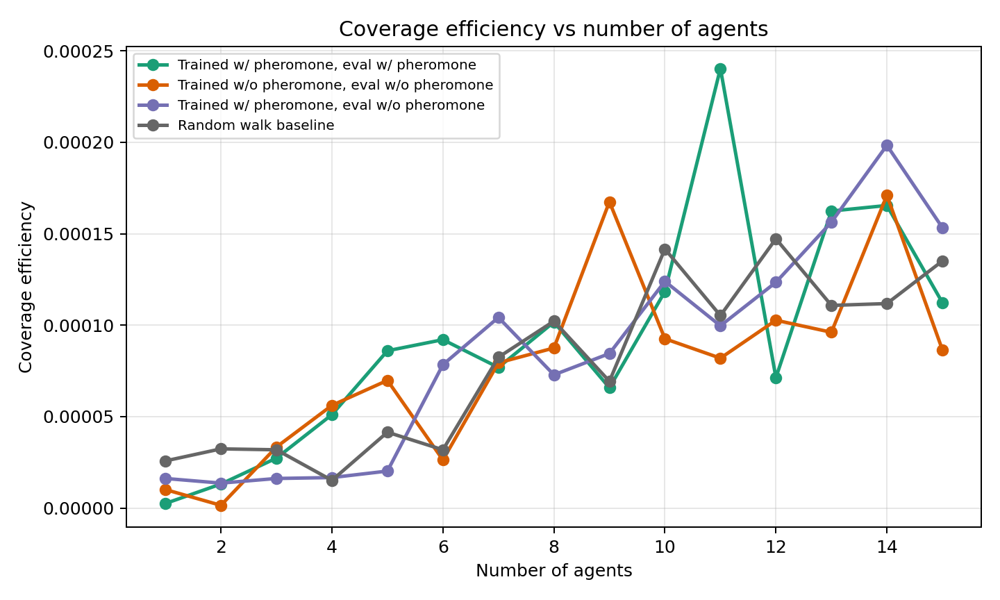
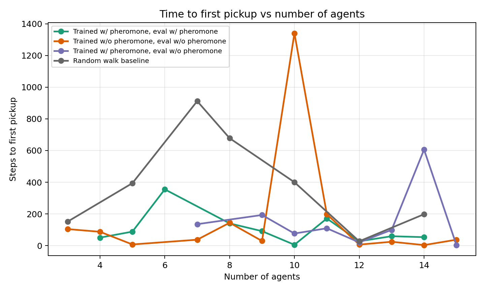
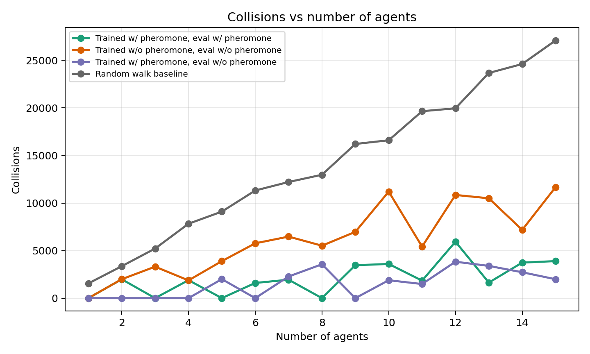
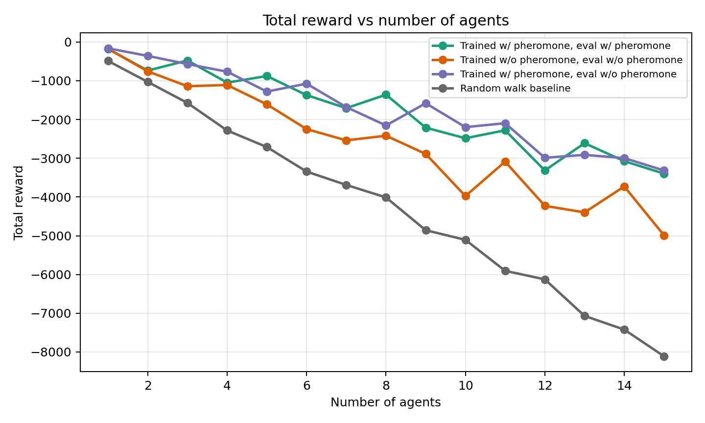

# Stigmergic Foraging in a Swarm RL Benchmark: Post-hoc Analysis of Pheromone, Ablation, and Random-Walk Conditions

## Executive Summary

This report analyzes the completed comparison outputs stored in [experiment_data/](/Users/christopherlin/dev/cwsf2026/sim/experiments/experiment_data/) for a swarm foraging benchmark spanning four conditions: a pheromone-trained policy evaluated with pheromones enabled, a policy trained and evaluated without pheromones, a pheromone-trained policy evaluated with pheromones disabled, and a random-walk baseline. The available data cover swarm sizes from 1 to 15 agents.

The strongest defensible finding is that the pheromone-trained policy evaluated with pheromones enabled achieved the highest average pickup count across agent counts and clearly outperformed the random-walk baseline. It also reached food faster on successful runs than the non-pheromone-trained policy. However, the evidence for a broad, stable pheromone advantage is limited: performance varies substantially with agent count, the non-pheromone-trained policy wins at some swarm sizes, and the pheromone-trained policy remains partially functional when pheromones are disabled at evaluation.

The most important limitation is that **no condition delivered any food to the nest**. Every episode ended at the time limit, and the available evidence therefore supports conclusions about **pickup-phase search efficiency**, not full-task completion. In addition, the comparison uses only **one episode per agent count per condition**, so these results should be treated as exploratory rather than statistically conclusive.

## Experimental Conditions

### Condition mapping

The condition mapping was inferred from:

- [experiments/experiment_data/pheromone_vs_random_metadata.json](/Users/christopherlin/dev/cwsf2026/sim/experiments/experiment_data/pheromone_vs_random_metadata.json)
- [experiments/experiment_data/raw/pheromone_vs_random_all_conditions_raw.csv](/Users/christopherlin/dev/cwsf2026/sim/experiments/experiment_data/raw/pheromone_vs_random_all_conditions_raw.csv)
- [experiments/experiment_data/raw/pheromone_vs_random_summary.csv](/Users/christopherlin/dev/cwsf2026/sim/experiments/experiment_data/raw/pheromone_vs_random_summary.csv)

The raw data encode four comparison labels:

| Comparison label | Interpretation |
| --- | --- |
| `trained_with_pheromone__eval_with_pheromone` | Policy trained with pheromones and evaluated with pheromones enabled |
| `trained_without_pheromone__eval_without_pheromone` | Policy trained without pheromones and evaluated without pheromones |
| `trained_with_pheromone__eval_without_pheromone` | Pheromone-trained policy evaluated with pheromones disabled |
| `random_walk` | Non-learning baseline using random actions |

### Experimental envelope

The available metadata indicate:

- Agent counts: 1 through 15
- Conditions: 4
- Episodes per agent count: 1
- Active targets: 4
- Checkpoints:
  - `checkpoints/with_pheremone/full_policy`
  - `checkpoints/without_pheremone/full_policy`

This yields 60 raw evaluation episodes in total:

- 15 agent counts x 4 conditions x 1 episode each

### Important setup inconsistency

There is a mismatch between top-level metadata and the raw episode records:

- [pheromone_vs_random_metadata.json](/Users/christopherlin/dev/cwsf2026/sim/experiments/experiment_data/pheromone_vs_random_metadata.json) reports `eval_steps = 600`
- [pheromone_vs_random_all_conditions_raw.csv](/Users/christopherlin/dev/cwsf2026/sim/experiments/experiment_data/raw/pheromone_vs_random_all_conditions_raw.csv) reports `eval_steps_configured = 2000`
- every recorded episode lasted `2000` steps and ended with `episode_done_reason = max_steps`

This inconsistency should be treated as a reporting limitation.

## Metrics Analyzed

The following metrics were actually available in the stored outputs:

- `targets_collected` / `targets_picked_up`: pickup events, not delivery events
- `food_discovered` / `food_picked_up`: equivalent pickup-phase counts
- `food_retrieved` / `food_delivered`: delivery counts
- `coverage` / `exploration_coverage`: fraction of the coverage grid visited
- `coverage_efficiency`: coverage divided by total steps taken
- `time_to_first_discovery`: step index of the first pickup event; missing where no pickup occurred
- `total_reward`
- `mean_episode_reward`
- `collisions`
- `pheromone_usage`
- `swarm_efficiency`

### Missing or effectively uninformative metrics

- Delivery performance is present as a field, but all recorded values are zero.
- Pheromone usage is present, but it is near zero even in the pheromone-enabled evaluation condition.
- No exploration maps, trajectory overlays, or spatial heatmaps were present under `experiments/experiment_data/`; only CSV outputs were available. Because of that, the report uses coverage metrics rather than direct visual evidence of path redundancy or trail structure.

## Condition Summary

The table below is derived from [condition_summary.csv](/Users/christopherlin/dev/cwsf2026/sim/experiments/experiment_data/report_assets/condition_summary.csv), generated only from the existing experiment CSVs.

| Condition | Mean pickups across agent counts | Peak pickups | Agent count at peak | Mean coverage | Mean collisions | Mean total reward | Mean delivered |
| --- | ---: | ---: | ---: | ---: | ---: | ---: | ---: |
| Trained w/ pheromone, eval w/ pheromone | 1.80 | 6 | 11 | 0.185 | 2,099.9 | -1808.2 | 0.0 |
| Trained w/o pheromone, eval w/o pheromone | 1.67 | 6 | 9 | 0.155 | 6,172.2 | -2619.1 | 0.0 |
| Trained w/ pheromone, eval w/o pheromone | 1.27 | 4 | 12 | 0.170 | 1,541.6 | -1741.8 | 0.0 |
| Random walk baseline | 0.67 | 2 | 8 | 0.158 | 14,089.7 | -4248.3 | 0.0 |

## Results

### 1. Pickup performance versus swarm size

*Figure 1. Pickup-phase target collection as a function of agent count. This figure was derived from the stored summary CSV because the original graph folders were not present in the repository.*

#### Observations

- The pheromone-trained policy evaluated with pheromones enabled has the highest average pickup count across the full sweep.
- Its strongest region is in the larger swarms, especially around 11, 13, and 14 agents.
- The non-pheromone-trained policy is competitive and actually wins at some agent counts, especially 9 and 15 agents.
- The pheromone-trained policy evaluated without pheromones still performs above the random baseline and occasionally wins outright, especially at 7 and 12 agents.
- The random-walk baseline occasionally finds targets, but its ceiling is much lower, peaking at only 2 pickups.

#### Interpretation

The data support a **moderate pickup-phase benefit** for the pheromone-enabled trained policy, but not a universal one. The best-performing condition does not dominate at every swarm size, which suggests either strong stochastic sensitivity, agent-count-specific dynamics, or incomplete convergence of the policies.

The ablation result matters: the pheromone-trained policy does not collapse when pheromones are removed at evaluation. That weakens the strongest possible claim of pheromone dependence. A more cautious interpretation is that training with pheromones may have produced a policy that remains functional through non-pheromonal cues such as geometry, coverage pressure, or local motion heuristics.

#### Key Takeaways

- The pheromone-enabled trained policy is the strongest pickup-phase condition on average.
- The non-pheromone-trained policy remains competitive at several swarm sizes.
- The random baseline is clearly weaker, but not completely inert.

### 2. Exploration coverage and coverage efficiency

*Figure 2. Raw exploration coverage versus number of agents.*

*Figure 3. Coverage efficiency versus number of agents.*

#### Observations

- Coverage generally increases with the number of agents in all conditions.
- The pheromone-trained policy evaluated with pheromones enabled has the highest mean coverage across the sweep.
- The pheromone-trained policy evaluated without pheromones has coverage close to, but generally below, the full pheromone condition.
- The random baseline achieves substantial coverage at large swarm sizes despite poor pickup performance.

#### Interpretation

Coverage alone is not sufficient for successful foraging. The random-walk baseline covers increasing portions of the arena as more agents are added, but this does not translate into commensurate pickup performance. That pattern suggests that **space-filling motion is not the same as efficient search**.

The pheromone-enabled trained policy appears to convert coverage into pickups more effectively than the random baseline. This is consistent with some degree of coordinated search or more purposeful local behavior, although the absence of trajectory-level visuals prevents stronger claims about how that coordination manifests spatially.

#### Key Takeaways

- More agents increase coverage for every condition.
- The best pickup condition is not simply the one with the most raw movement.
- Coverage metrics support, but do not by themselves prove, coordinated foraging behavior.

### 3. Time to first pickup

*Figure 4. Time to first pickup on successful runs only. Missing points correspond to runs with no pickup event.*

#### Observations

- Among successful runs, the pheromone-enabled trained policy reached first pickup fastest on average, at about 104 steps.
- The non-pheromone-trained policy averaged about 168 steps on successful runs.
- The pheromone-trained policy evaluated without pheromones averaged about 155 steps on successful runs.
- The random baseline was much slower, averaging about 394 steps when it succeeded at all.

#### Interpretation

This is one of the clearest signals in the dataset. Conditional on success, trained policies find food substantially faster than the random baseline. The pheromone-enabled condition appears strongest here, which is compatible with the idea that stigmergic cues or training under stigmergic conditions help bootstrap more directed search behavior.

However, because unsuccessful runs are omitted from this metric by construction, it should be interpreted together with pickup counts rather than alone.

#### Key Takeaways

- Trained policies detect food earlier than random walk when they succeed.
- The pheromone-enabled trained policy is fastest on this metric.
- This is suggestive, but not conclusive, evidence for improved search efficiency.

### 4. Collisions and reward

*Figure 5. Collision counts versus number of agents.*

*Figure 6. Total reward versus number of agents.*

#### Observations

- The random baseline produces by far the largest collision counts, with collision load increasing steeply with swarm size.
- The pheromone-enabled trained policy reduces collisions substantially relative to the random baseline.
- The pheromone-trained policy evaluated without pheromones has the lowest mean collision count overall.
- Total reward is negative for every condition and worsens as the number of agents increases.

#### Interpretation

The reward signal is difficult to interpret as a stand-alone success metric here because:

- no food deliveries occur in any condition
- all episodes run to the time limit
- collision and step penalties likely dominate the return

The slightly better total reward in the ablated pheromone-trained condition likely reflects lower penalty accumulation rather than higher task completion. In other words, lower reward magnitude here does **not** mean stronger foraging in a straightforward sense.

#### Key Takeaways

- Collision suppression is one place where trained policies clearly beat random walk.
- Reward is not the best headline metric for this dataset because the task never completes.
- Pickup count and first-pickup time are more interpretable than return alone.

### 5. Pheromone vs no-pheromone vs ablation

The central scientific question is whether stigmergic coordination helps.

#### What the data do support

- Training with pheromones and evaluating with pheromones enabled produced the best average pickup count.
- That condition also achieved the fastest mean time to first pickup on successful runs.
- It outperformed the random baseline by a wide margin on pickup count and collision control.

#### What the data do not cleanly support

- A universal pheromone advantage across all swarm sizes.
- Strong dependence on pheromones at inference time.
- A full-task performance advantage on delivery, because no deliveries were observed in any condition.

The most careful interpretation is that pheromone-enabled training appears beneficial for pickup-phase search, but the effect is **incomplete, heterogeneous across swarm sizes, and not yet sufficient to demonstrate reliable stigmergic task completion**.

#### Key Takeaways

- Evidence for a pickup-phase benefit from pheromones is present but modest.
- Evidence for full stigmergic task completion is absent.
- Evidence for hard dependence on pheromones at inference time is mixed.

## Figures and Derived Assets

The repository did not contain the originally expected generated graph folders under `experiments/experiment_data/graphs/` or `experiments/experiment_data/exploration_graphs/`. To keep this report evidence-based, lightweight derived assets were generated only from the stored CSV outputs and saved under:

- [experiments/experiment_data/report_assets/](/Users/christopherlin/dev/cwsf2026/sim/experiments/experiment_data/report_assets/)

Derived files used in this report:

- [condition_summary.csv](/Users/christopherlin/dev/cwsf2026/sim/experiments/experiment_data/report_assets/condition_summary.csv)
- [pickup_comparison_by_agents.csv](/Users/christopherlin/dev/cwsf2026/sim/experiments/experiment_data/report_assets/pickup_comparison_by_agents.csv)
- `targets_collected_vs_agents.png`
- `coverage_vs_agents.png`
- `coverage_efficiency_vs_agents.png`
- `time_to_first_pickup_vs_agents.png`
- `collisions_vs_agents.png`
- `total_reward_vs_agents.png`

## Interpretation and Discussion

### Does stigmergic coordination improve performance?

The most defensible answer is: **partially, at the pickup stage, but not yet at the full-task level**.

The pheromone-enabled trained policy is strongest on average for pickup count and first-pickup time, which is directionally consistent with useful stigmergic coordination. At the same time:

- the no-pheromone-trained policy wins at several swarm sizes
- the pheromone-trained policy still works when pheromones are disabled at evaluation
- no condition delivers food successfully

So the data suggest that pheromones may be helping local search, but they do not yet demonstrate a mature collective retrieval loop.

### Coordination vs independent motion

The random baseline provides an important counterpoint. It covers space, but does so inefficiently and with far more collisions. The trained policies do better than that, which suggests they have learned more than mere motion. Still, because trajectory-level exploration maps are missing, the data do not allow a strong claim that the swarm is exhibiting sophisticated trail-following or division of labor. The safest conclusion is that the trained policies show **better collective search efficiency than random motion**, not definitive higher-order collective intelligence.

### Scaling behavior

Scaling is clearly non-monotonic. Larger swarms often help, but not smoothly:

- the pheromone-enabled condition peaks at 11 agents
- the non-pheromone-trained condition peaks at 9 agents
- both conditions exhibit regressions at some larger swarm sizes

This pattern is more consistent with **diminishing or unstable returns** than with clean linear scaling.

### Dependence on pheromones at inference time

The pheromone-ablation condition remains viable and occasionally strong. That suggests the trained policy is not solely dependent on live pheromone cues during evaluation. It may have learned behaviors that generalize through motion, local geometry, or reward-shaped exploration rather than relying on a strong explicit trail-following mechanism.

### Exploration patterns

Because direct exploration visuals are absent, coverage metrics stand in as a proxy. They suggest:

- more agents increase visited area
- trained policies convert coverage into pickups better than random walk
- high coverage alone does not guarantee good search efficiency

This is useful but incomplete evidence. The next round of experiments should preserve actual trajectory or occupancy visualizations if spatial coordination is a scientific claim of interest.

## Limitations

This dataset has several serious limitations:

1. **One episode per agent count per condition**
   - There is no meaningful estimate of variability.
   - Standard deviations in the provided summary are effectively zero because there is only one sample per point.

2. **No successful deliveries**
   - `mean_food_delivered` is zero for all conditions and all swarm sizes.
   - The data therefore support claims about search and pickup, not end-to-end foraging success.

3. **All episodes end by time limit**
   - Every raw row records `episode_done_reason = max_steps`.
   - No condition reaches a natural task-completion termination.

4. **Metadata inconsistency**
   - Top-level metadata report `eval_steps = 600`, while raw rows report and exhibit 2000-step episodes.

5. **Missing original figures**
   - The documentation suggests pre-generated graph and exploration-visual folders, but they were not present in the repository snapshot analyzed here.

6. **Weak pheromone signal visibility**
   - Recorded pheromone usage is near zero even in the pheromone-enabled condition, which complicates interpretation of any claimed stigmergic mechanism.

7. **No confidence intervals or significance testing**
   - The current data volume is too small for robust inferential claims.

## Conclusion

The current experiment outputs provide credible evidence that trained policies outperform a random-walk baseline in pickup-phase foraging behavior, and they provide tentative evidence that training and evaluating with pheromones can improve that pickup-stage performance. The pheromone-enabled trained policy achieves the highest average pickups and the fastest successful first pickup, especially at some larger swarm sizes.

At the same time, the strongest conclusion is limited by the dataset itself. No condition delivered food to the nest, every episode timed out, and only one episode was run per agent count per condition. As a result, the experiments do **not** yet demonstrate robust end-to-end stigmergic foraging. They demonstrate a promising but incomplete improvement in search and pickup behavior.

## Future Work

The most impactful next steps are:

1. Increase evaluation rigor
   - run multiple seeds per agent count and condition
   - report means with confidence intervals or standard errors

2. Restore and preserve spatial diagnostics
   - save trajectory overlays
   - save occupancy or exploration heatmaps
   - save pheromone field snapshots during evaluation

3. Emphasize end-to-end task metrics
   - successful deliveries
   - delivery latency
   - pickup-to-delivery conversion rate

4. Resolve setup inconsistencies
   - ensure metadata and raw episode settings agree
   - record exact evaluation configuration once per experiment bundle

5. Probe the pheromone mechanism directly
   - run more seeds for the pheromone ablation
   - track pheromone usage with better dynamic range
   - test whether pickup gains persist under stricter ablations
